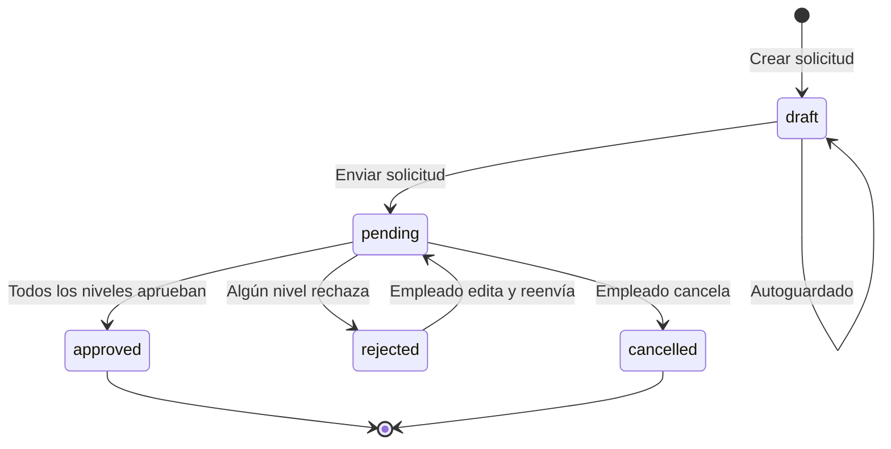
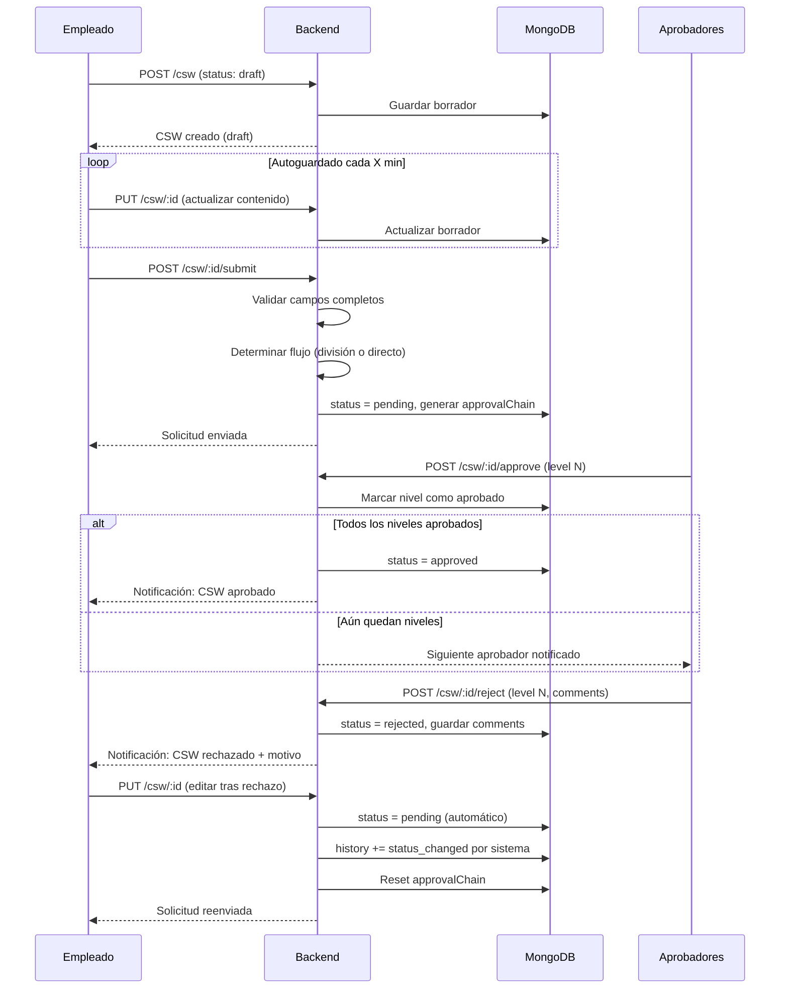
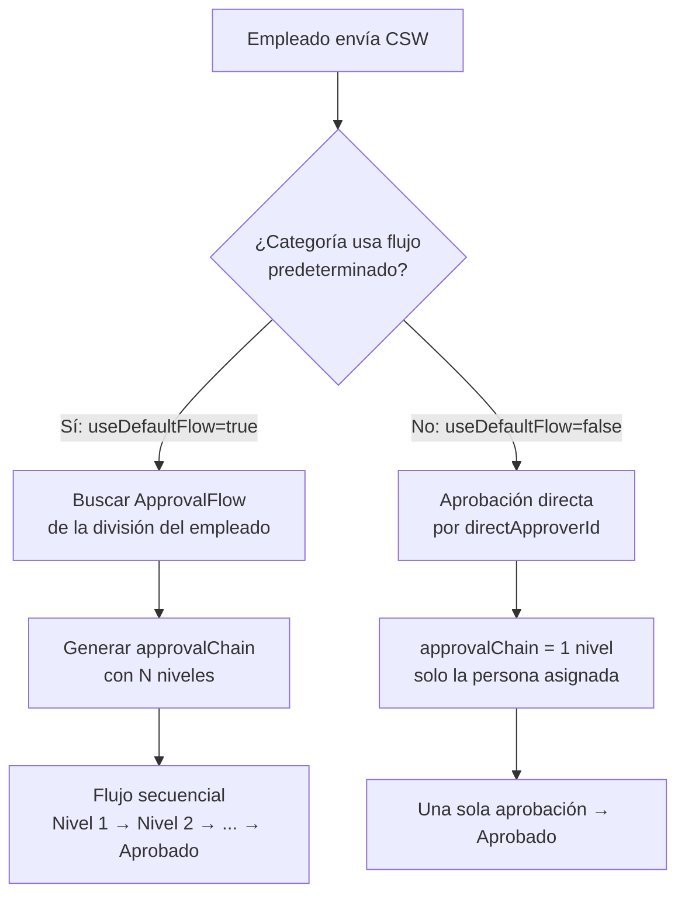
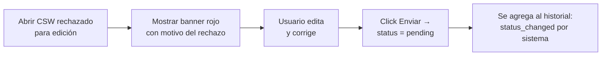

# Módulo CSW — Documentación Completa

## Canal de Solicitudes de Trabajo (Completed Staff Work)

---

## Visión General

El CSW es el sistema de solicitudes internas donde los empleados pueden crear solicitudes formales que pasan por un flujo de aprobación configurable.

---

## Estados del CSW



| Estado | Descripción | Quién actúa |
|--------|-------------|-------------|
| `draft` | Borrador, no visible para aprobadores | Creador |
| `pending` | En proceso de aprobación | Aprobadores del flujo |
| `approved` | Todos los niveles aprobaron | Sistema |
| `rejected` | Algún nivel rechazó | Aprobador |
| `cancelled` | Cancelado por el creador | Creador |

---

## Formato del Título

```
CSW-{CATEGORIA_UPPER_SNAKE_CASE}-{YYYYMMDD}-{5chars_ObjectId}
```

**Ejemplos:**
- `CSW-PERMISO-20260624-6a3c5`
- `CSW-VACACIONES-20260624-6a3c5`
- `CSW-AUMENTO_SALARIAL-20260624-6a3c5`
- `CSW-ORDEN_DE_ESTUDIO-20260701-6b4d2`

**Generación (frontend helper):**
```typescript
// utils/csw.ts
export const toUpperSnakeCase = (str: string) =>
  str.toUpperCase().normalize('NFD').replace(/[\u0300-\u036f]/g, '')
     .replace(/[^A-Z0-9]+/g, '_').replace(/^_|_$/g, '');

export const formatCSWTitle = (csw: { _id: string; category?: { name: string }; createdAt: string }) => {
  const catName = toUpperSnakeCase(csw.category?.name || 'OTRO');
  const date = new Date(csw.createdAt).toISOString().split('T')[0].replace(/-/g, '');
  const idShort = csw._id.substring(0, 5);
  return `CSW-${catName}-${date}-${idShort}`;
};
```

---

## Flujo Completo de un CSW



---

## Flujo de Aprobación Condicional



---

## Modelo de Datos

### CSW

```typescript
interface ICSW {
  _id: ObjectId;
  
  // Contenido
  situation: string;          // ¿Qué sucede? (máx 200 palabras)
  information: string;        // ¿Qué datos tienes? (máx 200 palabras)
  solution: string;           // ¿Cómo se resuelve? (máx 200 palabras)
  
  // Relaciones
  requester: ObjectId;        // Empleado solicitante
  requesterName: string;      // Desnormalizado
  requesterDivision: ObjectId;
  category: ObjectId;         // CSWCategory
  
  // Estado
  status: 'draft' | 'pending' | 'approved' | 'rejected' | 'cancelled';
  
  // Flujo de aprobación
  approvalFlowId?: ObjectId;
  approvalChain: [{
    level: number;
    name: string;
    approverId: ObjectId;
    approverName: string;
    status: 'pending' | 'approved' | 'rejected';
    approvedAt?: Date;
    comments?: string;
  }];
  currentLevel: number;
  
  // Historial
  history: [{
    action: 'created' | 'edited' | 'submitted' | 'approved' | 'rejected' | 'cancelled' | 'status_changed';
    performedBy: ObjectId | 'system';
    performedByName: string;
    performedAt: Date;
    previousStatus?: string;
    newStatus?: string;
    comments?: string;
  }];
  
  // Timestamps
  createdAt: Date;
  updatedAt: Date;
  deleted: boolean;
}
```

### CSWCategory

```typescript
interface ICSWCategory {
  _id: ObjectId;
  name: string;               // "Permiso", "Vacaciones", etc.
  description?: string;
  active: boolean;
  order: number;
  useDefaultFlow: boolean;    // Si usa flujo de la división
  directApproverId?: ObjectId; // Aprobador único (si useDefaultFlow=false)
  createdAt: Date;
  updatedAt: Date;
}
```

---

## API Endpoints

| Método | Ruta | Permiso | Descripción |
|--------|------|---------|-------------|
| GET | /api/v1/csw | csw:read | Listar CSWs (filtros: status, category, requester) |
| GET | /api/v1/csw/:id | csw:read | Detalle de un CSW |
| POST | /api/v1/csw | csw:create | Crear CSW (estado: draft) |
| PUT | /api/v1/csw/:id | csw:update | Actualizar CSW (autoguardado o edición) |
| DELETE | /api/v1/csw/:id | csw:delete | Cancelar/eliminar CSW |
| **POST** | **/api/v1/csw/:id/submit** | **csw:create** | **Enviar borrador → pending (activa flujo)** |
| POST | /api/v1/csw/:id/approve | csw:approve | Aprobar nivel actual |
| POST | /api/v1/csw/:id/reject | csw:approve | Rechazar con comentario |

---

## Draft + Autoguardado

### Configuración (AppSettings)

```typescript
{ key: 'csw_autosave_interval', value: 5 } // minutos, configurable por admin
```

### Frontend — Lógica de autoguardado

```typescript
// En CSWForm.tsx
useEffect(() => {
  if (csw.status !== 'draft') return;
  
  const interval = setInterval(async () => {
    if (hasUnsavedChanges) {
      await apiClient.put(`/csw/${csw._id}`, formData);
      setLastSaved(new Date());
    }
  }, autosaveInterval * 60 * 1000);

  return () => clearInterval(interval);
}, [formData, autosaveInterval]);
```

### UI del Draft

- Badge "Borrador" en la lista
- Indicador "Guardado a las HH:MM" debajo del form
- Botón "Guardar borrador" (manual)
- Botón "Enviar solicitud" (cambia a pending)
- Los drafts NO se ven por otros usuarios (solo el creador)

---

## Banner de Rechazo (al editar)

Cuando un CSW en estado `rejected` se abre para edición:



**UI:**
```
┌─────────────────────────────────────────────┐
│ ⚠️ Solicitud rechazada                       │
│                                             │
│ "El documento adjunto no es legible,        │
│  por favor adjunte uno nuevo."              │
│                                             │
│ Rechazado por: Oscar Hernandez              │
│ Fecha: 24 jun 2026, 15:30                   │
└─────────────────────────────────────────────┘
```

---

## Badge de Estado en Header

Al ver o editar un CSW, el header muestra:

```
CSW-VACACIONES-20260624-6a3c5    [● Pendiente]
```

| Estado | Color Badge | Texto |
|--------|-------------|-------|
| draft | gray/light | Borrador |
| pending | warning/yellow | Pendiente |
| approved | success/green | Aprobado |
| rejected | error/red | Rechazado |
| cancelled | gray | Cancelado |

---

## Categorías con Tipo de Flujo

| Categoría | Flujo | Aprobador |
|-----------|-------|-----------|
| Permiso | División | Según flujo configurado |
| Vacaciones | División | Según flujo configurado |
| Incapacidad | División | Según flujo configurado |
| Aumento Salarial | División | Según flujo configurado |
| Orden de Estudio | **Directo** | **Oscar Hernandez** |
| Capacitación | División | Según flujo configurado |
| Trabajo Remoto | División | Según flujo configurado |
| Horas Extra | División | Según flujo configurado |
| Otros | División | Según flujo configurado |

---

## Permisos CSW

| Permiso | Quién puede |
|---------|-------------|
| `csw:read` | Todos (solo ven sus propios CSWs) |
| `csw:create` | Todos pueden crear solicitudes |
| `csw:update` | Solo el creador puede editar (si draft o rejected) |
| `csw:approve` | Solo personas con `approve_csw=true` |
| `csw:cancel` | Solo el creador |
| `csw:delete` | Admin |

**Regla importante:** Un usuario solo ve:
- Sus propios CSWs (todos los estados)
- CSWs pendientes donde es aprobador del nivel actual
- Todos los CSWs si es admin (`csw_categories:update`)

---

## Historial de Cambios

Cada acción queda registrada:

| Action | Cuándo | Quién |
|--------|--------|-------|
| `created` | Se crea el CSW | Empleado |
| `submitted` | Se envía (draft → pending) | Empleado |
| `edited` | Se modifica contenido | Empleado |
| `status_changed` | Cambio automático (rejected → pending) | Sistema |
| `approved` | Un nivel aprueba | Aprobador |
| `rejected` | Un nivel rechaza | Aprobador |
| `cancelled` | Se cancela | Empleado |

---

**Última actualización:** Junio 24, 2026
