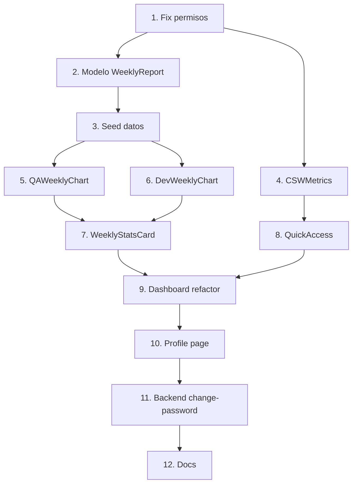

# Análisis Completo — Dashboard de Productividad por Hat

## Resumen Ejecutivo

Cada hat verá un dashboard personalizado con información relevante a su función. El sistema cargará métricas semanales (jueves a miércoles) y mostrará gráficas de tendencia multi-semana usando `LineChartTwo` (área con gradiente y múltiples series).

---

## Modelo de Datos (Backend)

### 1. WeeklyReport — Reporte semanal de productividad

```typescript
// backend/src/models/WeeklyReport.ts
interface IWeeklyReport {
  _id: ObjectId;
  employeeId: ObjectId;        // Ref Employee
  weekStart: Date;             // Jueves (inicio)
  weekEnd: Date;               // Miércoles (fin)
  type: 'qa' | 'developer' | 'general';
  
  // Métricas QA
  qa_metrics?: {
    commits_qa: number;          // Commits qa()
    acs_validated: number;       // ACs validados (pass)
    acs_automated: number;       // ACs automatizados
    acs_pending: number;         // ACs pendientes (bug/no implementado)
    automation_rate: number;     // % de automatización
  };
  
  // Métricas Developer
  dev_metrics?: {
    gross_insertions: number;    // Líneas insertadas brutas
    deletions: number;           // Líneas eliminadas
    self_churn: number;          // Reescritura propia
    net_insertions: number;      // Neto = gross - self_churn
    uip_per_day: number;         // UIP/d (métrica core)
    commits: number;             // Total commits
    working_days: number;        // Días trabajados en la semana
  };
  
  // Timestamps
  createdAt: Date;
  updatedAt: Date;
}
```

### 2. Training (futuro, para Calidad)

```typescript
// Ya existe parcialmente en la documentación
interface ICourse {
  _id: ObjectId;
  title: string;
  description: string;
  type: 'link' | 'document';
  content: string;
  status: 'active' | 'completed' | 'archived';
  assignedTo: ObjectId[];      // Empleados asignados
  completedBy: ObjectId[];     // Empleados que terminaron
  createdAt: Date;
}
```

---

## Dashboard por Tipo de Hat

### QA Analyst / Tester

**Cards principales (4 columnas):**
| Card | Dato | Color |
|------|------|-------|
| Total CSW | Cantidad total de solicitudes | Azul |
| En Trámite | Solicitudes pendientes | Amarillo/Warning |
| Aprobadas | Solicitudes aprobadas | Verde/Success |
| Rechazadas | Solicitudes rechazadas | Rojo/Error |

**Gráfica (LineChartTwo — área):**
- Título: "Reporte QA Semanal"
- Período: Últimas 8 semanas
- Series:
  - Línea 1 (azul): ACs Validados
  - Línea 2 (cyan): ACs Automatizados
- Eje X: Semanas (ej: "Jun 5", "Jun 12", "Jun 19", "Jun 26")
- Eje Y: Cantidad

**Card resumen semana actual:**
| Métrica | Valor ejemplo |
|---------|---------------|
| Período | 2026-06-19 a 2026-06-25 |
| Commits qa() | 9 |
| ACs validados (pass) | 155 |
| ACs automatizados | 181 |
| ACs pendientes | 20 |
| Tasa automatización | 100% |

**Accesos rápidos:** Mis Solicitudes, Directorio Empleados

---

### Developer / Fullstack / Frontend

**Cards principales (4 columnas):**
| Card | Dato | Color |
|------|------|-------|
| Total CSW | Solicitudes | Azul |
| En Trámite | Pendientes | Amarillo |
| UIP/d | Productividad actual | Verde |
| Commits | Commits de la semana | Púrpura |

**Gráfica (LineChartTwo — área):**
- Título: "Productividad Semanal"
- Período: Últimas 8 semanas
- Series:
  - Línea 1 (azul): Inserciones Netas
  - Línea 2 (roja light): Eliminaciones
- Eje X: Semanas
- Eje Y: Líneas de código

**Card resumen semana actual:**
| Métrica | Valor ejemplo |
|---------|---------------|
| Período | 2026-06-19 a 2026-06-25 |
| Inserciones brutas | 1,890 |
| Eliminaciones | 420 |
| Self-churn | 180 |
| Inserciones netas | 1,710 |
| UIP/d | 342 |
| Commits | 23 |
| Días trabajados | 5 |

**Accesos rápidos:** Mis Solicitudes, Directorio Empleados

---

### Technical Leader / Architect Manager

**Cards principales (4 columnas):**
| Card | Dato | Color |
|------|------|-------|
| Total Empleados | De su división | Azul |
| CSW Pendientes | Por aprobar | Amarillo |
| Aprobadas hoy | Aprobadas por mí | Verde |
| Solicitudes equipo | CSW de su equipo | Púrpura |

**Gráfica:**
- Título: "Solicitudes del Equipo"
- Series: Creadas vs Aprobadas por semana

**Accesos rápidos:** Pendientes de Aprobación, Directorio, Divisiones

---

### Human Talent Manager

**Cards principales (4 columnas):**
| Card | Dato | Color |
|------|------|-------|
| Total Empleados | Sistema completo | Azul |
| Activos | Empleados activos | Verde |
| Inactivos | Empleados inactivos | Rojo |
| Divisiones | Total divisiones | Púrpura |

**Gráfica:**
- Título: "Empleados por División" (bar chart o pie chart)

**Secciones adicionales:**
- TopDivisions (lista de divisiones)
- RecentEmployees (últimos registrados)
- EmployeesByStatus (pie chart)

**Accesos rápidos:** Empleados, Divisiones, Hats, CSW Categorías

---

### CEO / Founder / EVP (Admin)

**Ve TODO:** Todas las métricas + todas las gráficas + todos los accesos rápidos.

**Cards extras para admin:**
| Card | Dato | Color |
|------|------|-------|
| Total Hats | Cantidad de hats | Azul |
| CSW Total (sistema) | Todas las solicitudes | Púrpura |
| Tasa aprobación | % aprobadas vs total | Verde |
| Empleados nuevos | Último mes | Cyan |

---

### Quality & Training Officer

**Cards principales:**
| Card | Dato | Color |
|------|------|-------|
| Cursos activos | En progreso | Azul |
| Personas estudiando | Esta semana | Verde |
| Completaron curso | Esta semana | Púrpura |
| Pendientes examen | Sin terminar | Amarillo |

**Gráfica:**
- Título: "Progreso de Capacitación"
- Series: Personas en curso vs Completados por semana

---

### Sales Representative

**Cards principales:**
| Card | Dato | Color |
|------|------|-------|
| Mis CSW | Total solicitudes | Azul |
| En Trámite | Pendientes | Amarillo |
| Aprobadas | Ok | Verde |
| Mi División | Info | Púrpura |

---

### Ethics Officer (solo lectura)

**Cards:** Info de su división + acceso a directorio.

---

## Componentes TailAdmin Pro a Copiar

| Componente | Fuente | Uso |
|------------|--------|-----|
| `LineChartTwo` | `components/charts/line/LineChartTwo.tsx` | Gráfica de tendencia semanal (multi-serie con área) |
| `BarChartOne` | `components/charts/bar/BarChartOne.tsx` | Empleados por división (admin) |
| Cards métricas | Custom (ya existe RHMetrics) | Cards numéricas por hat |
| `Badge` | `components/ui/badge/` | Indicadores de estado |
| `Table` | `components/ui/table/` | Tabla resumen semanal |

---

## Estructura de Archivos a Crear

```
frontend/src/
├── components/dashboard/
│   ├── RHMetrics.tsx              (ya existe — admin/HR)
│   ├── TopDivisions.tsx           (ya existe — admin/HR)
│   ├── RecentEmployees.tsx        (ya existe — admin/HR)
│   ├── EmployeesByStatus.tsx      (ya existe — admin/HR)
│   ├── CSWMetrics.tsx             (NUEVO — cards de CSW para todos)
│   ├── QAWeeklyChart.tsx          (NUEVO — gráfica QA semanal)
│   ├── DevWeeklyChart.tsx         (NUEVO — gráfica Dev semanal)
│   ├── WeeklyStatsCard.tsx        (NUEVO — card resumen semana actual)
│   ├── QuickAccess.tsx            (NUEVO — accesos rápidos dinámicos)
│   └── TrainingMetrics.tsx        (NUEVO — métricas de capacitación)
│
├── pages/Dashboard/
│   └── Home.tsx                   (refactorizar con lógica por hat type)
│
└── pages/Profile/
    └── Profile.tsx                (NUEVO — configuración usuario)

backend/src/
├── models/
│   └── WeeklyReport.ts           (NUEVO)
│
├── controllers/
│   └── weeklyReport.controller.ts (NUEVO)
│
├── routes/
│   └── weeklyReport.routes.ts    (NUEVO)
│
└── database/
    └── seeds/
        └── seed-weekly-reports.ts (NUEVO — datos dummy 8 semanas)
```

---

## API Endpoints Nuevos

| Método | Ruta | Descripción |
|--------|------|-------------|
| GET | `/api/v1/reports/weekly/me` | Mis reportes semanales (últimas 8 semanas) |
| GET | `/api/v1/reports/weekly/current` | Reporte de la semana en curso |
| GET | `/api/v1/reports/weekly/:employeeId` | Reportes de un empleado (managers) |
| POST | `/api/v1/reports/weekly` | Crear/actualizar reporte semanal |
| GET | `/api/v1/reports/weekly/team/:divisionId` | Reportes del equipo (TL/Manager) |

---

## Seed de Datos Dummy (8 semanas)

Semanas: Jun 19→25, Jun 12→18, Jun 5→11, May 29→Jun 4, May 22→28, May 15→21, May 8→14, May 1→7

### QA (Jhoann Acosta)

| Semana | Commits qa() | ACs Pass | ACs Auto | Pendientes | Tasa |
|--------|-------------|----------|----------|------------|------|
| Jun 19-25 | 9 | 155 | 181 | 20 | 100% |
| Jun 12-18 | 7 | 132 | 145 | 18 | 100% |
| Jun 5-11 | 8 | 140 | 160 | 15 | 100% |
| May 29-Jun 4 | 6 | 98 | 110 | 22 | 100% |
| May 22-28 | 10 | 178 | 195 | 12 | 100% |
| May 15-21 | 5 | 85 | 90 | 25 | 100% |
| May 8-14 | 8 | 120 | 135 | 16 | 100% |
| May 1-7 | 7 | 110 | 125 | 19 | 100% |

### Developer (ejemplo para cualquier dev)

| Semana | Insertions | Deletions | Self-churn | Net | UIP/d | Commits | Días |
|--------|-----------|-----------|-----------|-----|-------|---------|------|
| Jun 19-25 | 1890 | 420 | 180 | 1710 | 342 | 23 | 5 |
| Jun 12-18 | 1560 | 380 | 150 | 1410 | 282 | 19 | 5 |
| Jun 5-11 | 2100 | 510 | 220 | 1880 | 376 | 27 | 5 |
| May 29-Jun 4 | 980 | 200 | 80 | 900 | 225 | 12 | 4 |
| May 22-28 | 1750 | 450 | 170 | 1580 | 316 | 21 | 5 |
| May 15-21 | 1320 | 310 | 130 | 1190 | 238 | 16 | 5 |
| May 8-14 | 1680 | 400 | 160 | 1520 | 304 | 20 | 5 |
| May 1-7 | 1450 | 350 | 140 | 1310 | 262 | 18 | 5 |

---

## Página /profile

La página de perfil permitirá:
- Ver información personal (nombre, email, hat, división)
- Cambiar contraseña
- Ver permisos del hat (solo lectura)
- Configurar notificaciones (futuro)

---

## Accesos Rápidos — Lógica Dinámica

```typescript
const quickAccessItems = [
  { label: "Mis Solicitudes", path: "/csw/my-requests", resource: "csw", icon: "document" },
  { label: "Nueva Solicitud CSW", path: "/csw/new", resource: "csw", action: "create", icon: "plus" },
  { label: "Pendientes de Aprobación", path: "/csw/pending", resource: "csw", action: "approve", icon: "clipboard-check" },
  { label: "Directorio Empleados", path: "/employees", resource: "employees", icon: "users" },
  { label: "Divisiones", path: "/divisions", resource: "divisions", icon: "building" },
  { label: "Gestionar Hats", path: "/roles", resource: "roles", icon: "lock" },
  { label: "Categorías CSW", path: "/csw-categories", resource: "csw_categories", icon: "tag" },
];

// Filtrar según permisos
const visibleQuickAccess = quickAccessItems.filter(item => {
  if (item.action) return can(item.resource, item.action);
  return canAccessResource(item.resource);
});
```

---

## Orden de Implementación

| Fase | Tareas | Estimado |
|------|--------|----------|
| **1. Fix bug** | Arreglar permisos en frontend (dashboard vacío para QA) | 15 min |
| **2. Modelo + API** | WeeklyReport model, controller, routes | 30 min |
| **3. Seed** | Datos dummy 8 semanas para QA y Devs | 20 min |
| **4. Componentes** | CSWMetrics, QAWeeklyChart, DevWeeklyChart, WeeklyStatsCard, QuickAccess | 1h |
| **5. Dashboard** | Refactorizar Home.tsx con lógica por hat type | 30 min |
| **6. Profile** | Página /profile básica | 20 min |
| **7. Docs** | Actualizar HATS_PERMISSIONS_SYSTEM.md | 10 min |

**Total estimado: ~3 horas de desarrollo**

---

## Notas Técnicas

- **Período semanal:** Jueves a Miércoles (alineado con el workflow del skill repository)
- **ApexCharts:** Ya instalado en el proyecto (`react-apexcharts` + `apexcharts`)
- **LineChartTwo** es el componente ideal: área con gradiente, múltiples series, smooth curve, tooltips con fecha
- **No se modifica la estructura de la BD de empleados** — WeeklyReport es collection separada
- **Los reportes se pueden generar automáticamente** (futuro) vía scripts que lean git stats

---

**Última actualización:** Junio 24, 2026


---

## Página /profile — Análisis

### Componentes base de TailAdmin Pro

Se usarán los componentes de `UserProfiles.tsx`:
- `UserMetaCard` → Adaptado: avatar + nombre + hat + división + botón editar
- `UserInfoCard` → Adaptado: info personal (email, teléfono, cédula, nacionalidad, fecha nacimiento)

### Secciones del Perfil

```
┌─────────────────────────────────────────────────────────────┐
│ 📌 Breadcrumb: Inicio > Mi Perfil                           │
├─────────────────────────────────────────────────────────────┤
│                                                             │
│ ┌─────────────────────────────────────────────────────────┐ │
│ │ [Avatar]  Manuel Lara              [Editar Perfil]      │ │
│ │           FOUNDER & SOLUTIONS ARCHITECT                 │ │
│ │           División 7 — Ejecutiva                        │ │
│ │           ● Puede aprobar CSW                           │ │
│ └─────────────────────────────────────────────────────────┘ │
│                                                             │
│ ┌─────────────────────────────────────────────────────────┐ │
│ │ Información Personal                        [Editar]    │ │
│ │                                                         │ │
│ │ Nombre completo    Email                                │ │
│ │ Manuel Lara        admin@unlimitech.cloud               │ │
│ │                                                         │ │
│ │ Teléfono           Cédula                               │ │
│ │ +573001000001      FOUNDER001                           │ │
│ │                                                         │ │
│ │ Nacionalidad       Fecha de nacimiento                  │ │
│ │ Colombia           15 de enero de 1985                  │ │
│ └─────────────────────────────────────────────────────────┘ │
│                                                             │
│ ┌─────────────────────────────────────────────────────────┐ │
│ │ Seguridad                                               │ │
│ │                                                         │ │
│ │ Cambiar Contraseña                                      │ │
│ │ ┌─────────────────┐ ┌─────────────────┐                │ │
│ │ │ Nueva contraseña│ │ Confirmar       │  [Guardar]     │ │
│ │ └─────────────────┘ └─────────────────┘                │ │
│ └─────────────────────────────────────────────────────────┘ │
│                                                             │
│ ┌─────────────────────────────────────────────────────────┐ │
│ │ Preferencias                                            │ │
│ │                                                         │ │
│ │ Tema de color:  ○ Claro  ● Oscuro  ○ Sistema           │ │
│ └─────────────────────────────────────────────────────────┘ │
│                                                             │
│ ┌─────────────────────────────────────────────────────────┐ │
│ │ Accesos Directos                            [Editar]    │ │
│ │                                                         │ │
│ │ 📋 Mis Solicitudes    👥 Directorio    🎩 Hats         │ │
│ │ ✅ Pendientes Aprob.  🏢 Divisiones                    │ │
│ └─────────────────────────────────────────────────────────┘ │
│                                                             │
│ ┌─────────────────────────────────────────────────────────┐ │
│ │ Mi Hat — Permisos                                       │ │
│ │                                                         │ │
│ │ employees: ver, crear, actualizar, eliminar             │ │
│ │ divisions: ver, crear, actualizar, eliminar             │ │
│ │ roles: ver, crear, actualizar, eliminar                 │ │
│ │ csw: ver, crear, actualizar, aprobar, cancelar, eliminar│ │
│ │ ... (solo lectura)                                      │ │
│ └─────────────────────────────────────────────────────────┘ │
└─────────────────────────────────────────────────────────────┘
```

### Endpoints necesarios

| Método | Ruta | Descripción |
|--------|------|-------------|
| GET | `/api/v1/auth/me` | Ya existe — datos del usuario actual |
| PUT | `/api/v1/employees/me` | NUEVO — actualizar mi perfil (nombre, teléfono, foto) |
| PUT | `/api/v1/auth/change-password` | NUEVO — cambiar mi contraseña |

### Archivos

```
frontend/src/pages/Profile/
├── Profile.tsx               # Página principal
├── ProfileMetaCard.tsx       # Avatar + nombre + hat (basado en UserMetaCard)
├── ProfileInfoCard.tsx       # Info personal (basado en UserInfoCard)
├── ProfileSecurityCard.tsx   # Cambiar contraseña
├── ProfilePreferencesCard.tsx # Tema de color
└── ProfileQuickAccessCard.tsx # Accesos directos configurables
```

### Ruta en App.tsx

```typescript
<Route path="/profile" element={<Profile />} />
```

No requiere PermissionRoute — todos los usuarios autenticados acceden a su perfil.

---

## Resumen Final de Implementación Completa

### Fases

| # | Fase | Descripción | Estimado |
|---|------|-------------|----------|
| 1 | **Fix permisos** | Arreglar carga de permisos (QA no ve dashboard) | 15 min |
| 2 | **Modelo WeeklyReport** | Schema + controller + routes | 30 min |
| 3 | **Seed datos dummy** | 8 semanas para QA y Devs | 20 min |
| 4 | **CSWMetrics component** | 4 cards de CSW (para todos con permiso csw) | 15 min |
| 5 | **QAWeeklyChart** | LineChartTwo con ACs validados/automatizados | 25 min |
| 6 | **DevWeeklyChart** | LineChartTwo con insertions/deletions | 25 min |
| 7 | **WeeklyStatsCard** | Tabla resumen semana actual | 15 min |
| 8 | **QuickAccess** | Links dinámicos por permiso | 15 min |
| 9 | **Dashboard refactor** | Home.tsx con lógica por hat type | 30 min |
| 10 | **Profile page** | 5 sub-componentes + ruta | 45 min |
| 11 | **Backend /change-password** | Endpoint nuevo | 15 min |
| 12 | **Docs** | Actualizar documentación | 10 min |

**Total estimado: ~4.5 horas**

### Dependencias


