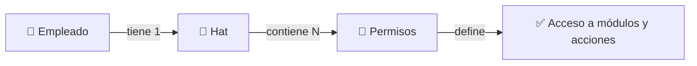
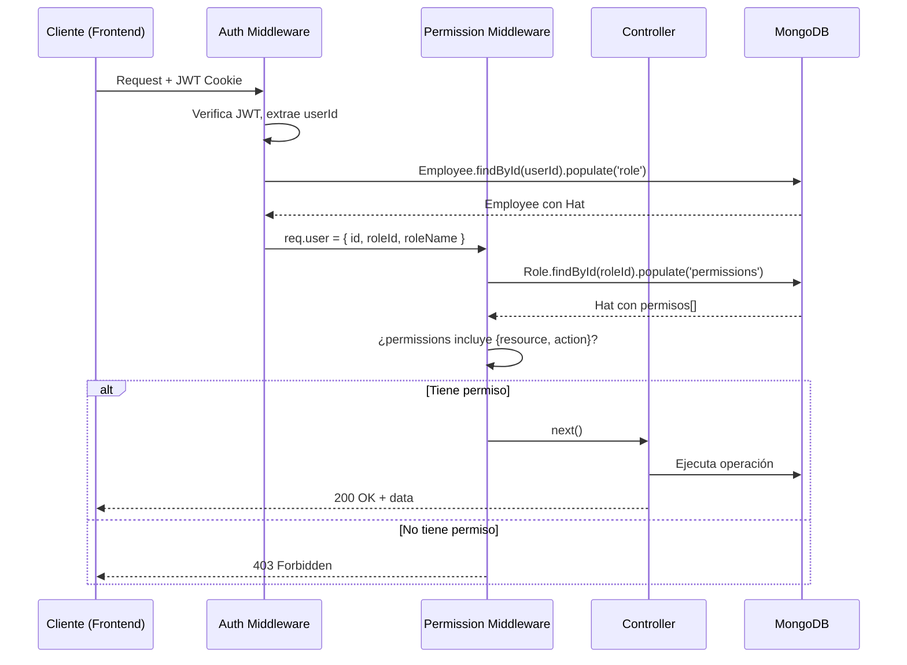
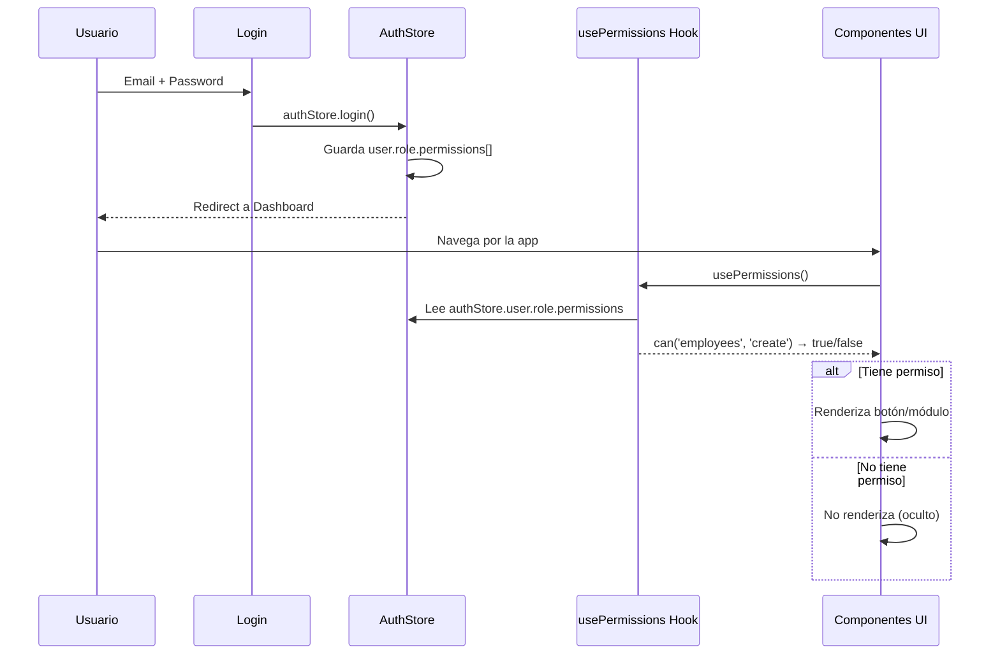
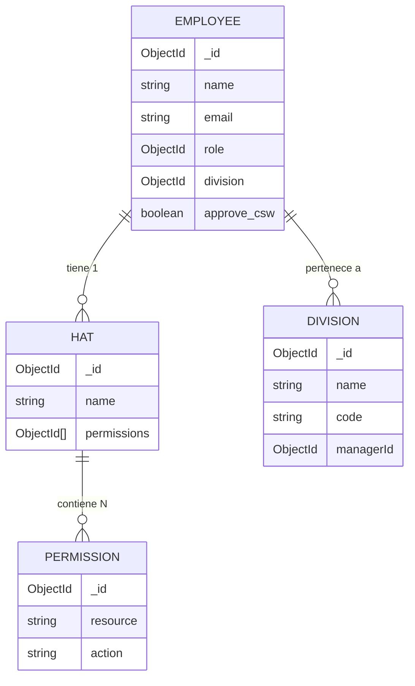
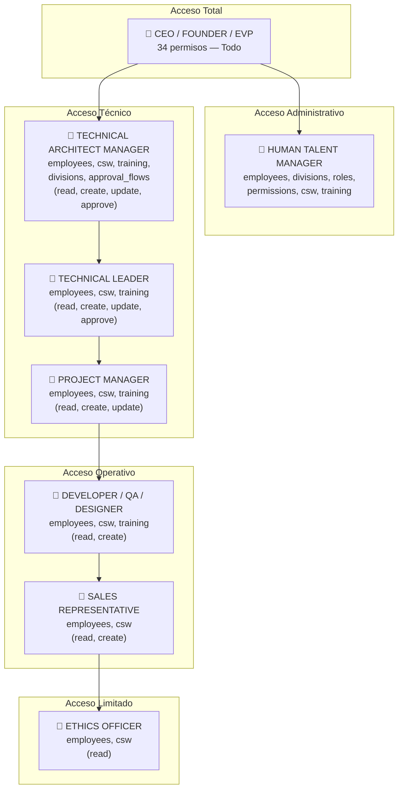
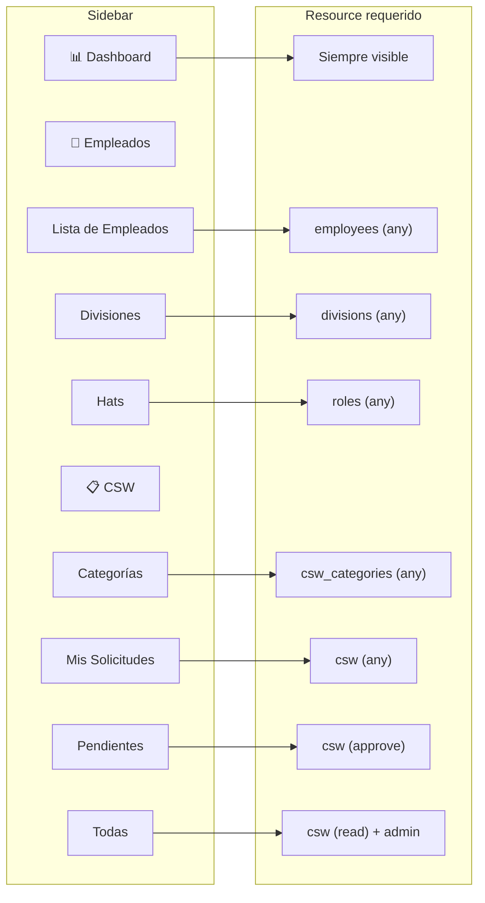
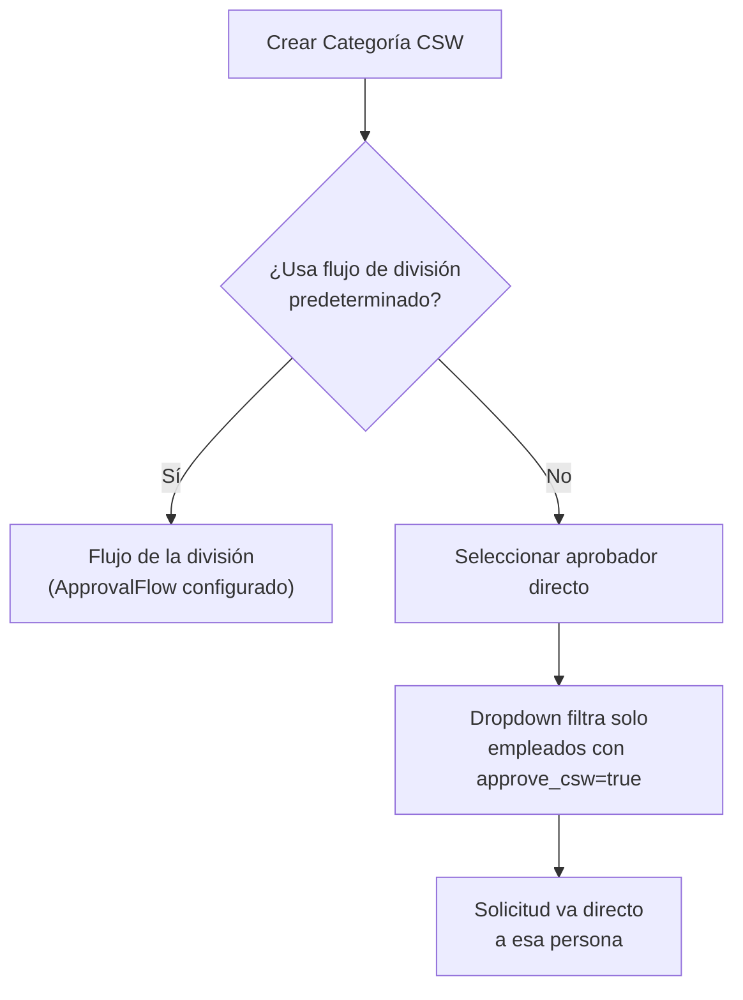
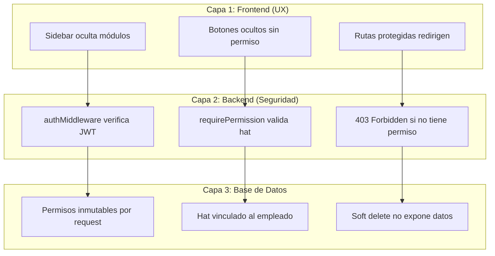
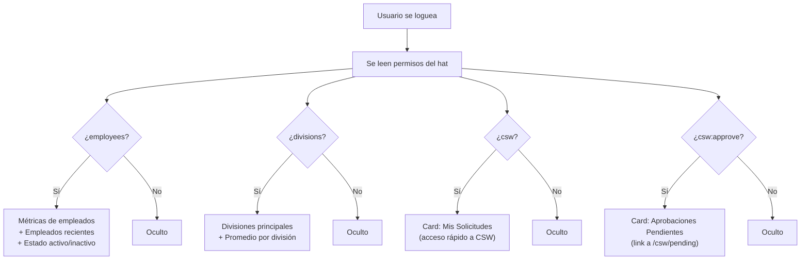

# Sistema de Hats y Permisos — RH Unlimitech Cloud

## Visión General

El sistema de control de acceso se basa en **Hats** (sombreros funcionales) que agrupan permisos. Cada empleado tiene **un hat asignado** que determina qué módulos puede ver y qué acciones puede realizar.



---

## Estructura de Datos

### Permiso

Un permiso es la unidad mínima de acceso. Combina un **recurso** (módulo) con una **acción** (operación).

```typescript
interface Permission {
  _id: string;
  resource: string;  // Módulo del sistema
  action: string;    // Operación permitida
}
```

**Recursos disponibles:**

| Resource | Módulo | Descripción |
|----------|--------|-------------|
| `employees` | Empleados | Gestión de personal |
| `divisions` | Divisiones | Estructura organizacional |
| `roles` | Hats | Gestión de hats y permisos |
| `permissions` | Permisos | CRUD de permisos individuales |
| `csw` | Solicitudes CSW | Canal de Solicitudes de Trabajo |
| `csw_categories` | Categorías CSW | Tipos de solicitud |
| `approval_flows` | Flujos de Aprobación | Configuración de cadenas |
| `training` | Capacitaciones | Cursos y formación |

**Acciones disponibles:**

| Action | Operación | Descripción |
|--------|-----------|-------------|
| `read` | Leer/Ver | Ver listados y detalles |
| `create` | Crear | Crear nuevos registros |
| `update` | Actualizar | Modificar registros existentes |
| `delete` | Eliminar | Soft delete de registros |
| `approve` | Aprobar | Aprobar solicitudes CSW |
| `cancel` | Cancelar | Cancelar solicitudes CSW |

### Hat

Un hat agrupa permisos y se asigna a empleados.

```typescript
interface Hat {
  _id: string;
  name: string;           // Nombre del hat (ej: "TECHNICAL LEADER")
  permissions: ObjectId[]; // Array de IDs de permisos
}
```

### Empleado

Cada empleado tiene exactamente un hat asignado.

```typescript
interface Employee {
  _id: string;
  name: string;
  email: string;
  role: ObjectId;         // Referencia al Hat
  division: ObjectId;     // Referencia a la División
  approve_csw: boolean;   // Si puede aprobar solicitudes CSW
  // ... otros campos
}
```

---

## Flujo de Verificación

### Backend (Seguridad Real)



**Código del middleware:**

```typescript
// backend/src/middleware/permission.ts
export const requirePermission = (resource: string, action: string) => {
  return async (req, res, next) => {
    const role = await Role.findById(req.user.roleId).populate('permissions');
    const hasPermission = role.permissions.some(
      (perm) => perm.resource === resource && perm.action === action
    );
    if (!hasPermission) {
      throw new AppError('No tienes permisos para realizar esta acción', 403);
    }
    next();
  };
};
```

### Frontend (UX — Ocultar lo que no puede hacer)



---

## Diagrama de Relaciones



---

## Hats del Sistema

### Matriz de Permisos por Hat



### Tabla detallada

| Hat | employees | divisions | roles | permissions | csw | csw_categories | approval_flows | training |
|-----|-----------|-----------|-------|-------------|-----|----------------|----------------|----------|
| CEO/FOUNDER/EVP | CRUD | CRUD | CRUD | CRUD | CRUD+A+C | CRUD | CRUD | CRUD |
| HUMAN TALENT MGR | CRUD | CRUD | CRUD | CRUD | CRUD+A+C | CRUD | — | CRUD |
| TECH ARCHITECT MGR | R,C,U,A | R,C,U | — | — | R,C,U,A | — | R,C,U | R,C,U |
| TECHNICAL LEADER | R,C,U,A | — | — | — | R,C,U,A | — | — | R,C,U,A |
| PROJECT MANAGER | R,C,U | — | — | — | R,C,U | — | — | R,C,U |
| DEVELOPER | R,C | — | — | — | R,C | — | — | R,C |
| QA ANALYST | R,C | — | — | — | R,C | — | — | R,C |
| UI/UX DESIGNER | R,C | — | — | — | R,C | — | — | R,C |
| SALES REP | R,C | — | — | — | R,C | — | — | — |
| ETHICS OFFICER | R | — | — | — | R | — | — | — |
| QUALITY OFFICER | R,C,U | — | — | — | R,C,U | — | — | R,C,U |

*R=read, C=create, U=update, D=delete, A=approve*

---

## Sidebar Dinámico

### Mapping de módulos del sidebar a resources



### Lógica de filtrado

```typescript
// Cada item del sidebar define qué resource necesita
const navItems = [
  { name: "Dashboard", path: "/", resource: null }, // Siempre visible
  {
    name: "Empleados",
    resource: null, // Se muestra si ALGÚN subitem es visible
    subItems: [
      { name: "Lista", path: "/employees", resource: "employees" },
      { name: "Divisiones", path: "/divisions", resource: "divisions" },
      { name: "Hats", path: "/roles", resource: "roles" },
    ],
  },
  {
    name: "CSW",
    resource: null,
    subItems: [
      { name: "Categorías", path: "/csw-categories", resource: "csw_categories" },
      { name: "Mis Solicitudes", path: "/csw/my-requests", resource: "csw" },
      { name: "Pendientes", path: "/csw/pending", resource: "csw", action: "approve" },
      { name: "Todas", path: "/csw/all", resource: "csw" }, // Solo admin
    ],
  },
];

// Filtrado
const visibleItems = navItems.filter(item => {
  if (!item.resource && !item.subItems) return true; // Dashboard
  if (item.subItems) {
    // Mostrar padre si al menos 1 subitem es visible
    return item.subItems.some(sub => canAccessResource(sub.resource));
  }
  return canAccessResource(item.resource);
});
```

---

## Campo approve_csw

### Propósito

El campo `approve_csw` en el empleado es un booleano que indica si esa persona puede ser asignada como **aprobador directo** en flujos CSW.



**Diferencia entre hat permissions y approve_csw:**

| Concepto | Qué controla |
|----------|-------------|
| Hat permission `csw:approve` | El permiso técnico de poder hacer click en "Aprobar" en una solicitud que le llegue |
| `approve_csw: true` | Si aparece como opción seleccionable cuando se configura un flujo de aprobación o aprobador directo |

Un usuario puede tener `csw:approve` en su hat pero `approve_csw: false` — significaría que técnicamente podría aprobar pero no está habilitado para ser asignado como aprobador en flujos.

---

## Seguridad en Capas



**Principio:** El frontend es solo UX. La seguridad real está en el backend. Aunque alguien manipule el frontend, el backend siempre verifica permisos antes de ejecutar cualquier operación.

---

## Endpoints de la API

### Hats

| Método | Ruta | Permiso | Descripción |
|--------|------|---------|-------------|
| GET | /api/v1/roles | roles:read | Listar hats |
| GET | /api/v1/roles/:id | roles:read | Detalle + empleados asignados |
| POST | /api/v1/roles | roles:create | Crear hat |
| PUT | /api/v1/roles/:id | roles:update | Actualizar hat |
| DELETE | /api/v1/roles/:id | roles:delete | Eliminar hat |
| GET | /api/v1/roles/permissions/all | roles:read | Listar todos los permisos disponibles |

### Empleados (relevante a permisos)

| Método | Ruta | Permiso | Descripción |
|--------|------|---------|-------------|
| GET | /api/v1/employees/csw-approvers | employees:read | Empleados con approve_csw=true |

---

## Cómo agregar un nuevo módulo al sistema

1. **Crear permisos en la BD:**
   ```javascript
   await Permission.create([
     { resource: 'nuevo_modulo', action: 'read' },
     { resource: 'nuevo_modulo', action: 'create' },
     { resource: 'nuevo_modulo', action: 'update' },
     { resource: 'nuevo_modulo', action: 'delete' },
   ]);
   ```

2. **Agregar el resource al tipo TypeScript (frontend):**
   ```typescript
   // frontend/src/utils/permissions.ts
   export type PermissionResource = 
     | 'employees' | 'divisions' | ... | 'nuevo_modulo';
   ```

3. **Proteger rutas en el backend:**
   ```typescript
   router.get('/', requirePermission('nuevo_modulo', 'read'), getItems);
   router.post('/', requirePermission('nuevo_modulo', 'create'), createItem);
   ```

4. **Agregar al sidebar con resource:**
   ```typescript
   { name: "Nuevo Módulo", path: "/nuevo-modulo", resource: "nuevo_modulo" }
   ```

5. **Asignar permisos a los hats correspondientes** desde la UI de gestión de Hats.

---

## Archivos Clave

| Archivo | Propósito |
|---------|-----------|
| `backend/src/middleware/permission.ts` | Middleware requirePermission |
| `backend/src/middleware/auth.ts` | JWT verification, carga user.roleId |
| `backend/src/models/Role.ts` | Modelo Hat (name + permissions[]) |
| `backend/src/models/Permission.ts` | Modelo Permission (resource + action) |
| `backend/src/models/Employee.ts` | Modelo Employee (role, approve_csw) |
| `frontend/src/utils/permissions.ts` | Tipos y helpers de permisos |
| `frontend/src/hooks/usePermissions.ts` | Hook can(), canAccessResource() |
| `frontend/src/layout/AppSidebar.tsx` | Sidebar (pendiente: filtrado dinámico) |
| `frontend/src/stores/views/AuthStore.live.ts` | Carga permisos al login |

---

**Última actualización:** Junio 24, 2026


---

## Dashboard Dinámico por Permisos

El Dashboard se adapta automáticamente según los permisos del hat del usuario logueado.

### Lógica de Visibilidad



### Qué ve cada tipo de Hat

| Hat | Métricas | Divisiones | Empleados Recientes | Estado Emp. | CSW Pendientes | Mis CSW |
|-----|----------|------------|---------------------|-------------|----------------|---------|
| CEO / FOUNDER | ✅ | ✅ | ✅ | ✅ | ✅ | ✅ |
| HUMAN TALENT MGR | ✅ | ✅ | ✅ | ✅ | — | ✅ |
| TECH ARCHITECT | ✅ | — | ✅ | ✅ | ✅ | ✅ |
| TECHNICAL LEADER | ✅ | — | ✅ | ✅ | ✅ | ✅ |
| PROJECT MANAGER | ✅ | — | ✅ | ✅ | — | ✅ |
| DEVELOPER / QA | ✅ | — | ✅ | ✅ | — | ✅ |
| SALES REP | ✅ | — | ✅ | ✅ | — | ✅ |
| ETHICS OFFICER | ✅ | — | ✅ | ✅ | — | — |

### Componentes del Dashboard

| Componente | Resource requerido | Descripción |
|------------|-------------------|-------------|
| `RHMetrics` | `employees` OR `divisions` | Cards de métricas (total, activos, divisiones, inactivos) |
| `TopDivisions` | `divisions` | Lista de divisiones con descripción |
| `RecentEmployees` | `employees` | Últimos empleados registrados |
| `EmployeesByStatus` | `employees` | Gráfica activos vs inactivos |
| Card "Aprobaciones Pendientes" | `csw:approve` | Link directo a solicitudes por aprobar |
| Card "Mis Solicitudes" | `csw` (sin approve) | Link directo a mis solicitudes |

### Implementación

```typescript
// pages/Dashboard/Home.tsx
const { can, canAccessResource } = usePermissions();

const canSeeEmployees = canAccessResource('employees');
const canSeeDivisions = canAccessResource('divisions');
const canSeeCSW = canAccessResource('csw');
const canApproveCSW = can('csw', 'approve');

// Renderizado condicional
{canSeeEmployees && <RHMetrics />}
{canSeeDivisions && <TopDivisions />}
{canApproveCSW && <ApprovalsPendingCard />}
```

---

## Resumen de Control de Acceso Implementado

### Capas de protección

| Capa | Componente | Función |
|------|-----------|---------|
| **Sidebar** | `AppSidebar.tsx` | Oculta módulos sin permiso (observer + useMemo) |
| **Rutas** | `PermissionRoute.tsx` | Redirige a `/` si accede por URL directa sin permiso |
| **Botones** | `usePermissions().can()` | Oculta botones de Crear/Editar/Eliminar |
| **Dashboard** | `Home.tsx` | Muestra cards según permisos del hat |
| **Backend** | `requirePermission()` | Retorna 403 si no tiene permiso (seguridad real) |

### Archivos modificados para esta implementación

| Archivo | Cambio |
|---------|--------|
| `frontend/src/layout/AppSidebar.tsx` | Sidebar dinámico con filtrado por permisos |
| `frontend/src/components/auth/PermissionRoute.tsx` | Nuevo componente de protección de rutas |
| `frontend/src/App.tsx` | Todas las rutas envueltas con PermissionRoute |
| `frontend/src/pages/Dashboard/Home.tsx` | Dashboard con cards condicionales |
| `frontend/src/pages/Hats/HatsList.tsx` | Botón "Nuevo Hat" condicionado |
| `frontend/src/pages/Employees/EmployeesList.tsx` | Botón "Nuevo Empleado" condicionado |
| `frontend/src/pages/Divisions/DivisionsList.tsx` | Botón "Nueva División" condicionado |
