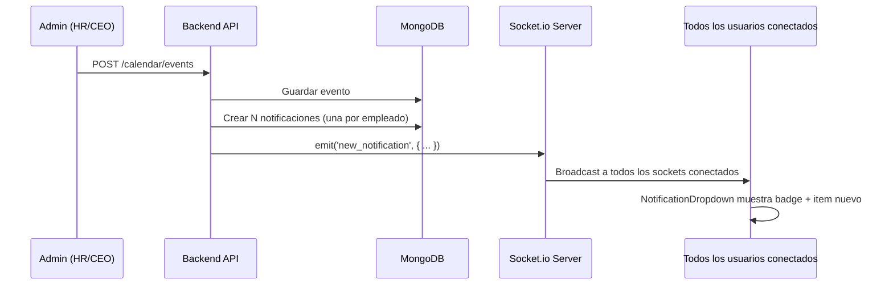

# Sistema de Notificaciones — Análisis de Arquitectura

## Visión General

Cuando se crea un evento en el calendario, todos los usuarios reciben una notificación en tiempo real. Las notificaciones se persisten en BD para que los usuarios las vean al loguearse.

---

## Tecnología: Socket.io (WebSocket)

**¿Por qué Socket.io y no webhooks?**
- Webhooks son server-to-server. Necesitamos server-to-browser (push en tiempo real).
- Socket.io es bidireccional, maneja reconexión automática, y funciona con fallback a polling.
- Ya tenemos Express — Socket.io se integra directamente.

---

## Modelo de Datos

### Notification

```typescript
interface INotification {
  _id: ObjectId;
  recipientId: ObjectId;        // Empleado destinatario
  type: 'event_created' | 'event_updated' | 'csw_approved' | 'csw_rejected' | 'csw_pending' | 'general';
  title: string;                // "Nuevo evento: Reunión semanal"
  message: string;              // "Manuel Lara creó un evento para el 26 de junio"
  link?: string;                // "/calendar" o "/csw/view/xxx"
  read: boolean;                // Si ya fue leída
  readAt?: Date;
  data?: any;                   // Datos adicionales (eventId, cswId, etc)
  createdAt: Date;
}
```

---

## Flujo de Notificación al Crear Evento



---

## Implementación Backend

### 1. Instalar Socket.io
```bash
cd backend
npm install socket.io
npm install -D @types/socket.io
```

### 2. Configurar Socket.io en server.ts
```typescript
import { createServer } from 'http';
import { Server as SocketServer } from 'socket.io';

const httpServer = createServer(app);
const io = new SocketServer(httpServer, {
  cors: { origin: config.frontend.url, credentials: true }
});

// Autenticación del socket
io.use(async (socket, next) => {
  const token = socket.handshake.auth.token;
  // Verificar JWT...
  next();
});

io.on('connection', (socket) => {
  const userId = socket.data.userId;
  socket.join(`user:${userId}`); // Room personal
  socket.join('all'); // Room global
});

// Exportar io para usar en controllers
export { io };
```

### 3. Emitir al crear evento
```typescript
// En calendarEvent.controller.ts → createEvent()
// Después de guardar el evento:
const allEmployees = await Employee.find({ deleted: { $ne: true } }).select('_id');
const notifications = allEmployees.map(emp => ({
  recipientId: emp._id,
  type: 'event_created',
  title: `Nuevo evento: ${event.title}`,
  message: `${req.user.name} creó un evento para el ${formatDate(event.startDate)}`,
  link: '/calendar',
  read: false,
  data: { eventId: event._id },
}));
await Notification.insertMany(notifications);

// Emit via Socket.io
io.to('all').emit('new_notification', {
  type: 'event_created',
  title: `Nuevo evento: ${event.title}`,
});
```

---

## Implementación Frontend

### 1. Instalar Socket.io client
```bash
cd frontend
npm install socket.io-client
```

### 2. Socket Provider
```typescript
// src/context/SocketContext.tsx
const socket = io('http://localhost:9050', {
  auth: { token: localStorage.getItem('auth_token') }
});

socket.on('new_notification', (data) => {
  // Incrementar badge counter
  // Mostrar toast
  notify.info(data.title);
});
```

### 3. NotificationDropdown (ya existe en TailAdmin)
- Badge con contador de no leídas
- Lista de notificaciones con scroll
- Click marca como leída
- Link navega al recurso

---

## Endpoints de Notificaciones

| Método | Ruta | Descripción |
|--------|------|-------------|
| GET | /api/v1/notifications | Mis notificaciones (últimas 50) |
| GET | /api/v1/notifications/unread-count | Contador de no leídas |
| PUT | /api/v1/notifications/:id/read | Marcar como leída |
| PUT | /api/v1/notifications/read-all | Marcar todas como leídas |

---

## Tipos de Notificación

| Tipo | Cuándo se dispara | Destinatarios |
|------|-------------------|---------------|
| `event_created` | Se crea un evento | Todos los empleados |
| `event_updated` | Se modifica un evento | Todos |
| `csw_pending` | Se crea un CSW | Aprobadores del flujo |
| `csw_approved` | Se aprueba un CSW | Solicitante |
| `csw_rejected` | Se rechaza un CSW | Solicitante |
| `general` | Mensaje del sistema | Específicos o todos |

---

## Orden de Implementación

| # | Tarea | Estimado |
|---|-------|----------|
| 1 | Modelo Notification + endpoints | 20 min |
| 2 | Socket.io server setup | 30 min |
| 3 | Socket.io client + provider | 20 min |
| 4 | NotificationDropdown en header | 30 min |
| 5 | Emit al crear evento | 15 min |
| 6 | Emit al crear/aprobar/rechazar CSW | 20 min |
| 7 | Toast en tiempo real | 10 min |

**Total: ~2.5 horas**

---

## CalendarEvent — Schema Completo (DAO)

```typescript
{
  title: String (requerido, max 200),
  description: String (opcional, max 500),
  startDate: Date (requerido),
  endDate: Date (requerido),
  startTime: String (opcional, formato "HH:mm"),
  endTime: String (opcional, formato "HH:mm"),
  color: Enum ['primary', 'success', 'warning', 'danger'] (default: 'primary'),
  type: Enum ['meeting', 'holiday', 'reminder', 'deadline', 'training', 'other'] (default: 'other'),
  allDay: Boolean (default: true),
  link: String (opcional, URL del evento),
  createdBy: ObjectId ref Employee (requerido),
  notifyBefore: Number (minutos, default: 0),
  createdAt: Date (auto),
  updatedAt: Date (auto),
}

Índices:
- { startDate: 1, endDate: 1 }
- { type: 1 }
- { createdBy: 1 }
```

---

**Última actualización:** Junio 24, 2026
