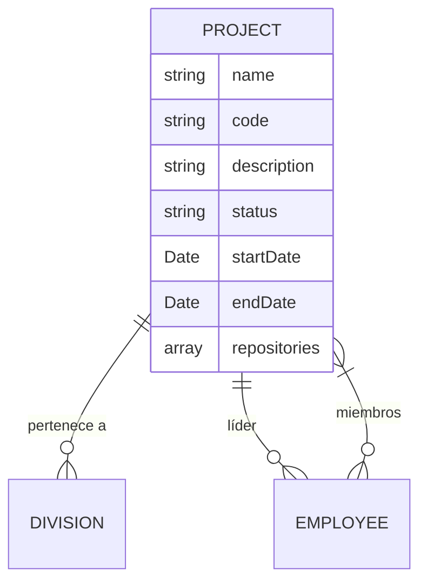

# Módulo de Proyectos — RH Unlimitech Cloud

## Visión General

El módulo de Proyectos permite gestionar los proyectos de la organización, asignarlos a divisiones y vincular empleados como miembros del equipo. Cada proyecto tiene un líder, miembros, estado y links asociados (repositorios, documentación, páginas, etc).

---

## Modelo de Datos

```typescript
interface IProject {
  _id: ObjectId;
  name: string;                    // Nombre del proyecto
  code: string;                    // Código único (uppercase, ej: "MTECH")
  description?: string;            // Descripción (máx 500 chars)
  divisionId: ObjectId;            // División responsable
  status: 'active' | 'on_hold' | 'completed' | 'cancelled';
  startDate?: Date;                // Fecha de inicio
  endDate?: Date;                  // Fecha de fin (si completado)
  members: ObjectId[];             // Empleados asignados
  leadId: ObjectId;                // Líder del proyecto (requerido)
  repositories: [{                 // Links asociados
    name: string;                  // Nombre descriptivo (ej: "Frontend", "Docs")
    url: string;                   // URL completa
    type: string;                  // 'github' | 'gitlab' | 'bitbucket' | 'other'
  }];
  
  deleted: boolean;
  deletedAt?: Date;
  createdAt: Date;
  updatedAt: Date;
}
```

### Relaciones



---

## API Endpoints

| Método | Ruta | Permiso | Descripción |
|--------|------|---------|-------------|
| GET | `/api/v1/projects/my-projects` | Auth (sin permiso especial) | Mis proyectos (donde soy miembro o líder) |
| GET | `/api/v1/projects` | `projects:read` | Listar todos los proyectos |
| GET | `/api/v1/projects/:id` | `projects:read` | Detalle de un proyecto (con miembros populados) |
| POST | `/api/v1/projects` | `projects:create` | Crear proyecto |
| PUT | `/api/v1/projects/:id` | `projects:update` | Actualizar proyecto |
| DELETE | `/api/v1/projects/:id` | `projects:delete` | Soft delete |
| POST | `/api/v1/projects/:id/members` | `projects:update` | Agregar miembro |
| DELETE | `/api/v1/projects/:id/members/:employeeId` | `projects:update` | Remover miembro |

### Detalle del GET /projects/:id

Devuelve el proyecto con:
- `divisionId` populado (name, code)
- `members` populado (name, email, photo, role.name) — **deduplicado**
- `leadId` populado (name, email, photo)
- `repositories[]` tal cual

---

## Permisos

| Permiso | Quién lo tiene |
|---------|----------------|
| `projects:read` | CEO, Founder, EVP, HTM, TAM, TL, PM, Developer, QA, Designer |
| `projects:create` | CEO, Founder, EVP |
| `projects:update` | CEO, Founder, EVP |
| `projects:delete` | CEO, Founder, EVP |

**Nota:** `/projects/my-projects` no requiere permiso específico — cualquier usuario autenticado ve sus propios proyectos.

---

## Frontend — Componentes

### Sidebar

```
📁 Proyectos → /projects (resource: 'projects')
```

Visible si el usuario tiene al menos un permiso en `projects`.

### Páginas

| Ruta | Componente | Descripción |
|------|-----------|-------------|
| `/projects` | `ProjectsList.tsx` | Lista con tabla, buscador, filtro por estado, paginación |
| `/projects/:id` | `ProjectDetail.tsx` | Detalle con info cards, links asociados, tabla de equipo |

### Componentes

| Componente | Ubicación | Función |
|-----------|-----------|---------|
| `ProjectsList.tsx` | `pages/Projects/` | Lista principal con CRUD |
| `ProjectDetail.tsx` | `pages/Projects/` | Vista de detalle |
| `ProjectFormModal.tsx` | `components/projects/` | Modal crear/editar |

### ProjectsList Features

- Buscador con debounce (nombre, código, descripción)
- Filtro por estado (SearchableSelect)
- Selector "Mostrar X registros"
- Paginación
- Columna Acciones: Ver (→ detalle), Editar (→ modal), Eliminar (→ confirmar)
- Botón "Nuevo Proyecto" condicionado por `projects:create`
- Avatares de miembros con overflow (+N)
- Badge de estado con colores

### ProjectFormModal Features

- Skeleton loading mientras carga divisiones/empleados
- Campos: Nombre, Código, Descripción, División, Estado, Líder
- Líder **requerido** (SearchableSelect)
- Miembros del equipo: lista con checkboxes + buscador
- Links asociados: array dinámico (nombre + URL, agregar/eliminar)
- Validaciones: nombre, código, división, líder requeridos
- Toast de éxito/error

### ProjectDetail Features

- Header con nombre, badge estado, código, descripción
- 4 info cards: División, Líder, Miembros, Fecha inicio
- Sección "Links asociados" con cards clickeables (target=_blank)
- Tabla "Equipo del Proyecto" con nombre, email, hat, badge "Líder"
- Botón "Volver"

---

## Dashboard — Mis Proyectos

En el dashboard, todos los usuarios con `projects:read` ven una card "Mis Proyectos" que lista los proyectos donde están asignados con:
- Nombre del proyecto
- Código (mono)
- Badge de estado (Activo/Pausa/Completado)
- Link "Ver todos →" que navega a `/projects`

---

## Seed de Datos

6 proyectos creados para División 4 (Infraestructura):

| Código | Nombre | Estado | Miembros |
|--------|--------|--------|----------|
| MTECH | MasterTech | Activo | 5 |
| JEJ | JE Jaimes | Activo | 3 |
| PAC | Pacific | Activo | 3 |
| INT | Proyectos Internos | Activo | 4 |
| IDM | IDM | En Pausa | 3 |
| SOP | Soporte | Activo | 3 |

---

## Consideraciones Técnicas

### Deduplicación de miembros
El `getProjectById` deduplica el array `members` en el response para prevenir duplicados que puedan existir en la BD.

### Populate anidado
Los miembros se populan con populate anidado para traer `role.name`:
```typescript
.populate({
  path: 'members',
  select: 'name email photo role',
  populate: { path: 'role', select: 'name' }
})
```

### Links asociados (antes "Repositorios")
Campo flexible para almacenar cualquier tipo de link:
- Repositorios GitHub/GitLab
- Documentación
- Páginas de producción
- Herramientas de CI/CD
- Cualquier URL relevante al proyecto

No requiere migración — MongoDB acepta el campo nuevo automáticamente.

---

**Última actualización:** Junio 24, 2026
