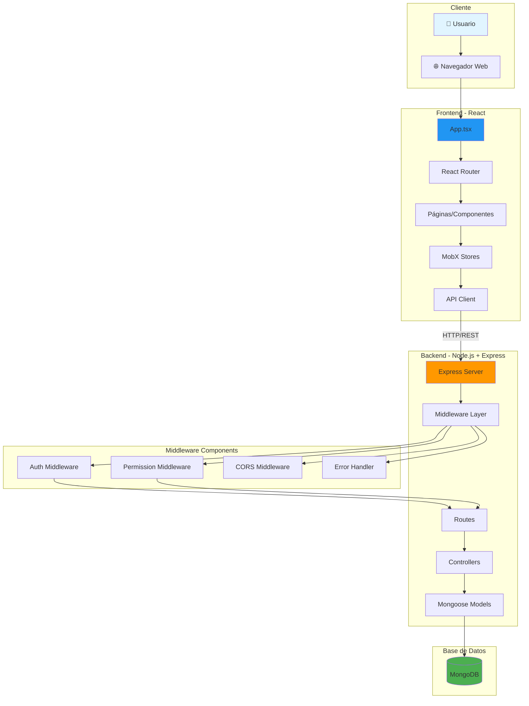
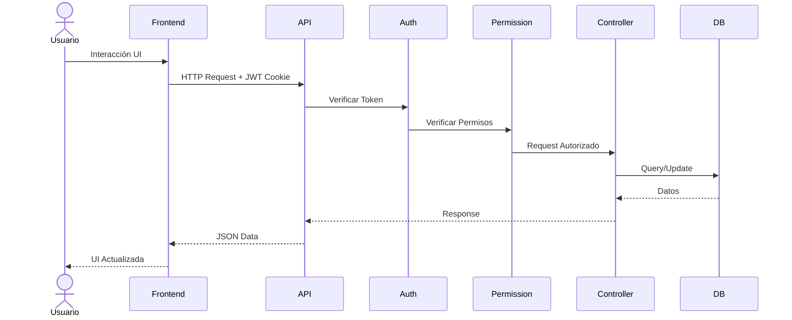
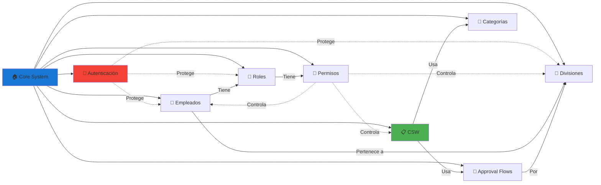
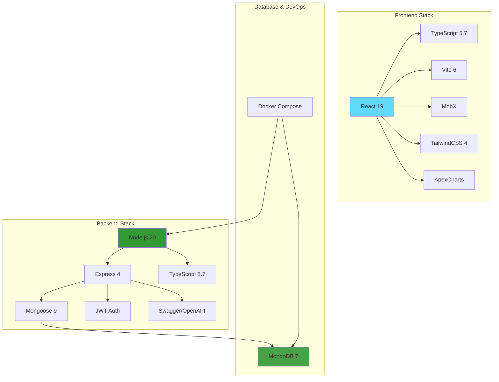
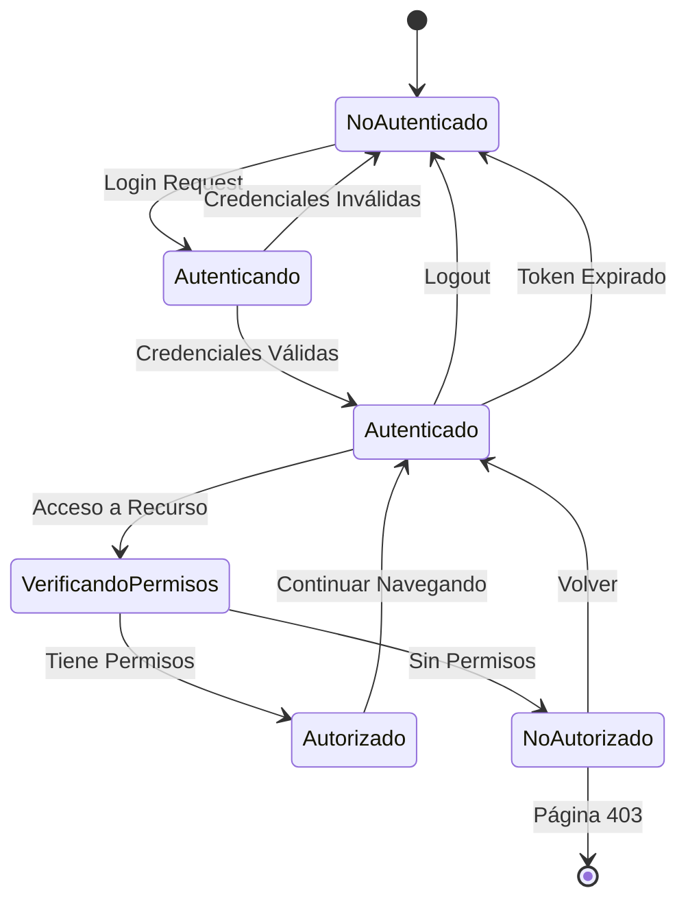

# Diagrama General del Sistema RH-UNLIMITECH

## Arquitectura General



## Flujo de Datos Principal



## Módulos del Sistema



## Stack Tecnológico



## Flujo de Autenticación y Autorización



## Arquitectura de Carpetas

```mermaid
graph TB
    ROOT[/ RH-UNLIMITECH-CLOUD]
    
    ROOT --> BACKEND[📁 backend]
    ROOT --> FRONTEND[📁 frontend]
    ROOT --> DOCS[📁 docs]
    ROOT --> DOCKER[🐳 docker-compose.yml]
    
    BACKEND --> SRC_B[📁 src]
    SRC_B --> CONTROLLERS_B[📁 controllers]
    SRC_B --> MODELS_B[📁 models]
    SRC_B --> ROUTES_B[📁 routes]
    SRC_B --> MIDDLEWARE_B[📁 middleware]
    SRC_B --> CONFIG_B[📁 config]
    
    FRONTEND --> SRC_F[📁 src]
    SRC_F --> PAGES[📁 pages]
    SRC_F --> COMPONENTS[📁 components]
    SRC_F --> STORES[📁 stores]
    SRC_F --> API[📁 api]
    SRC_F --> LAYOUT[📁 layout]
    
    DOCS --> DIAGRAMS[📁 diagrams]
    
    style ROOT fill:#1976d2
    style BACKEND fill:#ff9800
    style FRONTEND fill:#2196f3
    style DOCS fill:#4caf50
```

## Para visualizar estos diagramas:

1. Copia el código Mermaid
2. Ve a [https://mermaid.live/](https://mermaid.live/)
3. Pega el código en el editor
4. Exporta como PNG o SVG
