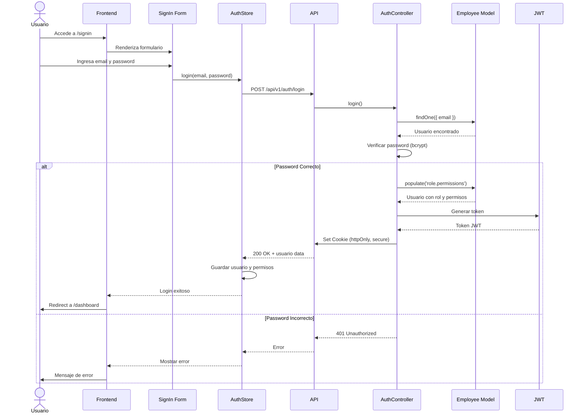
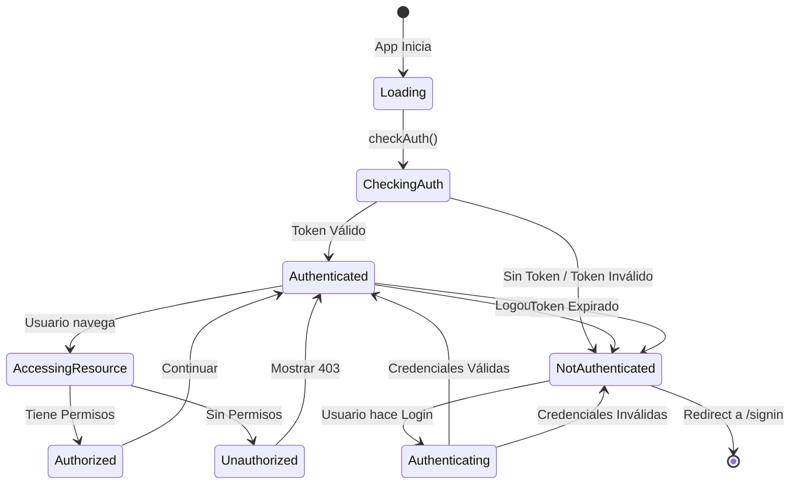
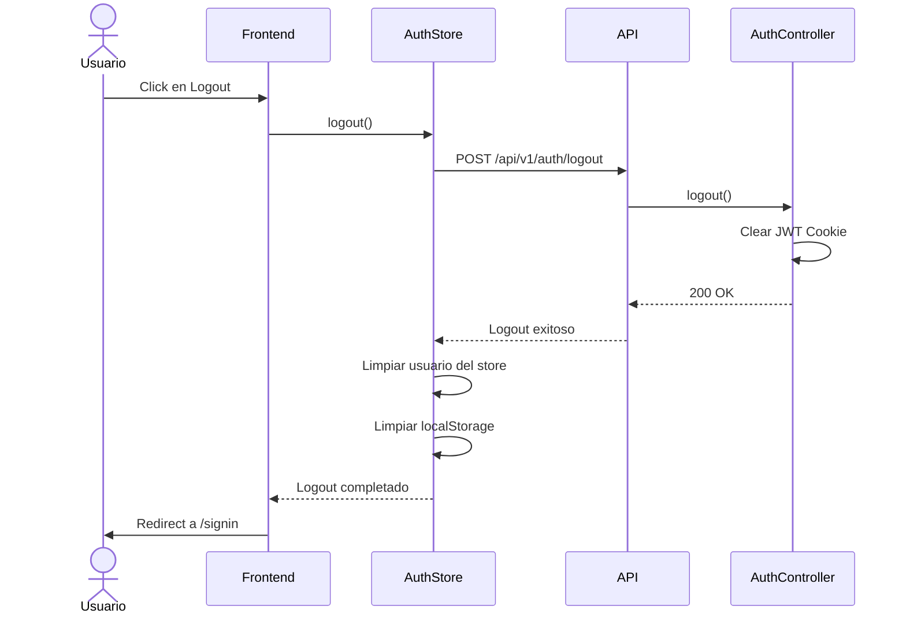
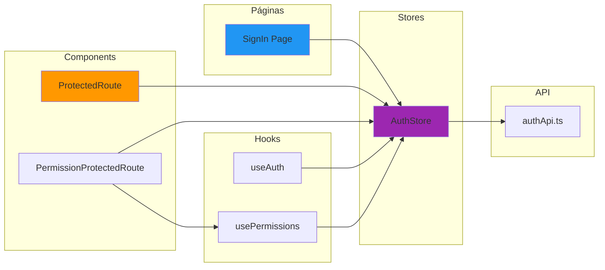
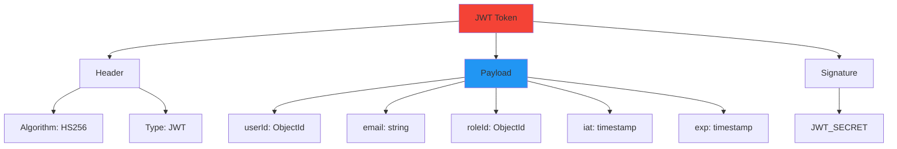
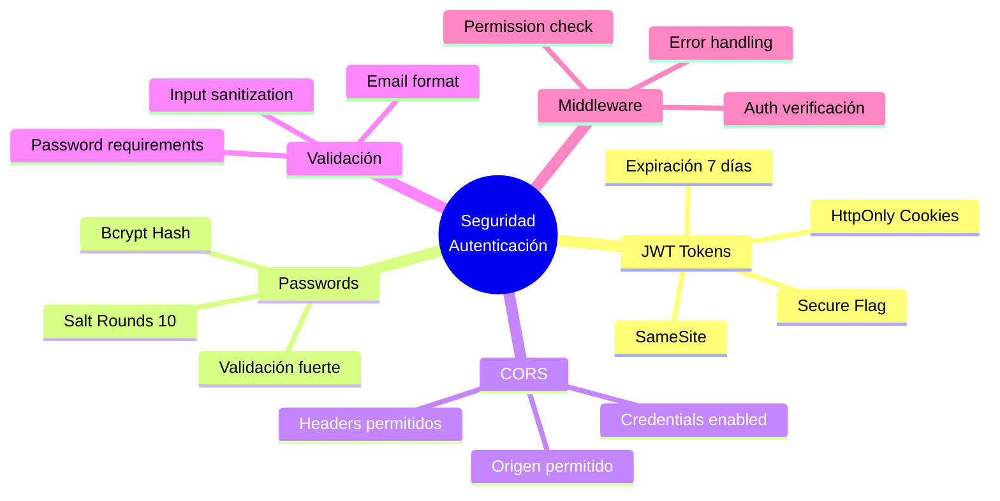

# Módulo de Autenticación

## Flujo Completo de Login



## Arquitectura del Sistema de Autenticación

```mermaid
graph TB
    subgraph "Frontend - Auth"
        LOGIN_PAGE[SignIn Page]
        AUTH_STORE[AuthStore - MobX]
        AUTH_API[Auth API Client]
        PROTECTED[ProtectedRoute Component]
    end
    
    subgraph "Backend - Auth"
        AUTH_ROUTES[/api/v1/auth]
        AUTH_CONTROLLER[AuthController]
        AUTH_MW[Auth Middleware]
    end
    
    subgraph "Models"
        EMPLOYEE[Employee Model]
        ROLE[Role Model]
        PERMISSION[Permission Model]
    end
    
    subgraph "Security"
        JWT_GEN[JWT Generator]
        BCRYPT[Bcrypt]
        COOKIES[HTTP Cookies]
    end
    
    LOGIN_PAGE --> AUTH_STORE
    AUTH_STORE --> AUTH_API
    AUTH_API --> AUTH_ROUTES
    AUTH_ROUTES --> AUTH_CONTROLLER
    
    AUTH_CONTROLLER --> EMPLOYEE
    AUTH_CONTROLLER --> BCRYPT
    AUTH_CONTROLLER --> JWT_GEN
    AUTH_CONTROLLER --> COOKIES
    
    EMPLOYEE --> ROLE
    ROLE --> PERMISSION
    
    AUTH_MW --> JWT_GEN
    AUTH_MW --> COOKIES
    
    PROTECTED --> AUTH_STORE
    
    style LOGIN_PAGE fill:#2196f3
    style AUTH_CONTROLLER fill:#ff9800
    style JWT_GEN fill:#f44336
```

## Estados de Autenticación



## Flujo de Verificación de Token (Middleware)

```mermaid
flowchart TD
    START([Request Recibido]) --> CHECK_COOKIE{¿Cookie JWT<br/>existe?}
    
    CHECK_COOKIE -->|No| NO_TOKEN[Error: No autenticado]
    NO_TOKEN --> RETURN_401[Return 401]
    
    CHECK_COOKIE -->|Sí| VERIFY_TOKEN{¿Token JWT<br/>válido?}
    
    VERIFY_TOKEN -->|No| INVALID_TOKEN[Error: Token inválido]
    INVALID_TOKEN --> CLEAR_COOKIE[Limpiar cookie]
    CLEAR_COOKIE --> RETURN_401
    
    VERIFY_TOKEN -->|Sí| FIND_USER[Buscar usuario en DB]
    
    FIND_USER --> USER_EXISTS{¿Usuario<br/>existe?}
    
    USER_EXISTS -->|No| USER_NOT_FOUND[Error: Usuario no encontrado]
    USER_NOT_FOUND --> RETURN_401
    
    USER_EXISTS -->|Sí| LOAD_PERMISSIONS[Cargar rol y permisos]
    
    LOAD_PERMISSIONS --> ATTACH_USER[Adjuntar usuario a req.user]
    
    ATTACH_USER --> NEXT[next()]
    NEXT --> END([Continuar al Controller])
    
    RETURN_401 --> STOP([Request Terminado])
    
    style START fill:#4caf50
    style END fill:#4caf50
    style STOP fill:#f44336
    style RETURN_401 fill:#f44336
```

## Flujo de Logout



## Componentes de Autenticación



## Estructura de JWT Token



## Endpoints de Autenticación

```mermaid
graph LR
    API[/api/v1/auth]
    
    API --> LOGIN[POST /login]
    API --> LOGOUT[POST /logout]
    API --> ME[GET /me]
    API --> CHECK[GET /check]
    
    LOGIN --> LOGIN_CTRL[AuthController.login]
    LOGOUT --> LOGOUT_CTRL[AuthController.logout]
    ME --> ME_CTRL[AuthController.getMe]
    CHECK --> CHECK_CTRL[AuthController.checkAuth]
    
    LOGIN_CTRL -.->|Genera| JWT_COOKIE[JWT Cookie]
    LOGOUT_CTRL -.->|Limpia| JWT_COOKIE
    ME_CTRL -.->|Requiere| AUTH_MW[Auth Middleware]
    CHECK_CTRL -.->|Verifica| JWT_COOKIE
    
    style API fill:#1976d2
    style JWT_COOKIE fill:#f44336
```

## Seguridad Implementada



## Para visualizar estos diagramas:

1. Copia el código Mermaid
2. Ve a [https://mermaid.live/](https://mermaid.live/)
3. Pega el código en el editor
4. Exporta como PNG o SVG
