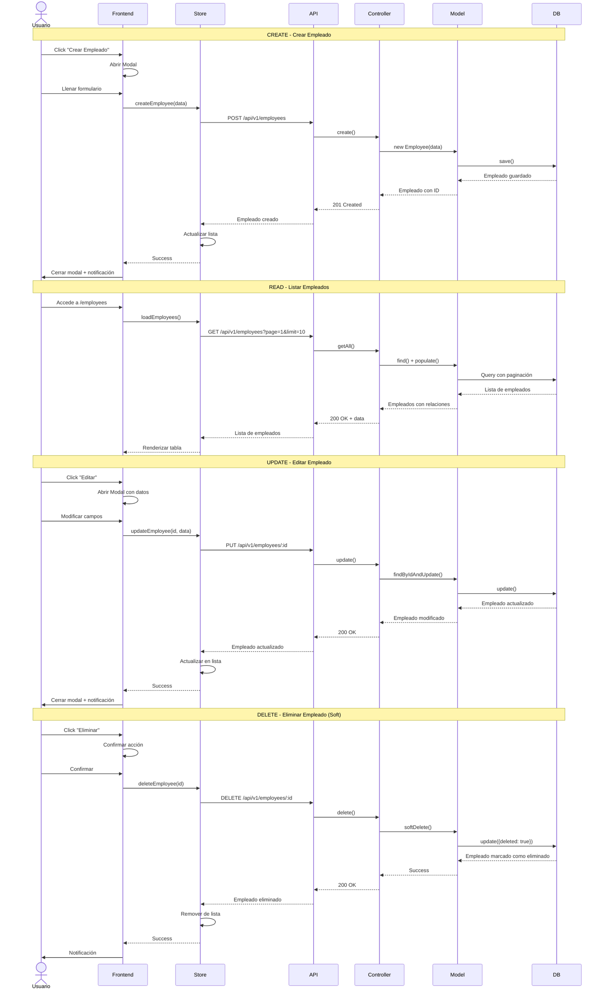
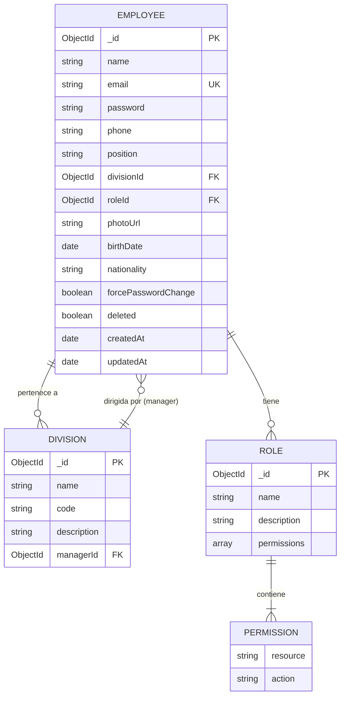
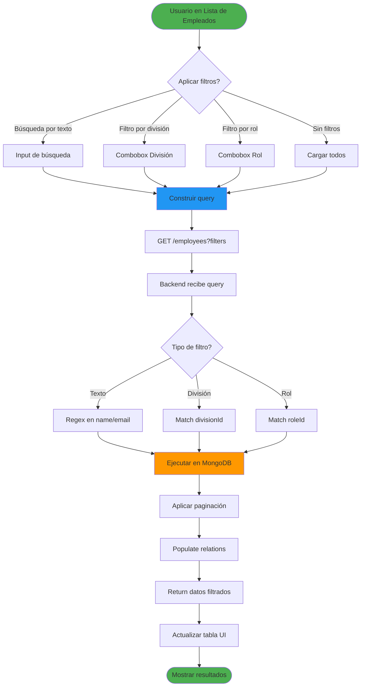
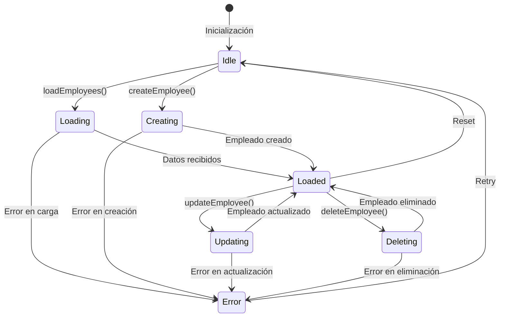
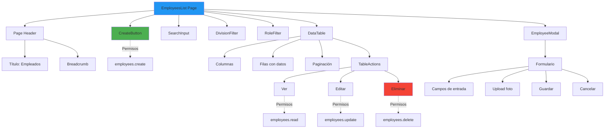
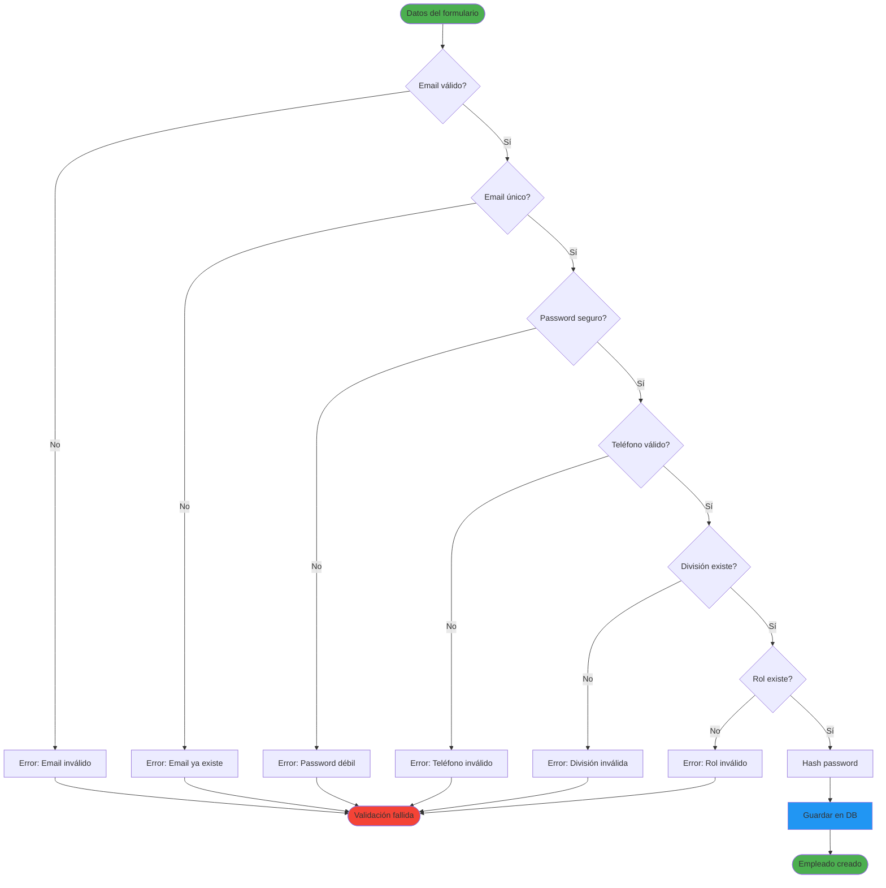
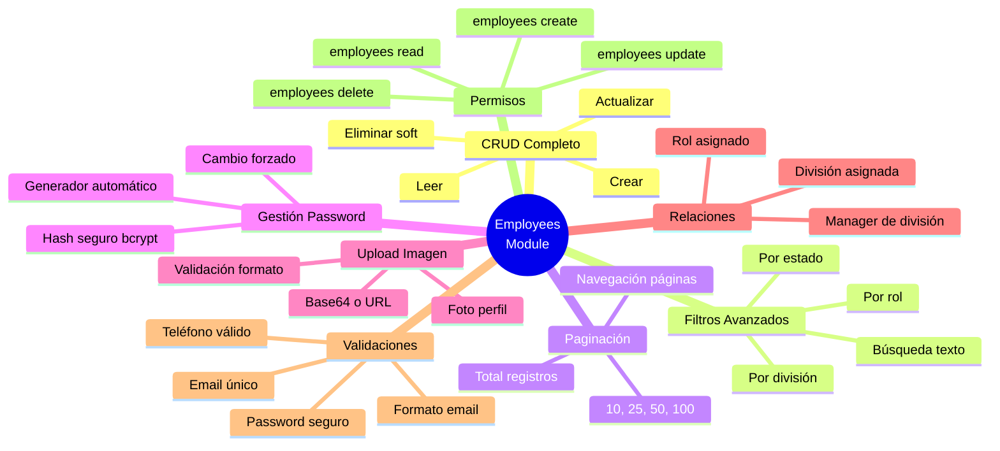

# Módulo de Empleados (Employees)

## Arquitectura del Módulo

```mermaid
graph TB
    subgraph "Frontend"
        EMP_LIST[EmployeesList Page]
        EMP_MODAL[Employee Modal Form]
        EMP_STORE[EmployeesStore]
        EMP_API[employeesApi]
        TABLE[Tabla con Paginación]
        FILTERS[Filtros y Búsqueda]
    end
    
    subgraph "Backend"
        EMP_ROUTES[/api/v1/employees]
        EMP_CONTROLLER[EmployeesController]
        EMP_MODEL[Employee Model]
    end
    
    subgraph "Middleware"
        AUTH[Auth Middleware]
        PERM[Permission Middleware]
    end
    
    subgraph "Relaciones"
        DIVISION[Division Model]
        ROLE[Role Model]
    end
    
    EMP_LIST --> TABLE
    EMP_LIST --> FILTERS
    EMP_LIST --> EMP_MODAL
    EMP_LIST --> EMP_STORE
    
    EMP_MODAL --> EMP_STORE
    EMP_STORE --> EMP_API
    EMP_API --> EMP_ROUTES
    
    EMP_ROUTES --> AUTH
    EMP_ROUTES --> PERM
    AUTH --> EMP_CONTROLLER
    PERM --> EMP_CONTROLLER
    
    EMP_CONTROLLER --> EMP_MODEL
    EMP_MODEL --> DIVISION
    EMP_MODEL --> ROLE
    
    style EMP_LIST fill:#2196f3
    style EMP_CONTROLLER fill:#ff9800
    style EMP_MODEL fill:#4caf50
```

## Flujo CRUD Completo



## Modelo de Datos Employee



## Endpoints del Módulo

```mermaid
graph TB
    BASE[/api/v1/employees]
    
    BASE --> GET_ALL[GET /]
    BASE --> GET_ONE[GET /:id]
    BASE --> CREATE[POST /]
    BASE --> UPDATE[PUT /:id]
    BASE --> DELETE[DELETE /:id]
    BASE --> CHANGE_PASS[POST /:id/change-password]
    BASE --> GENERATE_PASS[POST /:id/generate-password]
    
    GET_ALL --> PAGINATION[?page=1&limit=10]
    GET_ALL --> SEARCH[?search=nombre]
    GET_ALL --> FILTER_DIV[?division=id]
    GET_ALL --> FILTER_ROLE[?role=id]
    
    style BASE fill:#1976d2
    style CREATE fill:#4caf50
    style UPDATE fill:#ff9800
    style DELETE fill:#f44336
```

## Flujo de Filtros y Búsqueda



## Estados del Store (MobX)



## Componentes UI del Módulo



## Validaciones del Modelo



## Funcionalidades Especiales



## Para visualizar estos diagramas:

1. Copia el código Mermaid
2. Ve a [https://mermaid.live/](https://mermaid.live/)
3. Pega el código en el editor
4. Exporta como PNG o SVG
