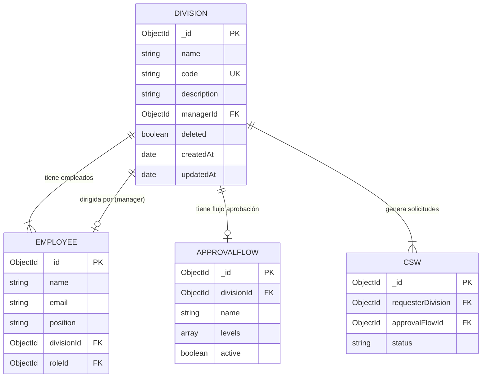
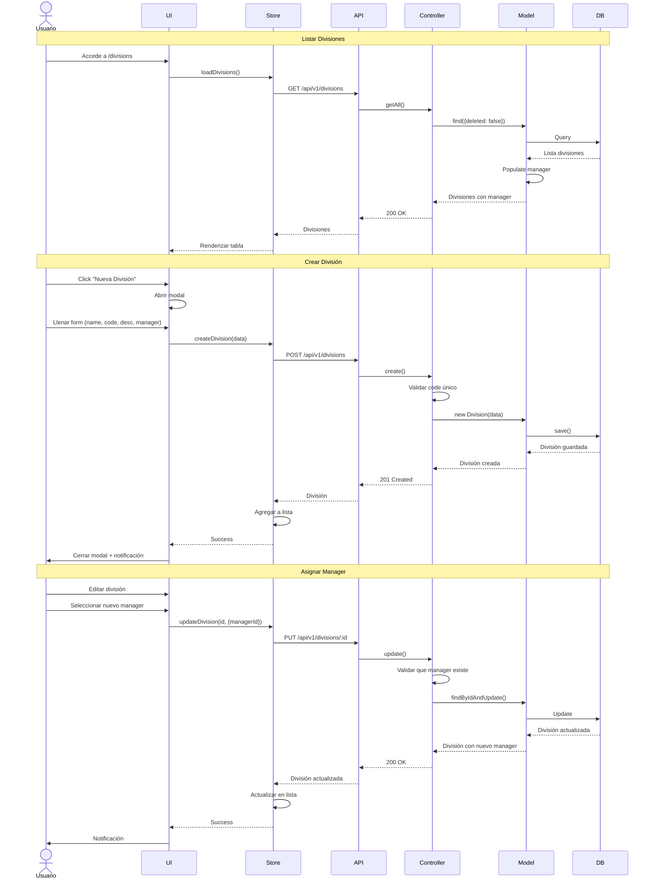
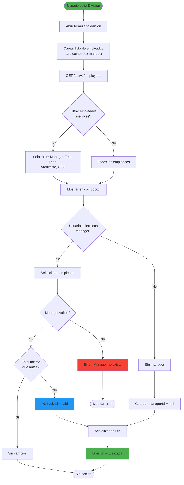
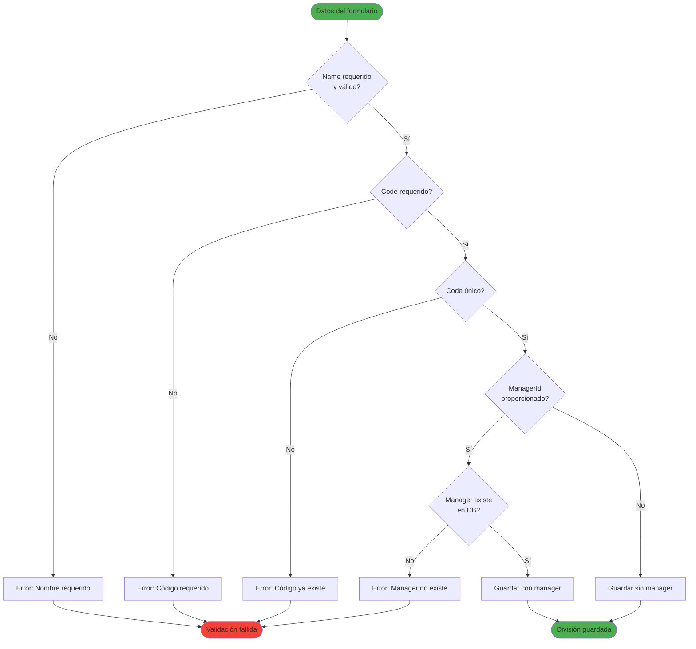
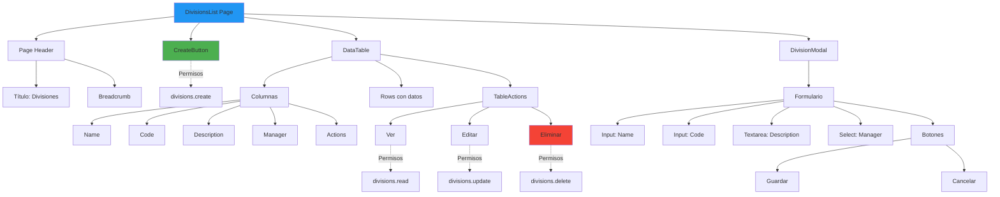
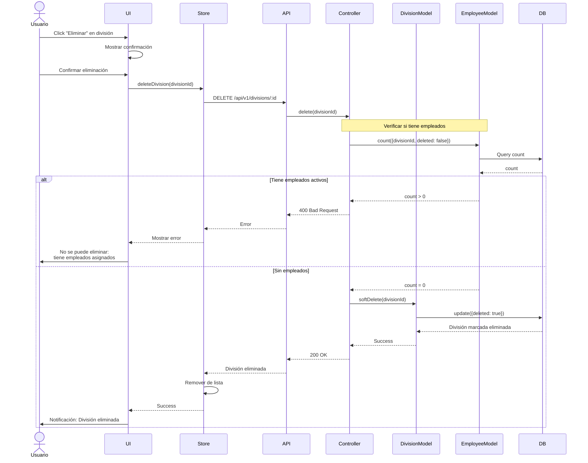
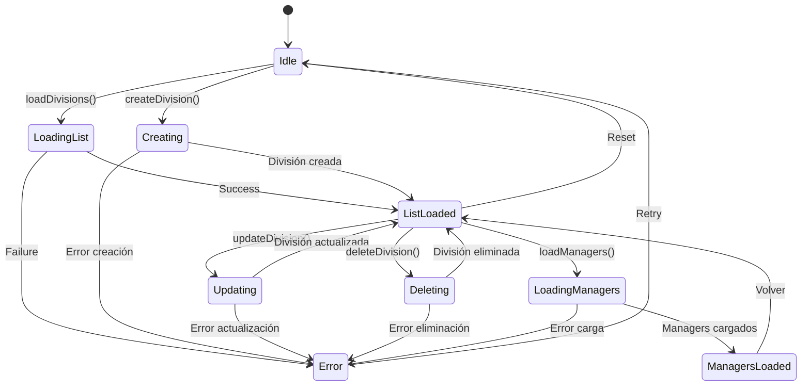
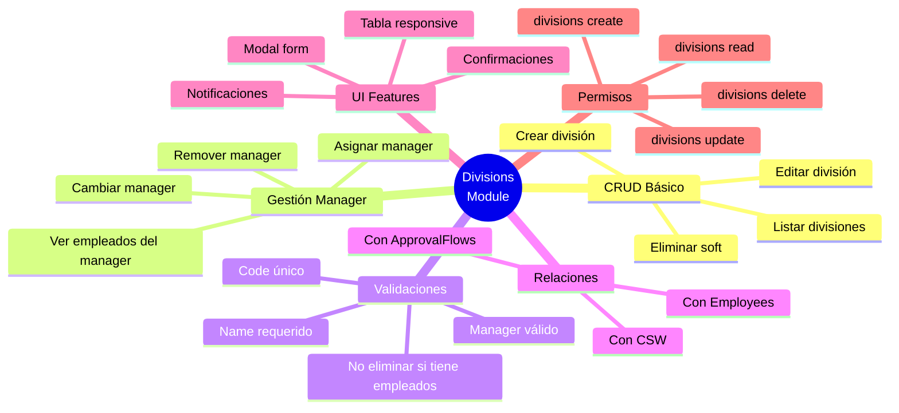
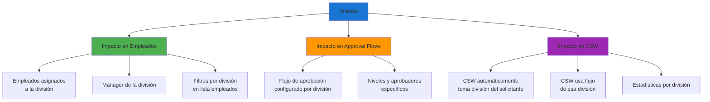

# Módulo de Divisiones (Divisions)

## Arquitectura del Módulo

```mermaid
graph TB
    subgraph "Frontend"
        DIV_LIST[DivisionsList Page]
        DIV_MODAL[Division Modal Form]
        DIV_STORE[DivisionsStore]
        DIV_API[divisionsApi]
        DIV_TABLE[Tabla Divisiones]
    end
    
    subgraph "Backend"
        DIV_ROUTES[/api/v1/divisions]
        DIV_CONTROLLER[DivisionsController]
        DIV_MODEL[Division Model]
    end
    
    subgraph "Middleware"
        AUTH[Auth Middleware]
        PERM[Permission Middleware]
    end
    
    subgraph "Relaciones"
        EMPLOYEE[Employee Model]
        APPROVAL_FLOW[ApprovalFlow Model]
    end
    
    DIV_LIST --> DIV_TABLE
    DIV_LIST --> DIV_MODAL
    DIV_LIST --> DIV_STORE
    
    DIV_MODAL --> DIV_STORE
    DIV_STORE --> DIV_API
    DIV_API --> DIV_ROUTES
    
    DIV_ROUTES --> AUTH
    DIV_ROUTES --> PERM
    AUTH --> DIV_CONTROLLER
    PERM --> DIV_CONTROLLER
    
    DIV_CONTROLLER --> DIV_MODEL
    DIV_MODEL --> EMPLOYEE
    DIV_MODEL --> APPROVAL_FLOW
    
    style DIV_LIST fill:#2196f3
    style DIV_CONTROLLER fill:#ff9800
    style DIV_MODEL fill:#4caf50
```

## Modelo de Datos Division



## Flujo CRUD de Divisiones



## Endpoints del Módulo

```mermaid
graph TB
    BASE[/api/v1/divisions]
    
    BASE --> GET_ALL[GET /]
    BASE --> GET_ONE[GET /:id]
    BASE --> CREATE[POST /]
    BASE --> UPDATE[PUT /:id]
    BASE --> DELETE[DELETE /:id]
    BASE --> GET_MANAGERS[GET /managers]
    BASE --> GET_EMPLOYEES[GET /:id/employees]
    
    GET_ALL --> POPULATE_MGR[populate manager]
    GET_ONE --> FULL_DATA[con employees y manager]
    GET_EMPLOYEES --> EMP_LIST[Lista empleados de la división]
    GET_MANAGERS --> MGR_LIST[Lista empleados disponibles como managers]
    
    style BASE fill:#1976d2
    style CREATE fill:#4caf50
    style UPDATE fill:#ff9800
    style DELETE fill:#f44336
```

## Flujo de Asignación de Manager



## Relaciones con Empleados

```mermaid
graph TB
    DIVISION[División]
    
    DIVISION --> HAS_MANAGER[Tiene Manager]
    DIVISION --> HAS_EMPLOYEES[Tiene Empleados]
    DIVISION --> HAS_FLOW[Tiene Flujo Aprobación]
    DIVISION --> GENERATES_CSW[Genera CSW]
    
    HAS_MANAGER --> MANAGER[Employee<br/>managerId reference]
    HAS_EMPLOYEES --> EMPLOYEES[Employees[]<br/>divisionId reference]
    HAS_FLOW --> FLOW[ApprovalFlow<br/>divisionId reference]
    GENERATES_CSW --> CSW[CSW[]<br/>requesterDivision reference]
    
    MANAGER -.->|opcional| NULL[Puede ser null]
    EMPLOYEES -.->|0 o más| MULTIPLE[Lista de empleados]
    FLOW -.->|0 o 1| SINGLE[Un flujo por división]
    CSW -.->|0 o más| REQUESTS[Solicitudes de la división]
    
    style DIVISION fill:#1976d2
    style MANAGER fill:#ff9800
    style EMPLOYEES fill:#4caf50
```

## Validaciones del Modelo



## Componentes UI del Módulo



## Flujo de Eliminación (Soft Delete)



## Estados del Store (MobX)



## Funcionalidades del Módulo



## Impacto de División en Otros Módulos



## Para visualizar estos diagramas:

1. Copia el código Mermaid
2. Ve a [https://mermaid.live/](https://mermaid.live/)
3. Pega el código en el editor
4. Exporta como PNG o SVG
