# Módulo de Roles y Permisos

## Arquitectura del Sistema de Permisos

```mermaid
graph TB
    subgraph "Frontend"
        ROLE_PAGE[Roles Page]
        ROLE_FORM[Role Form]
        PERM_SELECTOR[Permission Selector]
        USE_PERM[usePermissions Hook]
        PROTECTED[ProtectedRoute]
        TABLE_ACTIONS[TableActions]
    end
    
    subgraph "Backend"
        ROLE_ROUTES[/api/v1/roles]
        PERM_ROUTES[/api/v1/permissions]
        ROLE_CTRL[RolesController]
        PERM_CTRL[PermissionsController]
        ROLE_MODEL[Role Model]
        PERM_MODEL[Permission Model]
    end
    
    subgraph "Middleware"
        AUTH_MW[Auth Middleware]
        PERM_MW[Permission Middleware]
    end
    
    subgraph "Models"
        EMPLOYEE[Employee Model]
    end
    
    ROLE_PAGE --> ROLE_FORM
    ROLE_PAGE --> USE_PERM
    ROLE_FORM --> PERM_SELECTOR
    
    USE_PERM --> PROTECTED
    USE_PERM --> TABLE_ACTIONS
    
    ROLE_PAGE --> ROLE_ROUTES
    PERM_SELECTOR --> PERM_ROUTES
    
    ROLE_ROUTES --> AUTH_MW
    PERM_ROUTES --> AUTH_MW
    AUTH_MW --> PERM_MW
    PERM_MW --> ROLE_CTRL
    PERM_MW --> PERM_CTRL
    
    ROLE_CTRL --> ROLE_MODEL
    PERM_CTRL --> PERM_MODEL
    
    ROLE_MODEL --> PERM_MODEL
    EMPLOYEE --> ROLE_MODEL
    
    style ROLE_PAGE fill:#2196f3
    style PERM_MW fill:#f44336
    style ROLE_MODEL fill:#4caf50
```

## Modelo de Datos

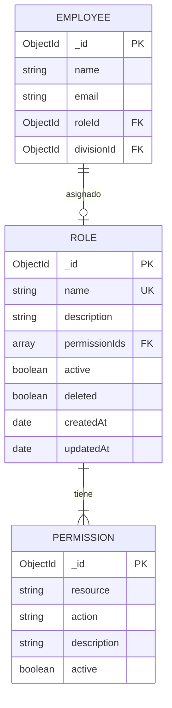

## Estructura de Permisos

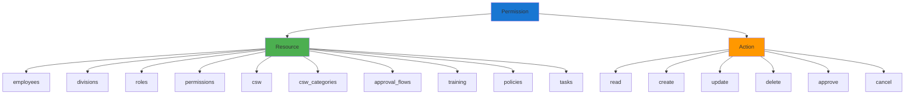

## Flujo de Verificación de Permisos

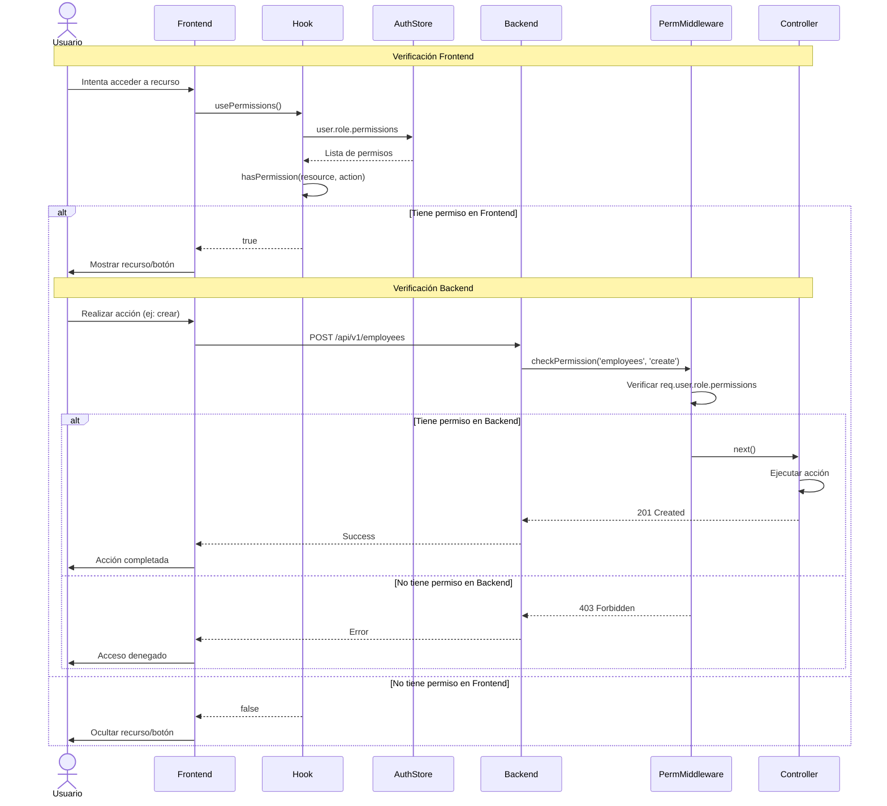

## Flujo de Creación de Rol

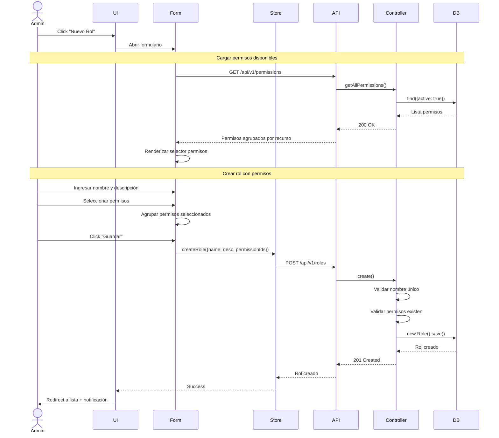

## Selector de Permisos en UI

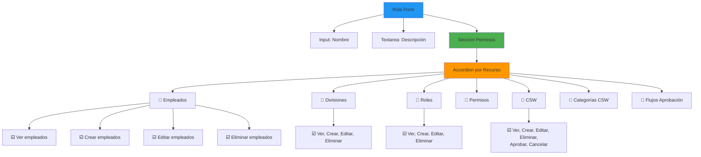

## Permisos por Módulo

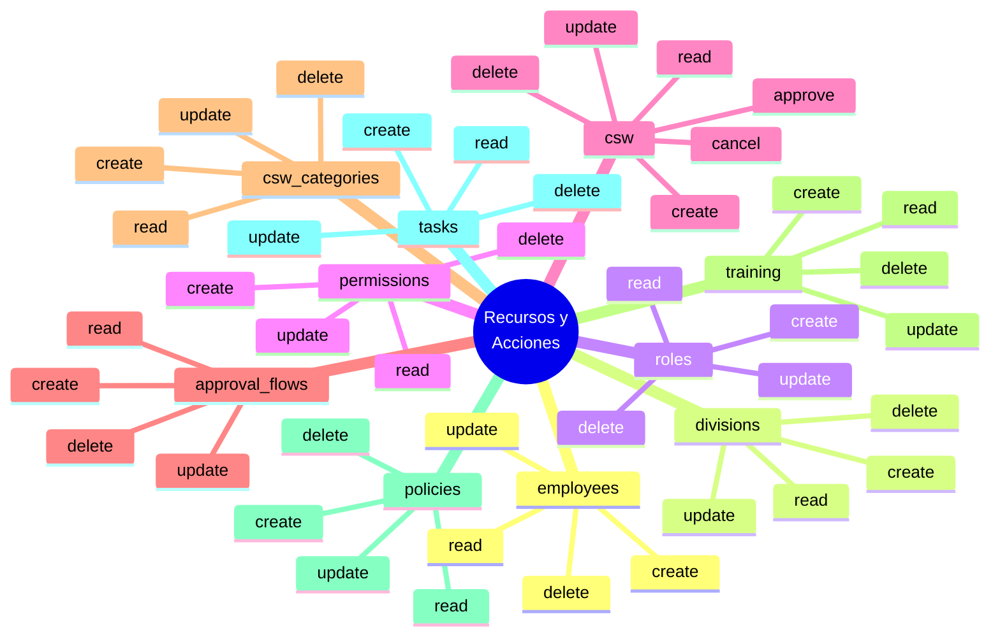

## Componentes de Protección

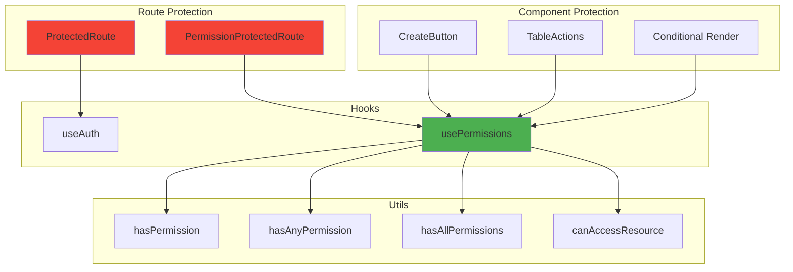

## Middleware de Permisos (Backend)

```mermaid
flowchart TD
    START([Request llega al endpoint])
    
    START --> AUTH{Auth<br/>Middleware}
    
    AUTH -->|No autenticado| ERR_401[401 Unauthorized]
    AUTH -->|Autenticado| PERM{Permission<br/>Middleware}
    
    PERM --> GET_USER[Obtener req.user]
    GET_USER --> LOAD_PERMS[Cargar user.role.permissions]
    
    LOAD_PERMS --> CHECK{¿Tiene permiso<br/>requerido?}
    
    CHECK -->|No| ERR_403[403 Forbidden]
    CHECK -->|Sí| NEXT[next()]
    
    NEXT --> CONTROLLER[Ejecutar Controller]
    
    ERR_401 --> END_ERR([Response Error])
    ERR_403 --> END_ERR
    CONTROLLER --> END_OK([Response Success])
    
    style START fill:#4caf50
    style CONTROLLER fill:#2196f3
    style END_OK fill:#4caf50
    style ERR_401 fill:#f44336
    style ERR_403 fill:#f44336
```

## Ejemplo de Roles Predefinidos

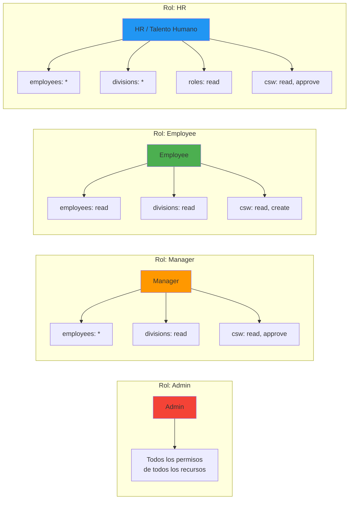

## Flujo de Edición de Rol

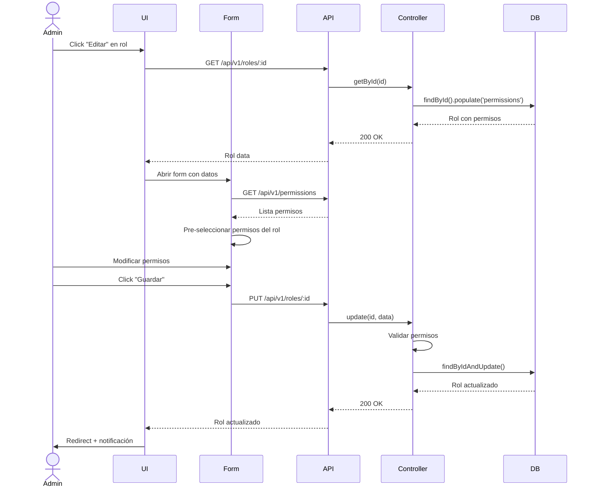

## Propagación de Cambios de Permisos

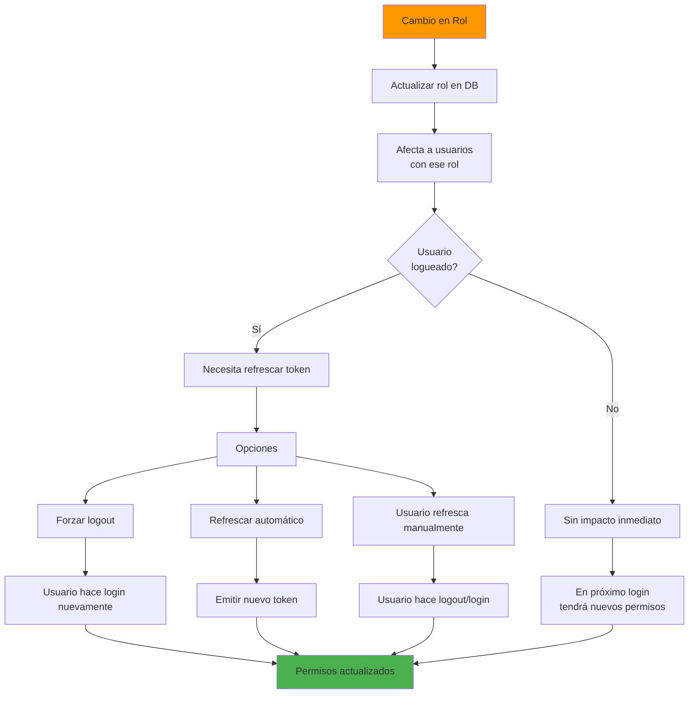

## Estados del Store

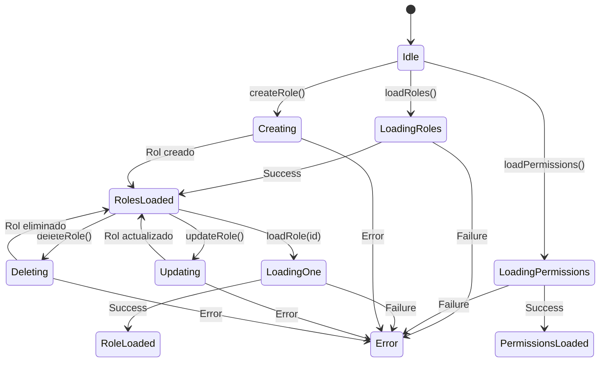

## Endpoints del Módulo

```mermaid
graph TB
    ROLES[/api/v1/roles]
    PERMS[/api/v1/permissions]
    
    ROLES --> R_GET_ALL[GET /]
    ROLES --> R_GET_ONE[GET /:id]
    ROLES --> R_CREATE[POST /]
    ROLES --> R_UPDATE[PUT /:id]
    ROLES --> R_DELETE[DELETE /:id]
    ROLES --> R_ASSIGN[POST /:id/assign-permissions]
    
    PERMS --> P_GET_ALL[GET /]
    PERMS --> P_BY_RESOURCE[GET /by-resource]
    PERMS --> P_CREATE[POST /]
    PERMS --> P_UPDATE[PUT /:id]
    PERMS --> P_DELETE[DELETE /:id]
    
    style ROLES fill:#1976d2
    style PERMS fill:#4caf50
    style R_CREATE fill:#4caf50
    style R_UPDATE fill:#ff9800
    style R_DELETE fill:#f44336
```

## Para visualizar estos diagramas:

1. Copia el código Mermaid
2. Ve a [https://mermaid.live/](https://mermaid.live/)
3. Pega el código en el editor
4. Exporta como PNG o SVG
