# Módulo CSW (Change Management)

## Arquitectura del Módulo CSW

```mermaid
graph TB
    subgraph "Frontend"
        CSW_LIST[CSW List]
        CSW_FORM[CSW Form]
        CSW_VIEW[CSW View]
        CSW_STORE[CSWStore]
        CSW_API[cswApi]
        APPROVAL_BTN[Approval Buttons]
    end
    
    subgraph "Backend"
        CSW_ROUTES[/api/v1/csw]
        CSW_CTRL[CSWController]
        CSW_MODEL[CSW Model]
        HISTORY_MODEL[CSWHistory Model]
    end
    
    subgraph "Related Models"
        EMPLOYEE[Employee]
        DIVISION[Division]
        CATEGORY[CSWCategory]
        FLOW[ApprovalFlow]
    end
    
    subgraph "Middleware"
        AUTH[Auth Middleware]
        PERM[Permission Middleware]
    end
    
    CSW_LIST --> CSW_STORE
    CSW_FORM --> CSW_STORE
    CSW_VIEW --> CSW_STORE
    CSW_VIEW --> APPROVAL_BTN
    
    CSW_STORE --> CSW_API
    CSW_API --> CSW_ROUTES
    
    CSW_ROUTES --> AUTH
    AUTH --> PERM
    PERM --> CSW_CTRL
    
    CSW_CTRL --> CSW_MODEL
    CSW_CTRL --> HISTORY_MODEL
    
    CSW_MODEL --> EMPLOYEE
    CSW_MODEL --> DIVISION
    CSW_MODEL --> CATEGORY
    CSW_MODEL --> FLOW
    
    style CSW_LIST fill:#2196f3
    style CSW_CTRL fill:#ff9800
    style CSW_MODEL fill:#4caf50
```

## Modelo de Datos CSW

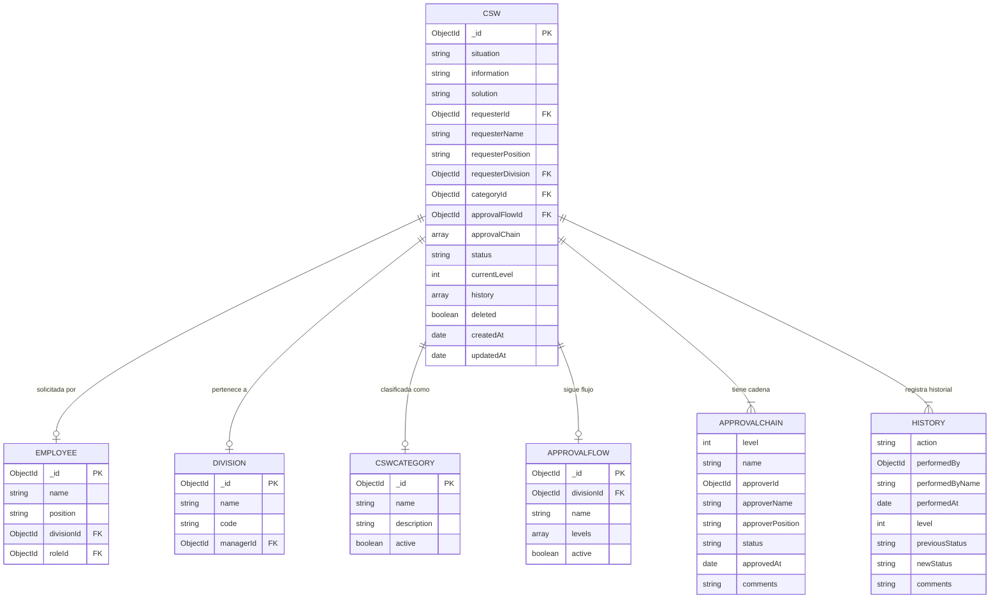

## Flujo Completo de Creación CSW

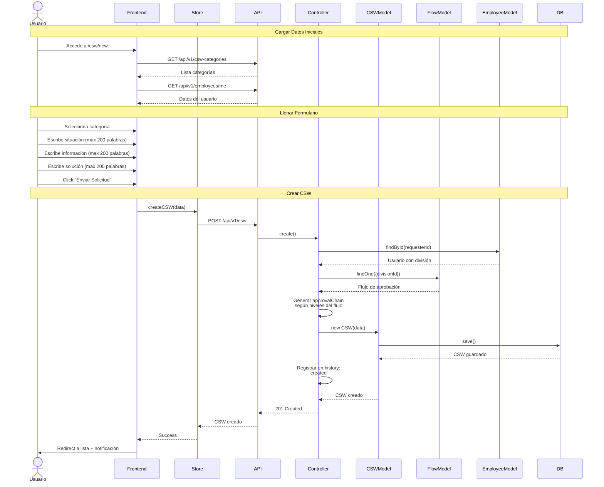

## Estados de una Solicitud CSW

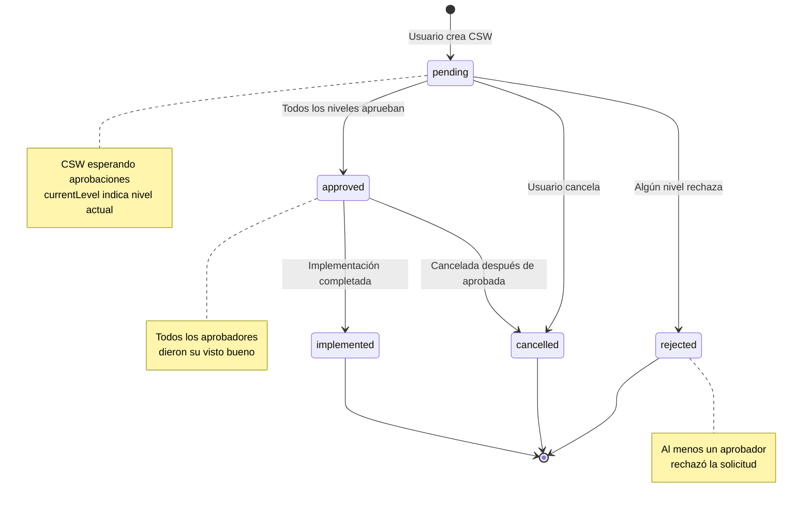

## Flujo de Aprobación

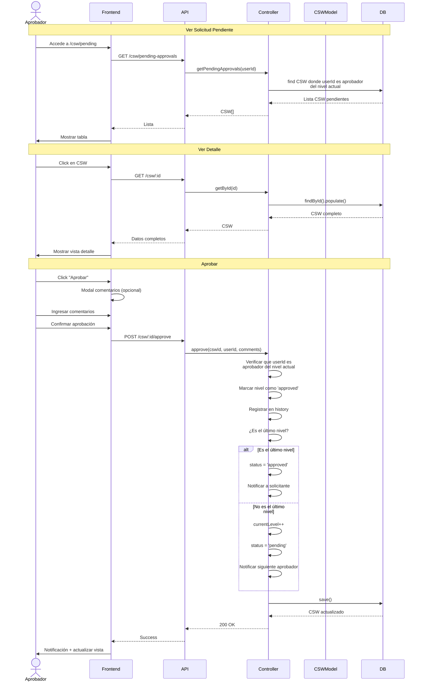

## Flujo de Rechazo

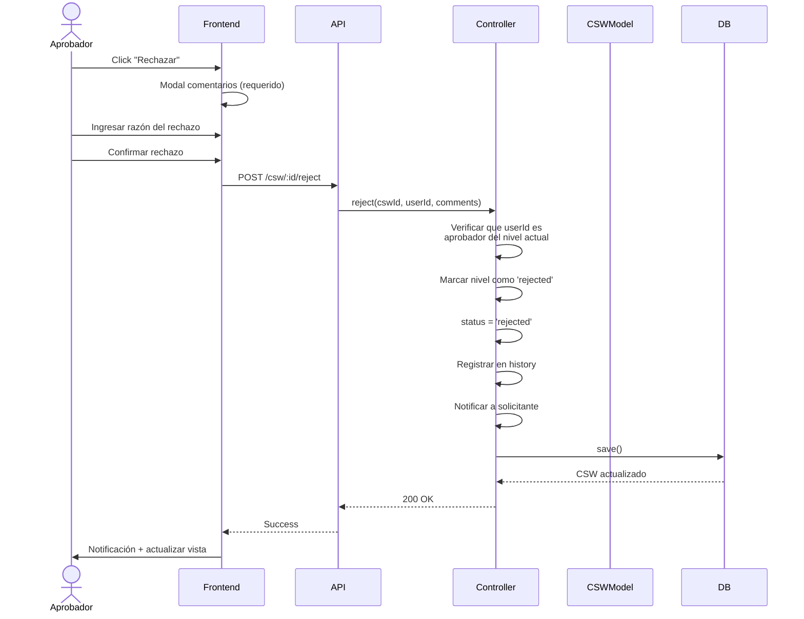

## Vistas del Módulo CSW

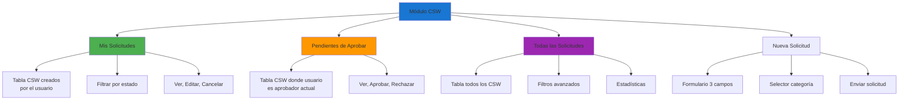

## Componentes UI del Módulo

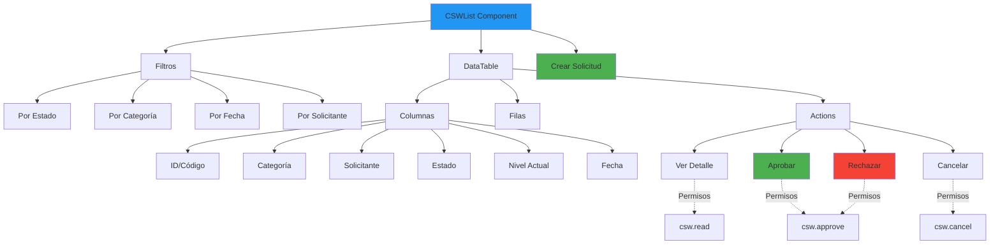

## Vista Detalle de CSW

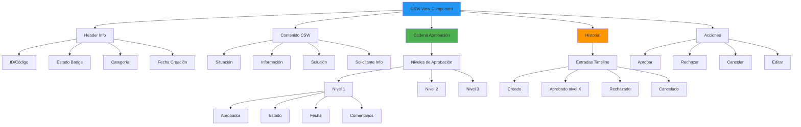

## Endpoints del Módulo

```mermaid
graph TB
    BASE[/api/v1/csw]
    
    BASE --> GET_ALL[GET /]
    BASE --> GET_ONE[GET /:id]
    BASE --> CREATE[POST /]
    BASE --> UPDATE[PUT /:id]
    BASE --> DELETE[DELETE /:id]
    BASE --> APPROVE[POST /:id/approve]
    BASE --> REJECT[POST /:id/reject]
    BASE --> CANCEL[POST /:id/cancel]
    BASE --> MY_REQ[GET /my-requests]
    BASE --> PENDING[GET /pending-approvals]
    BASE --> STATS[GET /statistics]
    
    GET_ALL --> FILTER_STATUS[?status=pending]
    GET_ALL --> FILTER_CAT[?category=id]
    GET_ALL --> FILTER_DIV[?division=id]
    
    style BASE fill:#1976d2
    style CREATE fill:#4caf50
    style APPROVE fill:#4caf50
    style REJECT fill:#f44336
    style CANCEL fill:#ff9800
```

## Generación de Approval Chain

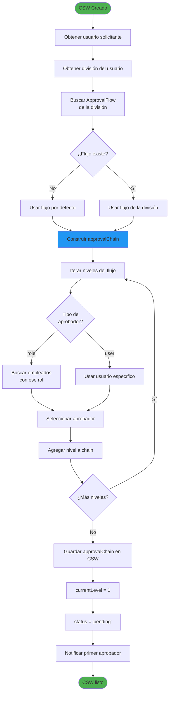

## Lógica de Progresión de Niveles

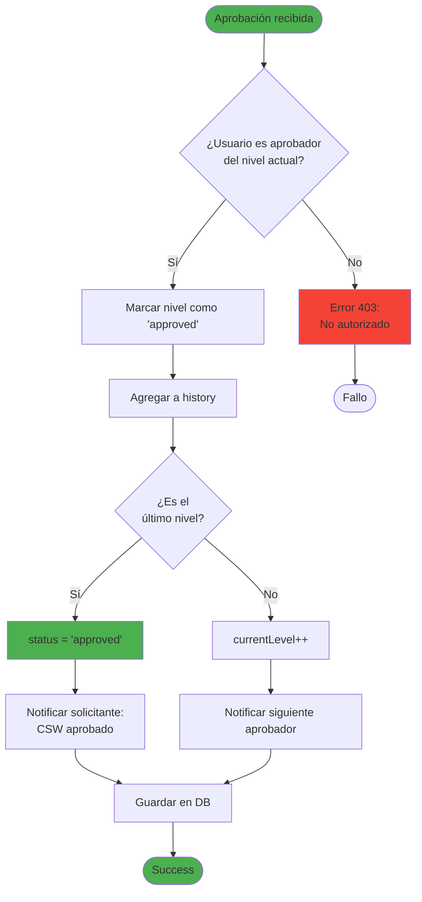

## Historial de Cambios

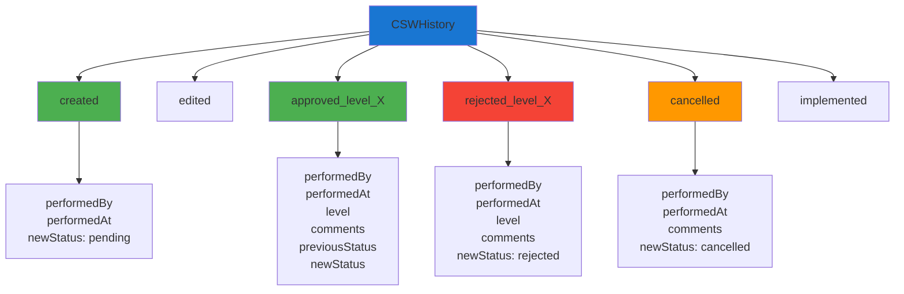

## Para visualizar estos diagramas:

1. Copia el código Mermaid
2. Ve a [https://mermaid.live/](https://mermaid.live/)
3. Pega el código en el editor
4. Exporta como PNG o SVG
