# Módulo de Flujos de Aprobación (Approval Flows)

## Arquitectura del Módulo

```mermaid
graph TB
    subgraph "Frontend"
        FLOW_LIST[ApprovalFlows List]
        FLOW_FORM[ApprovalFlow Form]
        LEVEL_BUILDER[Level Builder]
        FLOW_STORE[ApprovalFlowsStore]
        FLOW_API[approvalFlowsApi]
    end
    
    subgraph "Backend"
        FLOW_ROUTES[/api/v1/approval-flows]
        FLOW_CTRL[ApprovalFlowController]
        FLOW_MODEL[ApprovalFlow Model]
    end
    
    subgraph "Related Models"
        DIVISION[Division Model]
        ROLE[Role Model]
        EMPLOYEE[Employee Model]
        CSW[CSW Model]
    end
    
    subgraph "Middleware"
        AUTH[Auth Middleware]
        PERM[Permission Middleware]
    end
    
    FLOW_LIST --> FLOW_STORE
    FLOW_FORM --> LEVEL_BUILDER
    FLOW_FORM --> FLOW_STORE
    
    FLOW_STORE --> FLOW_API
    FLOW_API --> FLOW_ROUTES
    
    FLOW_ROUTES --> AUTH
    AUTH --> PERM
    PERM --> FLOW_CTRL
    
    FLOW_CTRL --> FLOW_MODEL
    FLOW_MODEL --> DIVISION
    FLOW_MODEL --> ROLE
    FLOW_MODEL --> EMPLOYEE
    
    CSW --> FLOW_MODEL
    
    style FLOW_LIST fill:#2196f3
    style FLOW_CTRL fill:#ff9800
    style FLOW_MODEL fill:#4caf50
```

## Modelo de Datos ApprovalFlow

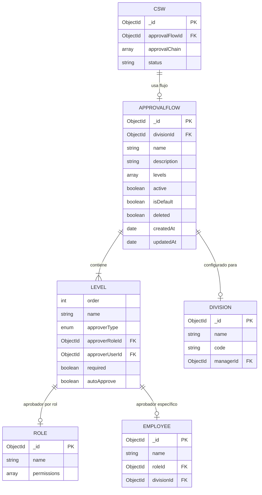

## Estructura de un Flujo de Aprobación

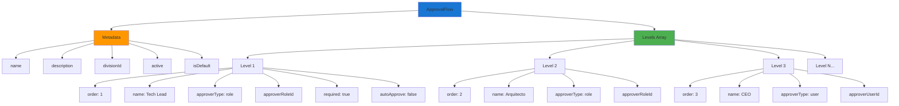

## Flujo de Creación de Approval Flow

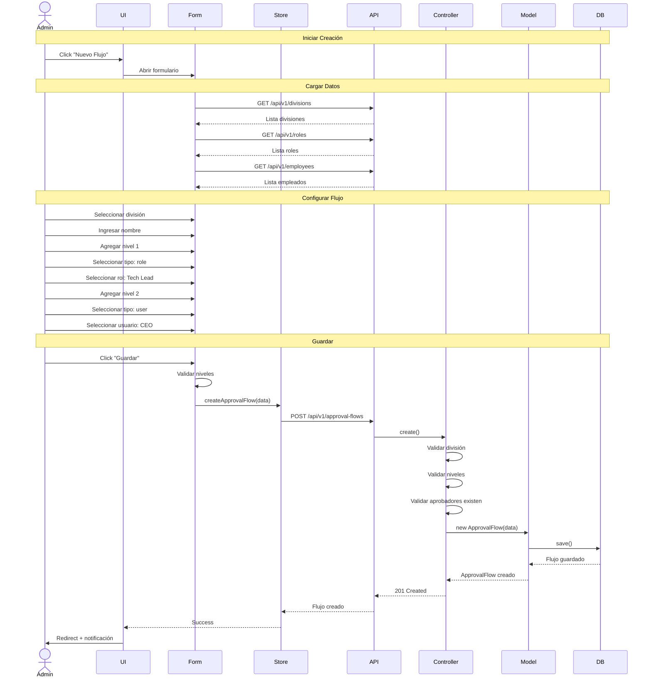

## Tipos de Aprobadores

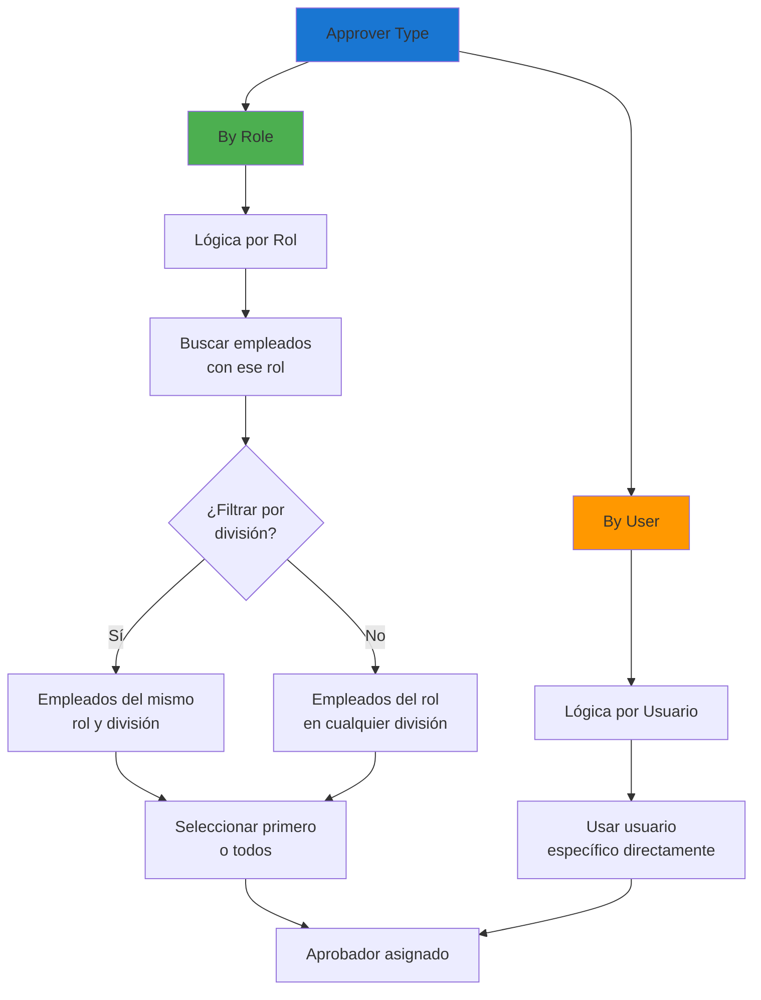

## Ejemplo: Flujos por División

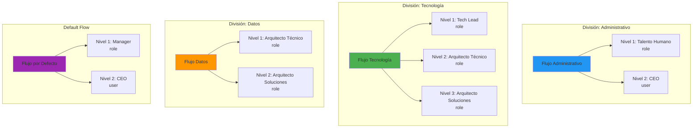

## Proceso de Asignación de Flujo a CSW

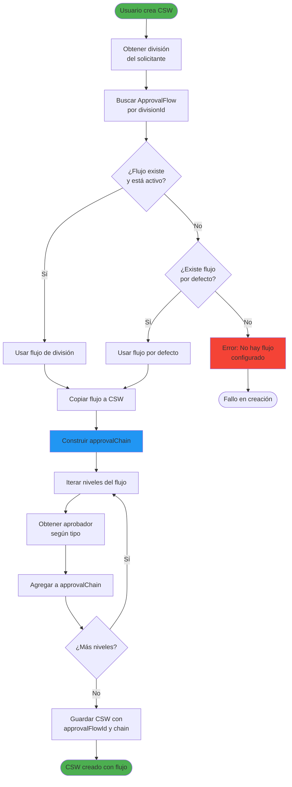

## Constructor de Niveles (UI)

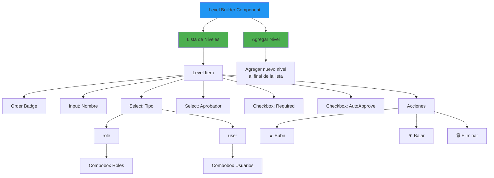

## Validaciones del Flujo

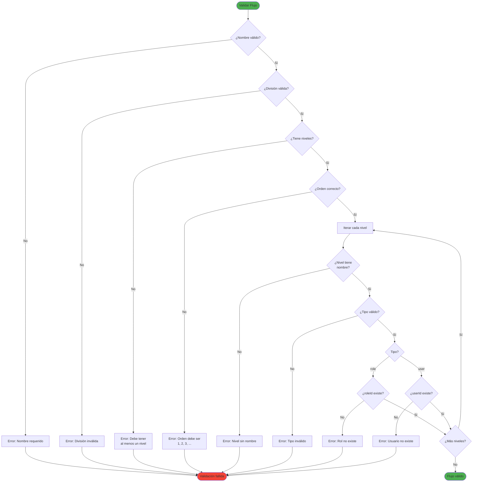

## Endpoints del Módulo

```mermaid
graph TB
    BASE[/api/v1/approval-flows]
    
    BASE --> GET_ALL[GET /]
    BASE --> GET_ONE[GET /:id]
    BASE --> CREATE[POST /]
    BASE --> UPDATE[PUT /:id]
    BASE --> DELETE[DELETE /:id]
    BASE --> BY_DIV[GET /by-division/:divisionId]
    BASE --> GET_DEFAULT[GET /default]
    BASE --> SET_DEFAULT[POST /:id/set-default]
    BASE --> ACTIVATE[POST /:id/activate]
    BASE --> DEACTIVATE[POST /:id/deactivate]
    
    GET_ALL --> FILTER_DIV[?division=id]
    GET_ALL --> FILTER_ACTIVE[?active=true]
    
    style BASE fill:#1976d2
    style CREATE fill:#4caf50
    style UPDATE fill:#ff9800
    style DELETE fill:#f44336
```

## Componentes UI del Módulo

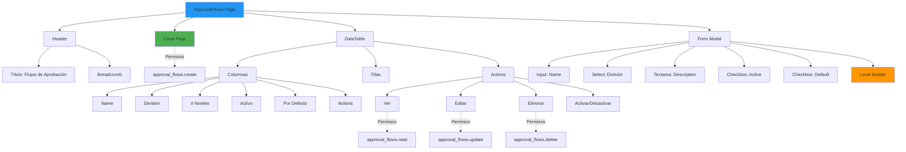

## Impacto de Cambios en Flujos

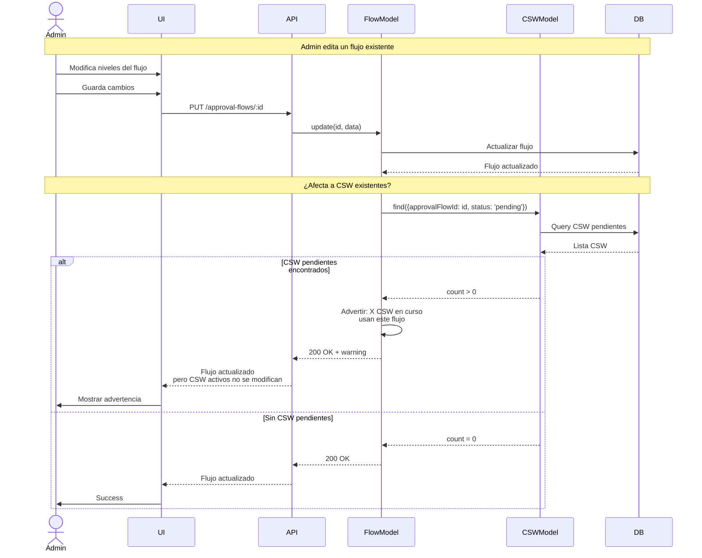

## Flujo de Eliminación

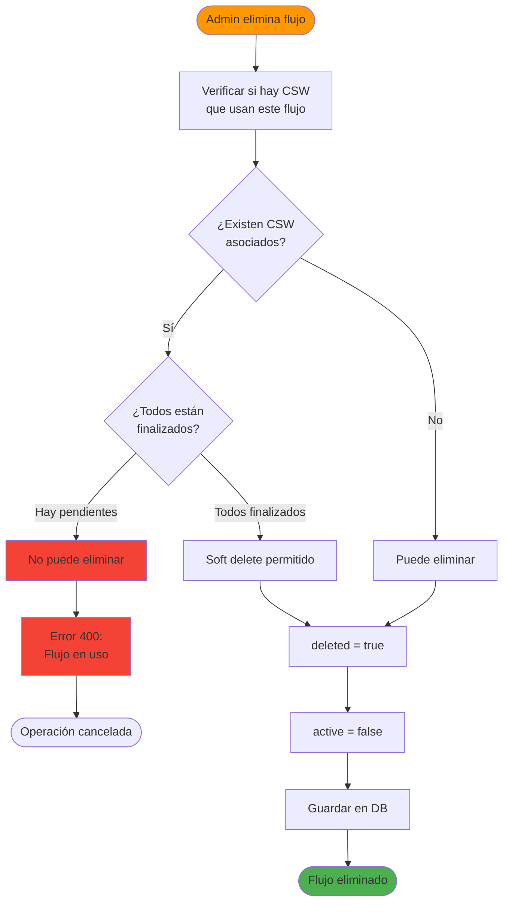

## Estados del Store (MobX)

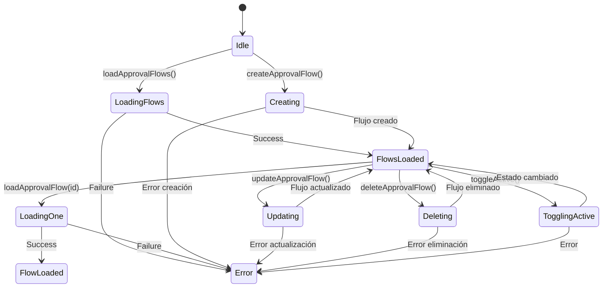

## Relación con CSW

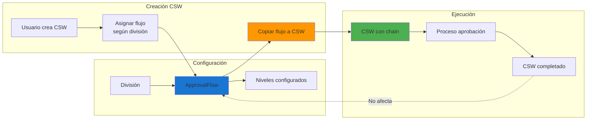

## Para visualizar estos diagramas:

1. Copia el código Mermaid
2. Ve a [https://mermaid.live/](https://mermaid.live/)
3. Pega el código en el editor
4. Exporta como PNG o SVG
