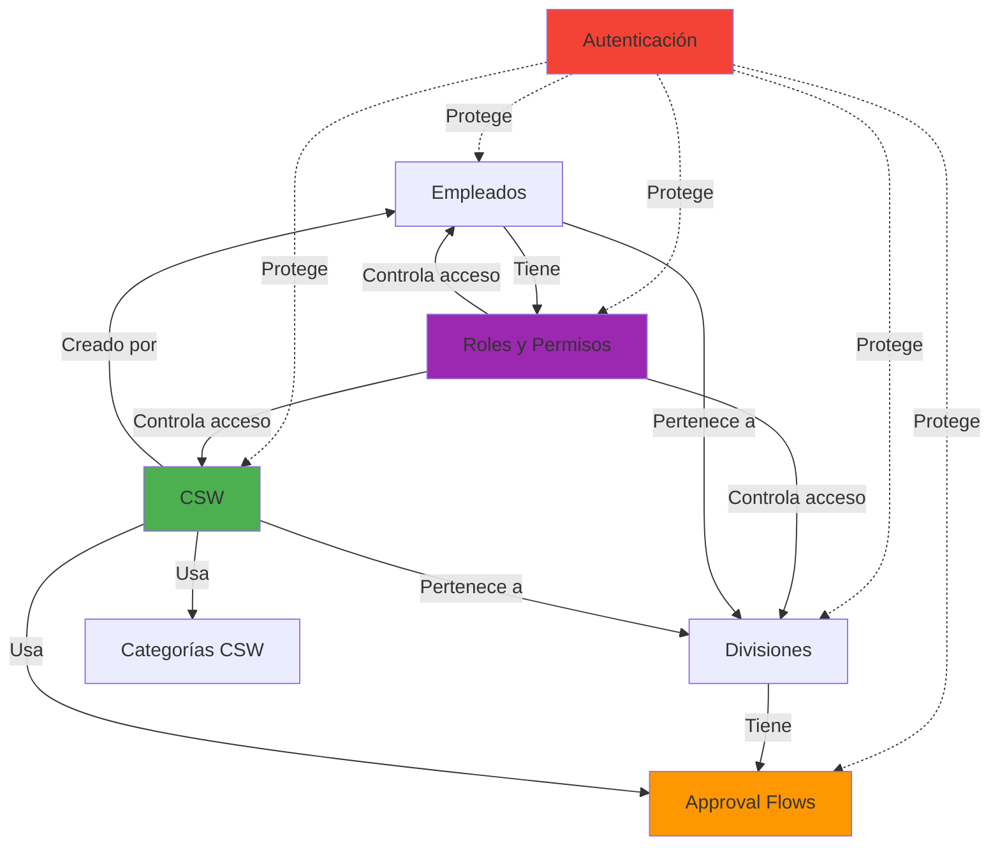

# 📊 Diagramas del Sistema RH-UNLIMITECH

Esta carpeta contiene diagramas de flujo completos del sistema RH-UNLIMITECH, organizados por módulos. Todos los diagramas están en formato Mermaid y pueden ser visualizados en [https://mermaid.live/](https://mermaid.live/).

---

## 📑 Índice de Diagramas

### [00 - Sistema General](./00-general-system.md)
**Descripción:** Visión completa de la arquitectura del sistema

**Diagramas incluidos:**
- 🏗️ Arquitectura General (Cliente, Frontend, Backend, Base de Datos)
- 🔄 Flujo de Datos Principal (Secuencia de request/response)
- 🧩 Módulos del Sistema (Relaciones entre módulos)
- 🛠️ Stack Tecnológico (Tecnologías frontend, backend y DevOps)
- 🔐 Flujo de Autenticación y Autorización (Estados)
- 📁 Arquitectura de Carpetas (Estructura del proyecto)

**Utilidad:** Entender la arquitectura completa y cómo interactúan los componentes.

---

### [01 - Módulo de Autenticación](./01-authentication-module.md)
**Descripción:** Sistema de autenticación, login, logout y gestión de sesiones

**Diagramas incluidos:**
- 🔐 Flujo Completo de Login (Secuencia desde formulario hasta token)
- 🏗️ Arquitectura del Sistema de Autenticación
- 📊 Estados de Autenticación (Máquina de estados)
- ✅ Flujo de Verificación de Token (Middleware)
- 🚪 Flujo de Logout
- 🧩 Componentes de Autenticación
- 🎫 Estructura de JWT Token
- 🌐 Endpoints de Autenticación
- 🔒 Seguridad Implementada (Mindmap)

**Utilidad:** Comprender cómo funciona el login, la gestión de tokens JWT y la protección de rutas.

**Endpoints:**
- `POST /api/v1/auth/login`
- `POST /api/v1/auth/logout`
- `GET /api/v1/auth/me`
- `GET /api/v1/auth/check`

---

### [02 - Módulo de Empleados](./02-employees-module.md)
**Descripción:** Gestión completa de empleados (CRUD + funcionalidades)

**Diagramas incluidos:**
- 🏗️ Arquitectura del Módulo
- 🔄 Flujo CRUD Completo (Create, Read, Update, Delete)
- 📋 Modelo de Datos Employee (ER Diagram)
- 🌐 Endpoints del Módulo
- 🔍 Flujo de Filtros y Búsqueda
- 📊 Estados del Store (MobX)
- 🧩 Componentes UI del Módulo
- ✅ Validaciones del Modelo
- 🎯 Funcionalidades Especiales (Mindmap)

**Utilidad:** Gestionar empleados, asignar roles y divisiones, cambiar contraseñas.

**Endpoints:**
- `GET /api/v1/employees`
- `GET /api/v1/employees/:id`
- `POST /api/v1/employees`
- `PUT /api/v1/employees/:id`
- `DELETE /api/v1/employees/:id`
- `POST /api/v1/employees/:id/change-password`
- `POST /api/v1/employees/:id/generate-password`

**Características:**
- Paginación y búsqueda
- Filtros por división y rol
- Cambio forzado de contraseña
- Upload de foto de perfil
- Soft delete

---

### [03 - Módulo de Divisiones](./03-divisions-module.md)
**Descripción:** Gestión de divisiones organizacionales

**Diagramas incluidos:**
- 🏗️ Arquitectura del Módulo
- 📋 Modelo de Datos Division (ER Diagram)
- 🔄 Flujo CRUD de Divisiones
- 🌐 Endpoints del Módulo
- 👤 Flujo de Asignación de Manager
- 🔗 Relaciones con Empleados
- ✅ Validaciones del Modelo
- 🧩 Componentes UI del Módulo
- 🗑️ Flujo de Eliminación (Soft Delete)
- 📊 Estados del Store (MobX)
- 🎯 Funcionalidades del Módulo (Mindmap)
- 🌐 Impacto de División en Otros Módulos

**Utilidad:** Organizar la empresa en divisiones con managers asignados.

**Endpoints:**
- `GET /api/v1/divisions`
- `GET /api/v1/divisions/:id`
- `POST /api/v1/divisions`
- `PUT /api/v1/divisions/:id`
- `DELETE /api/v1/divisions/:id`
- `GET /api/v1/divisions/managers`
- `GET /api/v1/divisions/:id/employees`

**Características:**
- Código único por división
- Asignación de manager
- Validación: no se puede eliminar si tiene empleados
- Relación con ApprovalFlows y CSW

---

### [04 - Módulo de Roles y Permisos](./04-roles-permissions-module.md)
**Descripción:** Sistema de control de acceso basado en roles (RBAC)

**Diagramas incluidos:**
- 🏗️ Arquitectura del Sistema de Permisos
- 📋 Modelo de Datos (ER Diagram)
- 🔑 Estructura de Permisos (Recursos y Acciones)
- 🔄 Flujo de Verificación de Permisos (Frontend + Backend)
- ➕ Flujo de Creación de Rol
- 🎨 Selector de Permisos en UI
- 🗂️ Permisos por Módulo (Mindmap)
- 🛡️ Componentes de Protección
- ⚙️ Middleware de Permisos (Backend)
- 👥 Ejemplo de Roles Predefinidos
- ✏️ Flujo de Edición de Rol
- 🔄 Propagación de Cambios de Permisos
- 📊 Estados del Store
- 🌐 Endpoints del Módulo

**Utilidad:** Controlar qué usuarios pueden ver/crear/editar/eliminar en cada módulo.

**Recursos:**
- employees, divisions, roles, permissions
- csw, csw_categories, approval_flows
- training, policies, tasks

**Acciones:**
- read, create, update, delete
- approve, cancel (para CSW)

**Endpoints:**
- `GET /api/v1/roles`
- `POST /api/v1/roles`
- `PUT /api/v1/roles/:id`
- `DELETE /api/v1/roles/:id`
- `GET /api/v1/permissions`
- `GET /api/v1/permissions/by-resource`

---

### [05 - Módulo CSW](./05-csw-module.md)
**Descripción:** Sistema de gestión de solicitudes de cambio (Change Management)

**Diagramas incluidos:**
- 🏗️ Arquitectura del Módulo CSW
- 📋 Modelo de Datos CSW (ER Diagram completo)
- 🔄 Flujo Completo de Creación CSW
- 📊 Estados de una Solicitud CSW
- ✅ Flujo de Aprobación (Secuencia detallada)
- ❌ Flujo de Rechazo
- 🖥️ Vistas del Módulo CSW
- 🧩 Componentes UI del Módulo
- 👁️ Vista Detalle de CSW
- 🌐 Endpoints del Módulo
- 🔗 Generación de Approval Chain
- ⬆️ Lógica de Progresión de Niveles
- 📜 Historial de Cambios

**Utilidad:** Gestionar solicitudes de trabajo con aprobaciones multinivel.

**Estados:**
- `pending`: Esperando aprobaciones
- `approved`: Todos los niveles aprobaron
- `rejected`: Algún nivel rechazó
- `cancelled`: Cancelada por solicitante
- `implemented`: Aprobada e implementada

**Endpoints:**
- `GET /api/v1/csw`
- `GET /api/v1/csw/:id`
- `POST /api/v1/csw`
- `PUT /api/v1/csw/:id`
- `DELETE /api/v1/csw/:id`
- `POST /api/v1/csw/:id/approve`
- `POST /api/v1/csw/:id/reject`
- `POST /api/v1/csw/:id/cancel`
- `GET /api/v1/csw/my-requests`
- `GET /api/v1/csw/pending-approvals`
- `GET /api/v1/csw/statistics`

**Características:**
- 3 campos: Situación, Información, Solución (máx 200 palabras c/u)
- Flujo de aprobación automático según división
- Historial completo de cambios
- Notificaciones a aprobadores
- Estadísticas por división

---

### [06 - Módulo de Flujos de Aprobación](./06-approval-flows-module.md)
**Descripción:** Configuración de flujos de aprobación personalizados por división

**Diagramas incluidos:**
- 🏗️ Arquitectura del Módulo
- 📋 Modelo de Datos ApprovalFlow (ER Diagram)
- 🔧 Estructura de un Flujo de Aprobación
- 🔄 Flujo de Creación de Approval Flow
- 👥 Tipos de Aprobadores (Por Rol vs Por Usuario)
- 🏢 Ejemplo: Flujos por División
- 🔗 Proceso de Asignación de Flujo a CSW
- 🎨 Constructor de Niveles (UI)
- ✅ Validaciones del Flujo
- 🌐 Endpoints del Módulo
- 🧩 Componentes UI del Módulo
- ⚠️ Impacto de Cambios en Flujos
- 🗑️ Flujo de Eliminación
- 📊 Estados del Store (MobX)
- 🔗 Relación con CSW

**Utilidad:** Configurar cadenas de aprobación personalizadas para cada división.

**Tipos de Aprobadores:**
- `role`: Aprobador determinado por rol (ej: Tech Lead, Manager)
- `user`: Usuario específico (ej: CEO)

**Endpoints:**
- `GET /api/v1/approval-flows`
- `GET /api/v1/approval-flows/:id`
- `POST /api/v1/approval-flows`
- `PUT /api/v1/approval-flows/:id`
- `DELETE /api/v1/approval-flows/:id`
- `GET /api/v1/approval-flows/by-division/:divisionId`
- `GET /api/v1/approval-flows/default`
- `POST /api/v1/approval-flows/:id/set-default`
- `POST /api/v1/approval-flows/:id/activate`
- `POST /api/v1/approval-flows/:id/deactivate`

**Características:**
- Niveles ordenados secuencialmente (1, 2, 3, ...)
- Aprobadores por rol o usuario específico
- Required vs opcional
- Auto-aprobación configurable
- Flujo por defecto para divisiones sin configuración

---

## 🎨 Cómo Visualizar los Diagramas

### Opción 1: Mermaid Live Editor (Recomendado)
1. Abre [https://mermaid.live/](https://mermaid.live/)
2. Copia el código Mermaid del diagrama que deseas ver
3. Pégalo en el editor
4. El diagrama se renderizará automáticamente
5. Puedes exportar como PNG, SVG o PDF

### Opción 2: VS Code con extensión Mermaid
1. Instala la extensión "Markdown Preview Mermaid Support"
2. Abre cualquier archivo `.md` de esta carpeta
3. Presiona `Ctrl+Shift+V` para ver el preview
4. Los diagramas se renderizarán en el preview

### Opción 3: GitHub
- Los archivos `.md` se pueden ver directamente en GitHub
- GitHub soporta renderizado de Mermaid nativamente

---

## 🔗 Relaciones entre Módulos

---

## 📊 Estadísticas del Proyecto

### Módulos Implementados
- ✅ Autenticación (JWT + Cookies)
- ✅ Empleados (CRUD completo)
- ✅ Divisiones (CRUD completo)
- ✅ Roles y Permisos (RBAC completo)
- ✅ CSW Backend (Sistema completo)
- ✅ Approval Flows Backend (Sistema completo)
- 🟡 CSW Frontend (En desarrollo)
- ❌ Training (Módulo futuro)
- ❌ Policies (Módulo futuro)
- ❌ Tasks (Módulo futuro)

### Tecnologías
- **Frontend:** React 19, TypeScript 5.7, Vite 6, TailwindCSS 4, MobX
- **Backend:** Node.js 20, Express 4, TypeScript 5.7, Mongoose 9
- **Base de Datos:** MongoDB 7 (Docker)
- **Autenticación:** JWT + HTTP-only Cookies
- **Seguridad:** RBAC, CORS, Bcrypt
- **Documentación:** Swagger/OpenAPI

---

## 🚀 Próximos Pasos

1. **Completar Frontend CSW**
   - Formulario de creación
   - Lista de solicitudes
   - Vista de detalle
   - Botones de aprobación/rechazo

2. **Completar Frontend Approval Flows**
   - Constructor visual de niveles
   - Gestión de flujos por división

3. **Módulo Training**
   - Cursos
   - Seguimiento de capacitaciones
   - Recomendaciones con IA

4. **Módulo Policies**
   - Gestión de políticas internas
   - Control de versiones

5. **Módulo Tasks**
   - Tablero Kanban
   - Asignación de tareas
   - Seguimiento

---

## 📝 Notas

- Todos los modelos soportan **soft delete** (`deleted: boolean`)
- Todos los modelos tienen **timestamps** (`createdAt`, `updatedAt`)
- El sistema sigue el patrón **MVC** (Model-View-Controller)
- La autenticación es **stateless** usando JWT
- Los permisos se verifican en **frontend y backend**
- El sistema usa **MobX** para gestión de estado en frontend

---

## 👨‍💻 Autor

**Proyecto:** RH-UNLIMITECH  
**Descripción:** Sistema de Gestión de Recursos Humanos  
**Fecha:** Enero 2026

---

## 📞 Contacto

Para más información, consultar la documentación principal en `/docs`:
- `PROJECT_STATUS.md` - Estado actual del proyecto
- `PROYECTO_COMPLETO.md` - Descripción completa
- `CSW_ARCHITECTURE.md` - Arquitectura CSW detallada
- `PERMISSIONS_SYSTEM.md` - Sistema de permisos
- `SWAGGER_AUTH_GUIDE.md` - Guía de autenticación Swagger
