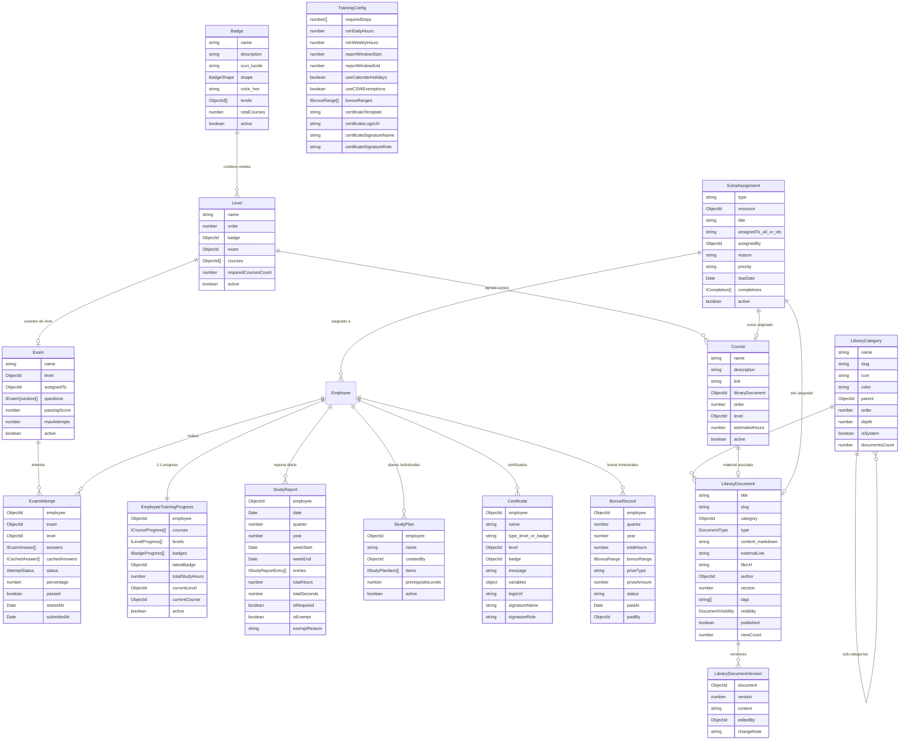
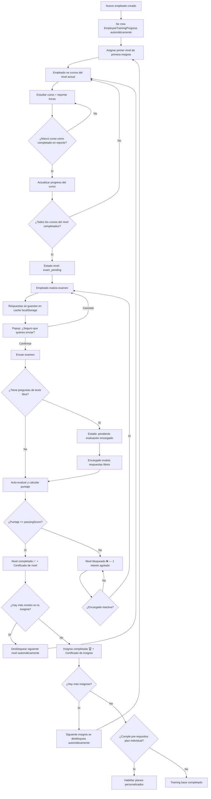
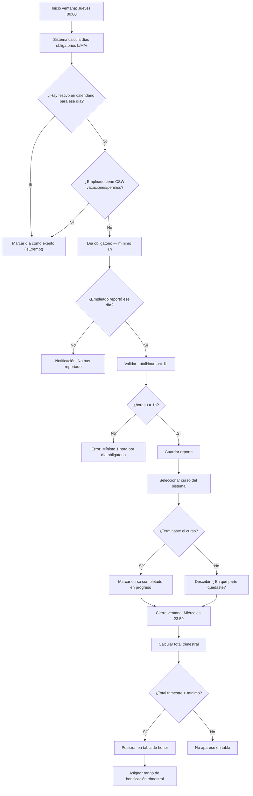
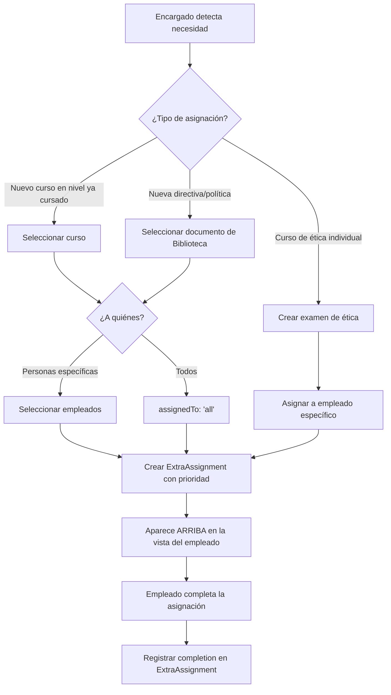
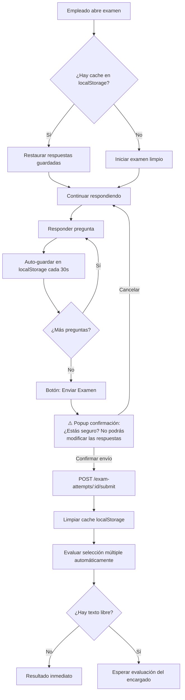
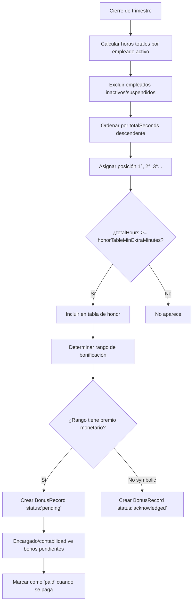
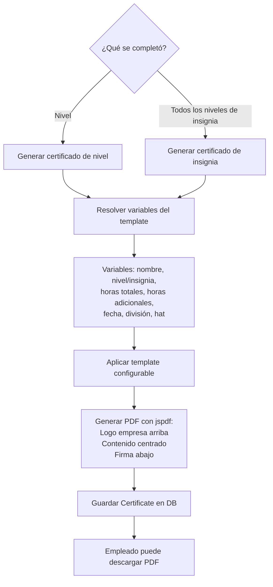

# Modelo de Datos — Módulo Training (v2 — post decisiones)

## Diagrama de Relaciones



## Diagrama de Flujo — Progreso del Empleado (actualizado)



## Diagrama de Flujo — Reporte de Estudio (actualizado: jue-mié, 1h/día mínimo)



## Diagrama — Asignaciones Extraordinarias



## Diagrama — Examen con Cache y Confirmación



## Diagrama — Tabla de Honor y Bonificaciones (trimestral)



## Diagrama — Certificados (por nivel y por insignia)



---

## Colecciones (15 nuevas + 1 campo en Employee)

### Colección 1: `Course`

```typescript
interface ICourse extends Document {
  name: string;
  description: string;
  link?: string;                   // URL externa (video, plataforma)
  libraryDocument?: Types.ObjectId; // ref: LibraryDocument (material en Biblioteca)
  order: number;                   // Orden dentro del nivel
  level: Types.ObjectId;           // ref: Level
  estimatedHours?: number;
  active: boolean;
  deleted: boolean;
  deletedAt?: Date;
  createdAt: Date;
  updatedAt: Date;
}
```

**Índices:** `{ level: 1, order: 1 }`, `{ active: 1, deleted: 1 }`

---

### Colección 2: `Level`

```typescript
interface ILevel extends Document {
  name: string;                    // "Nivel 1 — Fundamentos"
  description?: string;
  order: number;                   // Secuencia estricta (D1: no se puede saltar)
  badge: Types.ObjectId;           // ref: Badge
  exam?: Types.ObjectId;           // ref: Exam
  courses: Types.ObjectId[];       // ref: Course[]
  requiredCoursesCount: number;    // Default: todos los cursos
  active: boolean;
  deleted: boolean;
  deletedAt?: Date;
  createdAt: Date;
  updatedAt: Date;
}
```

**Índices:** `{ badge: 1, order: 1 }`, `{ active: 1, deleted: 1 }`

---

### Colección 3: `Badge`

```typescript
type BadgeShape = 'circle' | 'shield' | 'hexagon' | 'star' | 'diamond' | 'pentagon' | 'octagon' | 'badge' | 'medal';

interface IBadge extends Document {
  name: string;
  description: string;
  icon: string;                    // Nombre ícono Lucide (ej: "award", "shield-check")
  shape: BadgeShape;               // Forma SVG de la insignia
  color: string;                   // Color hex cuando está obtenida
  levels: Types.ObjectId[];        // ref: Level[] (orden define secuencia D1)
  totalCourses: number;            // Computed
  active: boolean;
  deleted: boolean;
  deletedAt?: Date;
  createdAt: Date;
  updatedAt: Date;
}
```

**Índices:** `{ name: 1 }` (unique), `{ active: 1, deleted: 1 }`

---

### Colección 4: `Exam`

```typescript
type QuestionType = 'multiple_choice' | 'open_text';

interface IExamQuestion {
  order: number;
  text: string;
  type: QuestionType;
  options?: { text: string; isCorrect: boolean }[];  // Solo multiple_choice
  expectedAnswer?: string;         // Guía para evaluador en open_text (D7)
  points: number;
  required: boolean;
}

interface IExam extends Document {
  name: string;
  description?: string;
  level?: Types.ObjectId;          // ref: Level (null si es de ética)
  assignedTo?: Types.ObjectId;     // ref: Employee (exámenes de ética D4)
  questions: IExamQuestion[];
  passingScore: number;            // Porcentaje mínimo (0-100)
  maxAttempts: number;             // Default: 1 (D5, configurable)
  active: boolean;
  deleted: boolean;
  deletedAt?: Date;
  createdAt: Date;
  updatedAt: Date;
}
```

**Nota D6:** Sin `timeLimitMinutes`. Eliminado del schema — no hay tiempo límite.

**Índices:** `{ level: 1 }`, `{ assignedTo: 1 }`

---

### Colección 5: `EmployeeTrainingProgress`

```typescript
type CourseStatus = 'not_started' | 'in_progress' | 'completed';
type LevelStatus = 'locked' | 'in_progress' | 'exam_pending' | 'exam_failed' | 'completed';
type BadgeStatus = 'not_started' | 'in_progress' | 'completed';

interface IEmployeeTrainingProgress extends Document {
  employee: Types.ObjectId;        // ref: Employee (D21: se crea automáticamente)
  courses: ICourseProgress[];
  levels: ILevelProgress[];
  badges: IBadgeProgress[];
  latestBadge?: Types.ObjectId;
  totalStudyHours: number;
  currentLevel?: Types.ObjectId;
  currentCourse?: Types.ObjectId;
  active: boolean;                 // D22: false si empleado inactivo (no aparece en tablas)
  createdAt: Date;
  updatedAt: Date;
}
```

**D22:** Cuando un empleado se suspende, se marca `active: false`. Todos los queries de tablas/dashboards filtran por `active: true`.

**Índices:** `{ employee: 1 }` (unique), `{ active: 1, 'badges.status': 1 }`

---

### Colección 6: `ExamAttempt`

```typescript
interface ICachedAnswer {
  questionOrder: number;
  answer: string;
  savedAt: Date;
}

type AttemptStatus = 'in_progress' | 'submitted' | 'pending_evaluation' | 'passed' | 'failed';

interface IExamAttempt extends Document {
  employee: Types.ObjectId;
  exam: Types.ObjectId;
  level?: Types.ObjectId;
  answers: IExamAnswer[];
  cachedAnswers?: ICachedAnswer[]; // D6: respuestas temporales pre-envío
  status: AttemptStatus;
  totalScore: number;
  maxScore: number;
  percentage: number;
  passed: boolean;
  startedAt: Date;
  submittedAt?: Date;
  evaluatedAt?: Date;
  createdAt: Date;
  updatedAt: Date;
}
```

**D6:** `cachedAnswers` se sincroniza desde localStorage del frontend. Se limpia al hacer submit.

**Índices:** `{ employee: 1, exam: 1 }`, `{ status: 1 }`, `{ exam: 1, passed: 1 }`

---

### Colección 7: `StudyReport`

```typescript
interface IStudyReportEntry {
  course: Types.ObjectId;          // ref: Course (D11: solo cursos del sistema)
  hoursSpent: number;
  completed: boolean;              // D3: ¿terminó este curso?
  progress?: string;               // Si no terminó: ¿en qué parte quedó?
}

interface IStudyReport extends Document {
  employee: Types.ObjectId;
  date: Date;                      // Normalizada a 00:00
  weekStart: Date;                 // D9: Jueves 00:00
  weekEnd: Date;                   // D9: Miércoles 23:59
  quarter: number;                 // D12: 1-4
  year: number;
  entries: IStudyReportEntry[];
  totalHours: number;              // Suma del día
  totalSeconds: number;            // Para ordenamiento preciso
  isRequired: boolean;             // D8: L/M/V sin festivo ni CSW
  isExempt: boolean;
  exemptReason?: string;
  createdAt: Date;
  updatedAt: Date;
}
```

**D8:** Cada día obligatorio requiere mínimo 1h (`minDailyHours`).
**D9:** Ventana jueves-miércoles. No se puede reportar fuera de la ventana.
**D11:** Solo cursos registrados en el sistema.

**Índices:** `{ employee: 1, date: 1 }` (unique), `{ quarter: 1, year: 1, totalSeconds: -1 }`, `{ weekStart: 1, employee: 1 }`

---

### Colección 8: `StudyPlan`

Sin cambios respecto al diseño original.

---

### Colección 9: `Certificate`

```typescript
type CertificateType = 'level' | 'badge';

interface ICertificate extends Document {
  employee: Types.ObjectId;
  type: CertificateType;           // D17: por nivel Y por insignia
  name: string;
  level?: Types.ObjectId;          // Si type = 'level'
  badge?: Types.ObjectId;          // Si type = 'badge'
  message: string;
  variables: {
    employeeName: string;
    levelName?: string;
    badgeName?: string;
    totalStudyHours: number;
    additionalStudyHours: number;
    completionDate: string;
    division: string;
    hat: string;
  };
  logoUrl: string;                 // D18: Logo empresa
  signatureName: string;           // D18: Nombre del firmante
  signatureRole: string;           // D18: Cargo del firmante
  generatedAt: Date;
  pdfUrl?: string;
  createdAt: Date;
  updatedAt: Date;
}
```

**D17:** Se genera un certificado por nivel completado + un certificado de insignia al completar todos los niveles.
**D18:** PDF con logo arriba, contenido centrado, firma abajo.

---

### Colección 10: `TrainingConfig`

```typescript
interface ITrainingConfig extends Document {
  requiredDays: number[];          // [1, 3, 5] = L, M, V
  minDailyHours: number;           // D8: 1h por día obligatorio
  minWeeklyHours: number;          // 3h total semanal
  reportWindowStart: number;       // D9: 4 = jueves
  reportWindowEnd: number;         // D9: 3 = miércoles
  useCalendarHolidays: boolean;
  useCSWExemptions: boolean;
  cswExemptCategories: string[];
  bonusRanges: IBonusRange[];
  certificateTemplate: string;
  certificateLogoUrl: string;      // D18: Logo para certificados
  certificateSignatureName: string; // D18
  certificateSignatureRole: string; // D18
  updatedBy: Types.ObjectId;
  createdAt: Date;
  updatedAt: Date;
}
```

---

### Colección 11: `LibraryCategory`

Sin cambios. Ver [04-library-module.md](./04-library-module.md).

---

### Colección 12: `LibraryDocument`

Sin cambios. Ver [04-library-module.md](./04-library-module.md).

---

### Colección 13: `LibraryDocumentVersion`

Sin cambios + TTL de 1 año para versiones antiguas.

---

### Colección 14: `BonusRecord` (NUEVA — D12/D13)

```typescript
interface IBonusRecord extends Document {
  employee: Types.ObjectId;
  quarter: number;                 // D12: Trimestre 1-4
  year: number;
  totalHours: number;              // Horas totales del trimestre
  totalSeconds: number;            // Para precisión
  position: number;                // Posición en la tabla de honor
  bonusRange: {                    // Snapshot del rango (desnormalizado)
    bonusName: string;
    commendation: string;
    icon: string;
    color: string;
  };
  prizeType: 'symbolic' | 'monetary' | 'both';
  prizeAmount?: number;            // D14: visible para todos
  prizeCurrency?: string;
  prizeDescription?: string;
  status: 'pending' | 'paid' | 'acknowledged';
  paidAt?: Date;
  paidBy?: Types.ObjectId;
  createdAt: Date;
  updatedAt: Date;
}
```

**Índices:** `{ employee: 1, quarter: 1, year: 1 }` (unique), `{ status: 1, year: 1 }`, `{ quarter: 1, year: 1, totalSeconds: -1 }`

---

### Colección 15: `ExtraAssignment` (NUEVA — D4)

```typescript
type AssignmentType = 'course' | 'document' | 'directive';
type AssignmentPriority = 'normal' | 'high' | 'urgent';

interface IExtraAssignment extends Document {
  type: AssignmentType;
  resource: Types.ObjectId;        // ref: Course | LibraryDocument
  title: string;                   // Desnormalizado para lista rápida
  description?: string;            // Motivo/contexto
  assignedTo: 'all' | Types.ObjectId[];  // 'all' o array de Employee IDs
  assignedBy: Types.ObjectId;      // ref: Employee (encargado)
  reason: string;                  // Por qué se asigna
  priority: AssignmentPriority;    // urgent = aparece primero
  dueDate?: Date;                  // Fecha límite opcional
  completions: {                   // Track por empleado
    employee: Types.ObjectId;
    completedAt: Date;
  }[];
  active: boolean;
  createdAt: Date;
  updatedAt: Date;
}
```

**D4:** Las asignaciones extraordinarias aparecen ARRIBA de los cursos regulares en la vista del empleado, ordenadas por prioridad (urgent > high > normal).

**Índices:** `{ active: 1, priority: -1 }`, `{ 'completions.employee': 1 }`, `{ assignedTo: 1 }`

---

### Campo nuevo en `Employee` (existente)

```typescript
// Agregar a Employee schema
studyProgress?: {
  latestBadgeIcon: string;       // Ícono Lucide
  latestBadgeShape: BadgeShape;  // Forma
  latestBadgeColor: string;      // Color hex
  totalBadgesEarned: number;     // Total insignias obtenidas
};
```

---

## Resumen Final

| # | Colección | Tipo | Decisión clave |
|---|-----------|------|----------------|
| 1 | `Course` | Nueva | Material vive en Biblioteca (ref) |
| 2 | `Level` | Nueva | Secuencia estricta obligatoria (D1) |
| 3 | `Badge` | Nueva | Lucide icons + shapes SVG |
| 4 | `Exam` | Nueva | Sin tiempo límite, max 1 intento default (D5/D6) |
| 5 | `EmployeeTrainingProgress` | Nueva | active=false si empleado inactivo (D22) |
| 6 | `ExamAttempt` | Nueva | Cache en localStorage + confirmación (D6) |
| 7 | `StudyReport` | Nueva | Ventana jue-mié, 1h/día mín, solo cursos sistema (D8/D9/D11) |
| 8 | `StudyPlan` | Nueva | Post-niveles base |
| 9 | `Certificate` | Nueva | Por nivel + por insignia, PDF con logo+firma (D17/D18) |
| 10 | `TrainingConfig` | Nueva | Singleton con toda la config |
| 11 | `LibraryCategory` | Nueva | Árbol dinámico de categorías |
| 12 | `LibraryDocument` | Nueva | Siempre almacena Markdown |
| 13 | `LibraryDocumentVersion` | Nueva | TTL 1 año |
| 14 | `BonusRecord` | Nueva | Trimestral, bonos monetarios visibles (D12/D13/D14) |
| 15 | `ExtraAssignment` | Nueva | Asignaciones prioritarias sobre flujo regular (D4) |
| — | `Employee` (mod) | Existente | Agregar `studyProgress` para navbar |

**Total: 15 colecciones nuevas + 1 campo en Employee**
