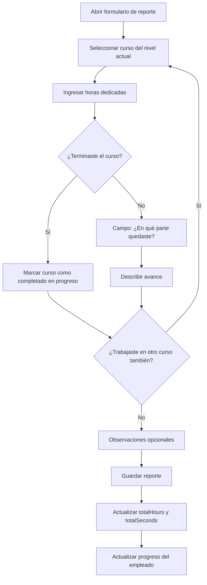

# Features Detalladas — Módulo Training

## Sub-módulo 1: Gestión de Cursos y Niveles

### 1.1 CRUD de Cursos
- Crear curso con: nombre, descripción, link, documento, orden, nivel
- Documento puede ser URL externa o contenido escrito en editor rich-text
- El contenido se almacena en Markdown (eficiente para procesamiento IA futuro)
- Reordenar cursos dentro de un nivel (drag & drop)
- Activar/desactivar cursos

### 1.2 CRUD de Niveles
- Crear nivel asociado a una insignia
- Definir cursos que componen el nivel
- Asociar examen de fin de nivel
- Secuencia obligatoria: completar cursos → habilitar examen
- Reordenar niveles dentro de una insignia

### 1.3 CRUD de Insignias
- Crear insignia con: nombre, logo, descripción, color
- Asociar niveles a la insignia
- Vista de progreso: gris (no iniciada), parcial (en progreso), color (completada)
- Auto-cálculo de totalCourses a partir de los niveles

---

## Sub-módulo 2: Sistema de Exámenes

### 2.1 Creador de Exámenes
- Agregar preguntas de tipo: selección múltiple / respuesta libre
- Para selección múltiple: definir opciones y marcar la correcta
- Asignar puntos por pregunta
- Reordenar preguntas con flechas ↑↓ o drag & drop (`react-dnd` ya instalado)
- Definir porcentaje mínimo de aprobación
- Tiempo límite opcional

### 2.2 Tipos de Examen
- **De nivel:** Asociado a un Level, se desbloquea al completar los cursos del nivel
- **De ética:** Asociado a un empleado específico, el encargado lo asigna manualmente cuando hay una condición de ética que requiere re-capacitación

### 2.3 Evaluación
- Selección múltiple: evaluación automática (isCorrect ya definido)
- Respuesta libre: evaluación manual por el encargado de Training
- Dashboard de exámenes pendientes de evaluar
- Feedback por pregunta (comentarios del evaluador)

### 2.4 Reactivación
- Si un empleado falla el examen, queda bloqueado
- El encargado puede reactivar el nivel/examen para que reintente
- Se registra quién y cuándo reactivó
- También aplica para re-asignar un curso/nivel por condición de ética

---

## Sub-módulo 3: Progreso del Empleado

### 3.1 Asignación y Tracking
- Al crear un empleado, se inicializa su `EmployeeTrainingProgress`
- El progreso se actualiza automáticamente al:
  - Marcar un curso como completado
  - Aprobar un examen
  - Obtener una insignia al 100%

### 3.2 Reglas de Progreso
- Un curso ya completado NO se puede volver a asignar (salvo reactivación por ética)
- Los niveles se desbloquean en orden secuencial
- El examen se desbloquea solo cuando todos los cursos requeridos están completados
- La insignia se otorga cuando todos los niveles están completados

### 3.3 Vista del Empleado
- Barra de progreso general (porcentaje de insignias obtenidas)
- Lista de insignias: color = obtenida, gris = faltante, parcial = en progreso
- Curso/nivel actual en el que se encuentra
- Historial de exámenes y calificaciones

### 3.4 Integración con Perfil/Avatar
- En el navbar, junto al avatar: mostrar ícono de la última insignia obtenida
- En la página de perfil: sección de insignias obtenidas
- En el detalle del empleado (vista admin): todas las insignias y progreso

---

## Sub-módulo 4: Reportes de Estudio

### 4.1 Reporte Diario
- Cada empleado reporta obligatoriamente L, M, V (configurable)
- Formulario de reporte con los siguientes campos:

**Campos del formulario de reporte:**

| Campo | Tipo | Obligatorio | Descripción |
|-------|------|-------------|-------------|
| Fecha | Date (auto) | ✅ | Día que se está reportando (default: hoy) |
| Curso(s) trabajado(s) | Select múltiple | ✅ | Seleccionar de los cursos asignados |
| Horas dedicadas | Number (por curso) | ✅ | Horas con decimales (ej: 1.5h) |
| ¿Terminaste el curso? | Toggle Sí/No (por curso) | ✅ | Si selecciona "Sí", marca el curso como completado |
| ¿En qué parte quedaste? | Textarea | ✅ si no terminó | Describir avance (ej: "Capítulo 3, video 2 de 5") |
| Observaciones | Textarea | ❌ | Notas adicionales, dificultades, dudas |

**Flujo del formulario:**



**Reglas de validación:**
- No puede reportar más de 12h en un solo día
- No puede reportar un curso que no está en su nivel actual (salvo plan individual)
- Si marca "terminé el curso", se valida que tenga al menos X horas acumuladas en ese curso
- No puede editar reportes de semanas anteriores (solo la semana actual)
- El encargado SÍ puede ajustar reportes de semanas pasadas

**Vista del reporte para el empleado:**
```
┌─────────────────────────────────────────────────────────┐
│  📝 Reportar Estudio — Miércoles 16 Jul 2026            │
├─────────────────────────────────────────────────────────┤
│                                                         │
│  Curso: [Fundamentos de TypeScript ▼]                   │
│                                                         │
│  Horas dedicadas: [1.5] h                               │
│                                                         │
│  ¿Terminaste este curso?  ○ Sí  ● No                   │
│                                                         │
│  ¿En qué parte quedaste?                                │
│  ┌─────────────────────────────────────────────────┐   │
│  │ Capítulo 3: Tipos avanzados, video 2 de 4       │   │
│  └─────────────────────────────────────────────────┘   │
│                                                         │
│  [+ Agregar otro curso]                                 │
│                                                         │
│  ─────────────────────────────────────────────────────  │
│  Observaciones (opcional):                              │
│  ┌─────────────────────────────────────────────────┐   │
│  │ Tuve dudas sobre utility types, preguntar...    │   │
│  └─────────────────────────────────────────────────┘   │
│                                                         │
│  Total del día: 1.5h                                    │
│                                                         │
│                              [Cancelar]  [Guardar ✓]    │
└─────────────────────────────────────────────────────────┘
```

### 4.2 Exenciones Automáticas
- **Festivos:** Se consulta el módulo de Calendario. Si el día es type='holiday' para el país del empleado, el día se marca como `isExempt` y no es obligatorio
- **CSW aprobados:** Si el empleado tiene un CSW aprobado de categoría "Vacaciones" o "Permiso" que cubra ese día, se exime automáticamente
- El sistema calcula al inicio de cada semana qué días son realmente obligatorios

### 4.3 Vista Semanal del Encargado
- Tabla con todos los empleados
- Columnas: L, M, V (o los días configurados)
- Indicador visual: ✅ reportado, ❌ no reportado, ⬜ exento
- Alertas de empleados que no han reportado

### 4.4 Ajustes de Semana
- El encargado puede marcar un día como exento para todos (ej: evento especial)
- Configurar semanas con días diferentes (ej: semana de solo 2 días por evento corporativo)

---

## Sub-módulo 5: Tabla de Honor y Gamificación

### 5.1 Tabla de Honor Semanal
- Lista de todos los empleados con al menos 1 minuto adicional sobre el mínimo semanal (3h)
- Ordenada por tiempo total reportado en la semana (descendente)
- El tiempo se almacena en segundos para precisión en el ordenamiento
- Visualización en formato HH:MM (ej: "05:30")
- Posición en la tabla (1°, 2°, 3°... con medallas para top 3)

### 5.2 Bonificaciones por Rango
- Rangos de 5 en 5 horas semanales (configurables en TrainingConfig)
- Cada rango tiene: nombre + condecoración + premio (bono monetario opcional)
- El premio puede ser una condecoración simbólica O un bono en dinero
- El encargado configura los rangos y premios desde la configuración del módulo

**Estructura del rango:**
```typescript
interface IBonusRange {
  minHours: number;          // Desde X horas
  maxHours: number;          // Hasta Y horas (0 = sin límite superior)
  bonusName: string;         // Nombre del rango (ej: "Experto")
  commendation: string;      // Texto de condecoración
  prizeType: 'symbolic' | 'monetary';  // Tipo de premio
  prizeAmount?: number;      // Monto en dinero (si es monetary)
  prizeCurrency?: string;    // Moneda (COP, USD) — default del sistema
  prizeDescription?: string; // Descripción del premio si no es dinero
  color?: string;            // Color del rango (para UI)
  icon?: string;             // Ícono Lucide del rango
}
```

**Ejemplo de configuración:**

| Rango | Horas | Nombre | Condecoración | Premio |
|-------|-------|--------|---------------|--------|
| 1 | 0-5h | Principiante | Buen inicio | 🏅 Condecoración simbólica |
| 2 | 5-10h | Comprometido | Dedicación notable | 💰 Bono $50.000 COP |
| 3 | 10-15h | Avanzado | Excelente progreso | 💰 Bono $100.000 COP |
| 4 | 15-20h | Experto | Dominio demostrado | 💰 Bono $150.000 COP |
| 5 | 20h+ | Maestro | Liderazgo en formación | 💰 Bono $250.000 COP + 🏆 Reconocimiento público |

**Notas:**
- Los montos y rangos son 100% configurables por el encargado
- El sistema solo **registra** el bono ganado, no lo paga automáticamente
- Se genera un reporte mensual/semanal de bonos a pagar para contabilidad
- Un empleado solo puede estar en un rango por semana (el más alto que alcance)

### 5.3 Insignias en la UI
- Avatar del navbar: última insignia obtenida (borde con color de la insignia)
- Perfil del empleado: grid de insignias (color = obtenida, gris = faltante)
- Tooltip al hover: nombre + porcentaje de progreso

---

## Sub-módulo 6: Certificados

### 6.1 Generación Automática
- Se genera al completar un nivel (todos los cursos + examen aprobado)
- Template configurable con variables (ver 01-data-model.md)
- Generado como PDF descargable (`jspdf`)

### 6.2 Template del Certificado
- Editable por el encargado desde la configuración
- Formato Markdown con variables `{{variableName}}`
- Preview en tiempo real antes de guardar

### 6.3 Historial
- Cada empleado puede ver sus certificados generados
- Descarga individual en PDF
- El encargado puede regenerar un certificado (si el template cambió)

---

## Sub-módulo 7: Planes de Estudio Individuales

### 7.1 Creación
- Solo disponible para empleados que completaron X niveles (configurable)
- El encargado crea una ruta personalizada con items de tipo:
  - Curso existente del sistema
  - Documento nuevo (escrito en editor → guardado como Markdown)
  - Link externo

### 7.2 Seguimiento
- El empleado marca items como completados
- Barra de progreso del plan
- No requiere examen (es auto-dirigido)

---

## Sub-módulo 8: Dashboard del Encargado

### 8.1 Métricas Generales
- Total de empleados en capacitación
- Distribución por nivel actual
- Tasa de aprobación de exámenes
- Horas totales de estudio (equipo completo)
- Empleados que no han reportado esta semana

### 8.2 Vista por Empleado
- Filtrar/buscar empleado
- Ver su progreso completo: cursos, niveles, insignias, reportes
- Historial de exámenes y calificaciones
- Poder reactivar niveles/exámenes

### 8.3 Alertas
- Empleados que fallaron un examen (necesitan reactivación)
- Empleados sin reporte en días obligatorios
- Exámenes pendientes de evaluación (respuestas libres)
- Empleados estancados (sin progreso en X semanas)

---

## Librerías Recomendadas

| Librería | Uso | Justificación |
|----------|-----|---------------|
| `react-dnd` | Reordenar preguntas/cursos | **Ya instalada** en el proyecto |
| `react-quill-new` | Editor rich-text para documentos y políticas | **100% gratuito**, fork activo de react-quill compatible con React 19, toolbar configurable, output HTML |
| `react-markdown` + `remark-gfm` | Renderizar documentos .md en la UI | Liviano, soporta tablas y código |
| `turndown` | Convertir HTML del editor a Markdown | Para almacenar como .md (eficiente para IA) |
| `lucide-react` | Íconos de insignias | **MIT**, 1500+ íconos, tree-shakeable, consistentes |
| `jspdf` | Generar certificados PDF | Estándar, sin dependencias server-side |
| `date-fns` | Manejo de semanas ISO, días | Más liviano que moment, tree-shakeable |

**¿Por qué react-quill-new y no Tiptap?**
- Tiptap tiene features de pago (colaboración, AI, extensiones pro)
- `react-quill-new` es 100% open source (MIT), cero costo
- Incluye toolbar completo: headers, bold, italic, listas, links, código, tablas
- Output HTML que se convierte a Markdown con `turndown`
- Fork mantenido activamente, compatible con React 18/19

**Alternativas evaluadas:**
| Librería | Gratuita | React 19 | Rich features | Decisión |
|----------|----------|-----------|---------------|----------|
| Tiptap | Parcial (pro features de pago) | ✅ | ✅ | ❌ Costo |
| react-quill | ✅ | ❌ (abandonada) | ✅ | ❌ Deprecated |
| react-quill-new | ✅ MIT | ✅ | ✅ | ✅ **Elegida** |
| Slate | ✅ | ✅ | ⚠️ Bajo nivel | ❌ Mucho boilerplate |
| Lexical (Meta) | ✅ | ✅ | ⚠️ Complejo | ❌ Overengineered para nuestro caso |
| MDXEditor | ✅ | ✅ | ✅ Markdown nativo | 🟡 Alternativa viable |

**Nota sobre MDXEditor como segunda opción:**
Si en el futuro se necesita edición directa en Markdown (sin paso de conversión HTML→MD), `MDXEditor` es una excelente alternativa que edita `.md` nativamente con toolbar visual. Pero para v1, react-quill-new es más simple de integrar.

**Nota sobre la estrategia de Markdown:**
- Los documentos de cursos y políticas se escriben en el editor rich-text (react-quill-new)
- Se convierten a Markdown al guardar (Turndown)
- Se almacenan como `.md` en el campo `documentContent`
- Se renderizan con `react-markdown` al visualizar
- Esto optimiza el procesamiento futuro por IA (GPT consume MD de forma eficiente y económica)
