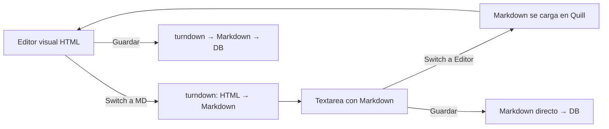

# Módulo de Biblioteca — Sistema Documental de Training

## Visión General

La Biblioteca es el repositorio central donde reside todo el contenido formativo de la empresa: cursos, políticas, whitepapers, documentación técnica, y cualquier categoría que el administrador quiera crear. Funciona como un **CMS documental interno** con categorías dinámicas y sub-niveles.

```
┌─────────────────────────────────────────────────────┐
│                   BIBLIOTECA                         │
├─────────────────────────────────────────────────────┤
│                                                     │
│  ┌─────────────┐  ┌─────────────┐  ┌───────────┐  │
│  │   Cursos    │  │  Políticas  │  │Whitepapers│  │
│  │  (default)  │  │  (default)  │  │ (creada)  │  │
│  └──────┬──────┘  └──────┬──────┘  └─────┬─────┘  │
│         │                │                │        │
│    ┌────┴────┐     ┌────┴────┐      ┌───┴────┐   │
│    │Sub-cat 1│     │Sub-cat 1│      │Doc IA 1│   │
│    │Sub-cat 2│     │Sub-cat 2│      │Doc IA 2│   │
│    └─────────┘     └─────────┘      └────────┘   │
│                                                     │
│  ┌─────────────┐  ┌─────────────┐                 │
│  │  Docs IA    │  │  Manuales   │  ← Creadas      │
│  │  (creada)   │  │  (creada)   │    dinámicamente │
│  └─────────────┘  └─────────────┘                 │
│                                                     │
└─────────────────────────────────────────────────────┘
```

## Arquitectura

### Categorías Dinámicas (Sub-niveles)

El administrador puede crear **categorías de primer nivel** (Cursos, Políticas, Whitepapers, Docs IA, Manuales, etc.) y dentro de cada una, **sub-categorías** sin límite de profundidad útil (recomendado máximo 3 niveles).

### Documentos

Cada documento pertenece a una categoría y puede contener:
- Contenido escrito en el editor rich-text (guardado como Markdown)
- Link externo (video, plataforma, recurso web)
- Archivo adjunto (PDF subido)
- O una combinación de los anteriores

---

## Modelo de Datos

### Colección: `LibraryCategory` (Categorías de la Biblioteca)

```typescript
interface ILibraryCategory extends Document {
  name: string;                    // Nombre de la categoría
  slug: string;                    // Slug URL-friendly (auto-generado)
  description?: string;            // Descripción opcional
  icon?: string;                   // Ícono (emoji o nombre de ícono)
  color?: string;                  // Color identificador (hex)
  parent?: Types.ObjectId;         // ref: LibraryCategory — null = primer nivel
  order: number;                   // Orden dentro de su nivel
  depth: number;                   // Profundidad (0 = raíz, 1 = sub, 2 = sub-sub)
  isSystem: boolean;               // true = categoría del sistema (no eliminable)
  documentsCount: number;          // Computed: cantidad de documentos en esta categoría
  active: boolean;
  deleted: boolean;
  deletedAt?: Date;
  createdBy: Types.ObjectId;       // ref: Employee
  createdAt: Date;
  updatedAt: Date;
}
```

**Categorías del sistema (isSystem: true, creadas en seed):**
- `Cursos` — Material asociado a los niveles de training
- `Políticas` — Políticas empresariales (código de ética, reglamento, etc.)

**Categorías creadas por el administrador (isSystem: false):**
- Whitepapers, Docs IA, Manuales Técnicos, Guías de Onboarding, etc.

**Índices:**
- `{ parent: 1, order: 1 }` — Listar hijos ordenados
- `{ slug: 1 }` (unique)
- `{ depth: 1, active: 1 }`

---

### Colección: `LibraryDocument` (Documentos)

```typescript
type DocumentType = 'article' | 'link' | 'file' | 'mixed';
type DocumentVisibility = 'all' | 'specific_roles' | 'specific_divisions';

interface ILibraryDocument extends Document {
  title: string;                   // Título del documento
  slug: string;                    // Slug URL-friendly
  description?: string;            // Resumen/extracto
  category: Types.ObjectId;        // ref: LibraryCategory
  type: DocumentType;              // Tipo de documento
  
  // Contenido (según type)
  content?: string;                // Contenido en Markdown (para article/mixed)
  externalLink?: string;           // URL externa (para link/mixed)
  fileUrl?: string;                // URL del archivo subido (para file/mixed)
  fileName?: string;               // Nombre original del archivo
  fileMimeType?: string;           // MIME type del archivo
  
  // Metadata
  author: Types.ObjectId;          // ref: Employee — quien lo creó/editó
  version: number;                 // Versión del documento (incrementa en cada edición)
  tags: string[];                  // Tags para búsqueda
  
  // Visibilidad
  visibility: DocumentVisibility;  // Quién puede ver este documento
  visibleToRoles?: Types.ObjectId[];      // ref: Role[] (si visibility = specific_roles)
  visibleToDivisions?: Types.ObjectId[];  // ref: Division[] (si visibility = specific_divisions)
  
  // Asociación con Training (opcional)
  linkedCourse?: Types.ObjectId;   // ref: Course — si este doc es material de un curso
  linkedLevel?: Types.ObjectId;    // ref: Level
  
  // Estado
  published: boolean;              // true = visible para empleados, false = borrador
  publishedAt?: Date;
  featured: boolean;               // Destacado en la biblioteca
  order: number;                   // Orden dentro de su categoría
  viewCount: number;               // Contador de vistas
  
  // Soft delete
  deleted: boolean;
  deletedAt?: Date;
  createdAt: Date;
  updatedAt: Date;
}
```

**Índices:**
- `{ category: 1, order: 1, published: 1 }` — Listar docs de una categoría
- `{ slug: 1 }` (unique)
- `{ tags: 1 }` — Búsqueda por tags
- `{ linkedCourse: 1 }` — Encontrar doc de un curso
- `{ author: 1 }` — Docs de un autor
- `{ published: 1, featured: 1 }` — Docs destacados publicados

---

### Colección: `LibraryDocumentVersion` (Historial de Versiones)

```typescript
interface ILibraryDocumentVersion extends Document {
  document: Types.ObjectId;        // ref: LibraryDocument
  version: number;                 // Número de versión
  content: string;                 // Contenido MD en esta versión
  editedBy: Types.ObjectId;        // ref: Employee
  changeNote?: string;             // Nota del cambio ("Actualizado sección 3")
  createdAt: Date;
}
```

**Índices:**
- `{ document: 1, version: -1 }` — Historial de un documento, más reciente primero

---

## Funcionalidades

### 1. Gestión de Categorías

**Para el Administrador de Training:**
- Crear categorías de primer nivel (ej: "Whitepapers", "Docs IA", "Manuales")
- Crear sub-categorías dentro de cualquier categoría existente
- Reordenar categorías (drag & drop o flechas)
- Editar nombre, descripción, ícono, color
- Desactivar categoría (oculta para empleados, no se eliminan los docs)
- Eliminar categoría (soft delete, requiere que no tenga docs activos)

**Visualización:**
- Árbol de navegación (sidebar o breadcrumbs)
- Cada categoría muestra contador de documentos
- Ícono + color para identificación visual rápida

### 2. Editor de Documentos (Modo dual: Editor visual / Markdown raw)

El sistema ofrece un **switch** para alternar entre editor visual y edición directa en Markdown. Independientemente del modo usado, el contenido siempre se **almacena como Markdown**.

**Modos de edición:**

| Modo | Herramienta | Input | Almacenamiento |
|------|-------------|-------|----------------|
| Editor visual (WYSIWYG) | `react-quill-new` | HTML visual | HTML → `turndown` → **Markdown** |
| Markdown raw | `textarea` con preview | Markdown directo | **Markdown** tal cual |

**UI del switch:**
```
┌─────────────────────────────────────────────────────────┐
│  Contenido del documento                                │
│                                                         │
│  Modo: [● Editor visual] [○ Markdown]  ← Toggle switch │
│  ─────────────────────────────────────────────────────  │
│                                                         │
│  MODO EDITOR VISUAL:                                    │
│  ┌─────────────────────────────────────────────────┐   │
│  │ B I U │ H1 H2 H3 │ • 1. │ 🔗 📷 │ </> │ 📋  │   │
│  ├─────────────────────────────────────────────────┤   │
│  │                                                 │   │
│  │  Texto con formato WYSIWYG...                   │   │
│  │                                                 │   │
│  └─────────────────────────────────────────────────┘   │
│                                                         │
│  MODO MARKDOWN (al hacer switch):                       │
│  ┌────────────────────────┬────────────────────────┐   │
│  │  # Título              │  Título (render)       │   │
│  │                        │                        │   │
│  │  Texto **negrita**     │  Texto negrita         │   │
│  │  - item 1             │  • item 1              │   │
│  │  - item 2             │  • item 2              │   │
│  │  (textarea raw)        │  (preview en vivo)     │   │
│  └────────────────────────┴────────────────────────┘   │
│             Editor                    Preview           │
└─────────────────────────────────────────────────────────┘
```

**Flujo de conversión entre modos:**


**Reglas:**
- Al cambiar de editor visual → markdown: se convierte con `turndown`
- Al cambiar de markdown → editor visual: se carga el MD como contenido del editor
- Siempre se guarda como Markdown en la base de datos (campo `content`)
- Si el usuario pega contenido HTML en modo markdown, se convierte automáticamente
- El preview en modo markdown usa `react-markdown` + `remark-gfm`

**Capacidades del editor visual (react-quill-new):**
- Encabezados (H1-H4)
- Texto enriquecido: negrita, cursiva, subrayado, tachado
- Listas ordenadas y no ordenadas
- Links (internos a otros docs, externos)
- Bloques de código con syntax highlighting
- Tablas
- Imágenes (upload o URL)
- Citas/blockquotes
- Separadores

**Flujo de guardado:**
1. **Modo editor visual:** Quill genera HTML → `turndown` convierte a Markdown → se guarda MD
2. **Modo markdown raw:** Se guarda el Markdown directamente (sin conversión)
3. En ambos casos se incrementa `version` y se crea entrada en `LibraryDocumentVersion`
4. Al visualizar, `react-markdown` + `remark-gfm` renderiza el MD

**¿Por qué siempre Markdown como almacenamiento?**
- Formato universal, ligero y diff-friendly
- Óptimo para procesamiento por IA (GPT consume MD eficientemente)
- Portabilidad: se puede exportar, versionar en git, convertir a PDF/HTML
- El editor visual es solo una capa de UX encima del MD

### 3. Tipos de Documento

| Tipo | Contenido | Uso típico |
|------|-----------|------------|
| `article` | Solo contenido escrito (MD) | Políticas, guías, manuales |
| `link` | Solo link externo | Cursos en plataforma, videos |
| `file` | Solo archivo adjunto (PDF, DOCX) | Documentos oficiales escaneados |
| `mixed` | Combinación de los anteriores | Curso con video + material escrito + PDF |

### 4. Visibilidad y Acceso

- **`all`** — Todos los empleados pueden ver el documento
- **`specific_roles`** — Solo empleados con ciertos Hats pueden ver
- **`specific_divisions`** — Solo empleados de ciertas divisiones
- La visibilidad se hereda de la categoría como default, pero cada doc puede override

### 5. Asociación con Training

Un documento de la biblioteca puede estar **vinculado** a un curso del módulo Training:
- El curso referencia al documento como su material
- Cuando el empleado accede al curso, ve el documento de la biblioteca
- Esto evita duplicar contenido (el curso apunta al doc, no lo contiene)

### 6. Búsqueda

- Búsqueda full-text en título, descripción y tags
- Filtro por categoría (y sub-categorías)
- Filtro por tipo de documento
- Filtro por autor
- Ordenar por: fecha, vistas, orden manual, nombre

### 7. Versionado

- Cada edición crea una versión nueva
- Se puede ver el historial de versiones
- Se puede comparar versiones (diff visual)
- Se puede restaurar una versión anterior
- La nota de cambio es opcional pero recomendada

---

## Endpoints API

Base URL: `/api/v1/library`

### Categorías

| Método | Ruta | Permiso | Descripción |
|--------|------|---------|-------------|
| GET | `/categories` | training:read | Listar categorías (árbol completo o por parent) |
| GET | `/categories/:id` | training:read | Obtener categoría con sub-categorías |
| POST | `/categories` | training:create | Crear categoría |
| PUT | `/categories/:id` | training:update | Actualizar categoría |
| PUT | `/categories/reorder` | training:update | Reordenar categorías |
| DELETE | `/categories/:id` | training:delete | Eliminar categoría (soft) |

### Documentos

| Método | Ruta | Permiso | Descripción |
|--------|------|---------|-------------|
| GET | `/documents` | training:read | Listar documentos (con filtros) |
| GET | `/documents/:slug` | training:read | Obtener documento por slug |
| GET | `/documents/:id/versions` | training:manage | Historial de versiones |
| GET | `/documents/:id/versions/:version` | training:manage | Versión específica |
| POST | `/documents` | training:create | Crear documento |
| PUT | `/documents/:id` | training:update | Actualizar documento (crea versión) |
| PUT | `/documents/:id/publish` | training:manage | Publicar/despublicar documento |
| PUT | `/documents/:id/feature` | training:manage | Destacar/quitar destacado |
| POST | `/documents/:id/restore-version/:version` | training:manage | Restaurar versión |
| DELETE | `/documents/:id` | training:delete | Eliminar documento (soft) |
| POST | `/documents/:id/view` | training:read | Registrar vista |

### Búsqueda

| Método | Ruta | Permiso | Descripción |
|--------|------|---------|-------------|
| GET | `/search?q=...&category=...&type=...` | training:read | Búsqueda con filtros |

---

## UI de la Biblioteca

### Vista del Empleado

```
┌─────────────────────────────────────────────────────────┐
│  📚 Biblioteca                                [🔍 Buscar]│
├─────────────────────────────────────────────────────────┤
│                                                         │
│  📌 Documentos Destacados                               │
│  ┌──────┐ ┌──────┐ ┌──────┐                           │
│  │Doc 1 │ │Doc 2 │ │Doc 3 │ ← Cards horizontales      │
│  └──────┘ └──────┘ └──────┘                           │
│                                                         │
│  ─────────────────────────────────────────────────────  │
│                                                         │
│  📂 Categorías                                          │
│  ├── 📘 Cursos (12 docs)                               │
│  │   ├── Nivel 1 - Fundamentos (4)                     │
│  │   └── Nivel 2 - Intermedio (3)                      │
│  ├── 📋 Políticas (8 docs)                             │
│  │   ├── Código de Ética                               │
│  │   └── Reglamento Interno                            │
│  ├── 📄 Whitepapers (5 docs)                           │
│  └── 🤖 Docs IA (3 docs)                               │
│                                                         │
└─────────────────────────────────────────────────────────┘
```

### Vista del Administrador

```
┌─────────────────────────────────────────────────────────┐
│  📚 Gestión de Biblioteca          [+ Nueva Categoría]  │
├────────────────────┬────────────────────────────────────┤
│                    │                                     │
│  Categorías (tree) │  Documentos de: {categoría actual} │
│  ┌──────────────┐ │  ┌─────────────────────────────┐   │
│  │ ▼ Cursos     │ │  │ Título │ Tipo │ Estado │ ··· │  │
│  │   ├─ Nivel 1 │ │  │ Doc A  │ 📝   │ ✅ Pub │     │  │
│  │   └─ Nivel 2 │ │  │ Doc B  │ 🔗   │ 📝 Draft│    │  │
│  │ ▼ Políticas  │ │  │ Doc C  │ 📎   │ ✅ Pub │     │  │
│  │ ▼ Whitepapers│ │  └─────────────────────────────┘   │
│  │ + Agregar    │ │                                     │
│  └──────────────┘ │  [+ Nuevo Documento]                │
│                    │                                     │
└────────────────────┴────────────────────────────────────┘
```

### Editor de Documento

```
┌─────────────────────────────────────────────────────────┐
│  Nuevo Documento                      [Guardar] [Publ.] │
├─────────────────────────────────────────────────────────┤
│  Título: [________________________]                     │
│  Categoría: [Políticas ▼]   Tipo: [Artículo ▼]        │
│  Tags: [ética] [compliance] [+]                         │
│  Visibilidad: [● Todos ○ Roles ○ Divisiones]           │
│  ─────────────────────────────────────────────────────  │
│  ┌─────────────────────────────────────────────────┐   │
│  │ B I U S │ H1 H2 H3 │ • 1. │ 🔗 📷 ═ │ </> │ 📋 │  │
│  ├─────────────────────────────────────────────────┤   │
│  │                                                 │   │
│  │  Aquí va el contenido del documento...          │   │
│  │  (editor WYSIWYG react-quill-new)               │   │
│  │                                                 │   │
│  └─────────────────────────────────────────────────┘   │
│  ─────────────────────────────────────────────────────  │
│  📎 Adjuntar archivo: [Seleccionar]                     │
│  🔗 Link externo: [https://...]                         │
│                                                         │
└─────────────────────────────────────────────────────────┘
```

---

## Relación Biblioteca ↔ Training

```
Biblioteca (repositorio de contenido)
    │
    ├── LibraryDocument (doc de curso) ←── linkedCourse ──→ Course (training)
    │                                                         │
    │   El curso apunta al documento                         │
    │   El empleado ve el documento desde el flujo de training│
    │                                                         │
    └── LibraryDocument (política)  ←── Exam (ética) → Empleado específico
        │
        └── Si un empleado viola la política, se le asigna
            un examen de ética que referencia este documento
```

**Principio:** La Biblioteca es la **fuente única** del contenido. Training referencia documentos de la biblioteca, no los duplica. Un curso es "aprende este documento" + "haz este examen".
