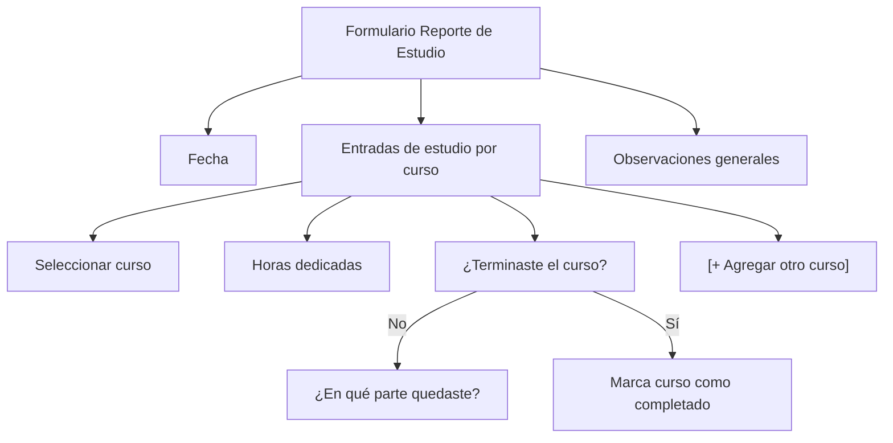

# Análisis de Implementación — Módulo Training

## 1. Componentes del Template TailAdmin Pro Disponibles

Mapeo de componentes existentes en `tailadmin-react-pro-2.0-main` que se reutilizarán directamente:

| Componente Template | Uso en Training | Ubicación |
|--------------------|-----------------|-----------| 
| `ui/progressbar/ProgressBar` | Barras de progreso de insignias, niveles, cursos | `components/ui/progressbar/` |
| `file-manager/FolderCard` | Cards de categorías en la Biblioteca | `components/file-manager/` |
| `file-manager/FileCard` | Cards de documentos en la Biblioteca | `components/file-manager/` |
| `file-manager/RecentFileTable` | Tabla de documentos recientes | `components/file-manager/` |
| `task/kanban/KanbanBoard` | Board visual de progreso por niveles | `components/task/kanban/` |
| `task/kanban/TaskItem` | Items arrastrables (preguntas de examen) | `components/task/kanban/` |
| `logistics/TrackingProgress` | Timeline de progreso del empleado en niveles | `components/logistics/` |
| `analytics/AnalyticsMetrics` | Dashboard del encargado (KPIs) | `components/analytics/` |
| `analytics/AnalyticsBarChart` | Gráfico de horas de estudio semanales | `components/analytics/` |
| `crm/CrmMetrics` | Métricas del dashboard: empleados activos, horas, tasa aprobación | `components/crm/` |
| `crm/UpcomingSchedule` | Próximos reportes obligatorios / próximos exámenes | `components/crm/` |
| `saas/SaasMetrics` | Cards de estadísticas del módulo | `components/saas/` |
| `saas/ProductPerformanceTab` | Tabla de honor con tabs (semanal/mensual) | `components/saas/` |
| `stocks/TrendingStocks` | Ranking tabla de honor (posiciones con flechas ↑↓) | `components/stocks/` |
| `price-table/PriceTableOne` | Rangos de bonificación visualizados | `components/price-table/` |
| `ecommerce/MonthlyTarget` | Círculo de progreso de insignia | `components/ecommerce/` |
| `charts/bar/` | Gráfico de barras horas por día/semana | `components/charts/bar/` |
| `charts/pie/` | Distribución de empleados por nivel | `components/charts/pie/` |
| `list/ListWithCheckbox` | Lista de cursos con checkbox de completado | `components/list/` |
| `list/ListWithIcon` | Lista de insignias con íconos Lucide | `components/list/` |
| `common/TableDropdown` | Acciones en tablas (editar, eliminar, ver) | `components/common/` |
| `ui/badge/` | Badge de estado (completado, en progreso, bloqueado) | `components/ui/badge/` |
| `ui/tabs/` | Tabs para vista de cursos/niveles/insignias | `components/ui/tabs/` |
| `ui/modal/` | Modales de creación/edición | `components/ui/modal/` |
| `ui/card/` | Cards genéricas para layouts | `components/ui/card/` |
| `form/MultiSelect` | Selección múltiple de cursos en reporte | `components/form/` |
| `form/switch/` | Toggle editor visual ↔ markdown | `components/form/switch/` |
| `UiExample/ModalExample` | Patrones de modales complejos | `components/UiExample/` |

---

## 2. Optimizaciones al Modelo de Datos

### 2.1 Fusión: `StudyReport` reutiliza `WeeklyReport` existente

**Problema:** Ya existe `WeeklyReport` con métricas semanales por empleado. Crear `StudyReport` por separado duplica el concepto de "reporte semanal de actividad".

**Decisión: NO fusionar.** Son conceptos distintos:
- `WeeklyReport` = métricas de productividad de código (commits, insertions, UIP/d)
- `StudyReport` = reportes diarios de horas de estudio (por curso, por día)

Son granularidades diferentes (semanal vs diario) y dominios diferentes (desarrollo vs capacitación). Mantener separados.

### 2.2 Optimización: Eliminar `CSWHistory` separada

**Observación:** El modelo CSW ya tiene `history: ICSWHistory[]` embebido. La colección `CSWHistory` separada es redundante.

**Recomendación para Training:** El historial de progreso NO necesita colección separada. Se embebe en `EmployeeTrainingProgress` como ya está diseñado. ✅ Ya optimizado.

### 2.3 Optimización: `EmployeeTrainingProgress` — desnormalización controlada

**Antes (diseño original):** Arrays de subdocumentos con ObjectId references.

**Optimización aplicada:** 
- `latestBadge` desnormalizado para consulta rápida en el navbar (evita populate costoso en cada request de header)
- `totalStudyHours` desnormalizado (se actualiza incrementalmente, no se recalcula cada vez)
- Los arrays `courses[]`, `levels[]`, `badges[]` tienen límite práctico (~50 items max) → embeber es correcto, no necesitan colección separada

### 2.4 Optimización: `ExamAttempt` como colección separada (confirmado correcto)

**Justificación:** Los intentos de examen pueden crecer indefinidamente (un empleado puede tener N intentos). Embederlos en `EmployeeTrainingProgress` haría crecer el documento sin límite → riesgo de superar el límite de 16MB de MongoDB. Colección separada es la decisión correcta.

### 2.5 Optimización: `LibraryDocumentVersion` — TTL o cap

**Recomendación:** Agregar un TTL index o limitar a las últimas N versiones:
```typescript
// Opción A: Solo mantener últimas 20 versiones por documento
// Implementar en el service: al crear versión 21, eliminar la más antigua

// Opción B: TTL de 1 año para versiones antiguas (mantener el current siempre)
LibraryDocumentVersionSchema.index({ createdAt: 1 }, { expireAfterSeconds: 31536000 });
```

### 2.6 Optimización: Índices compuestos para queries frecuentes

```typescript
// Tabla de honor semanal (query más frecuente del módulo)
StudyReportSchema.index({ week: 1, year: 1, employee: 1, totalSeconds: -1 });

// Reportes faltantes (encargado consulta diario)
StudyReportSchema.index({ date: 1, isRequired: 1, employee: 1 });

// Progreso de insignias para navbar (se consulta en CADA request autenticado)
EmployeeTrainingProgressSchema.index({ employee: 1 }, { unique: true });

// Exámenes pendientes de evaluación
ExamAttemptSchema.index({ status: 1, submittedAt: -1 });
```

### 2.7 Nuevo: Campo `studyProgress` en Employee (lightweight embed)

Para el **navbar** (que carga en cada request), embeber un subdocumento mínimo directamente en `Employee` evita un `populate` adicional:

```typescript
// Agregar a Employee schema
studyProgress?: {
  latestBadgeIcon: string;     // Ícono Lucide de última insignia
  latestBadgeShape: string;    // Shape de última insignia
  latestBadgeColor: string;    // Color de última insignia
  totalBadgesEarned: number;   // Total de insignias obtenidas
};
```

**Justificación:** El header/navbar carga el employee en cada request autenticado. Si la insignia está en otra colección (`EmployeeTrainingProgress`), se necesita un populate extra. Con este embed ligero, el navbar tiene lo que necesita sin join.

---

## 3. Formulario de Reporte de Estudio — Definición Completa

### Campos del formulario



**Detalle de cada campo:**

| # | Campo | Tipo UI | Validación | Notas |
|---|-------|---------|------------|-------|
| 1 | Fecha | DatePicker (readonly) | Debe ser hoy o un día de esta semana que no se haya reportado | Default: hoy |
| 2 | Curso estudiado | Select (de cursos del nivel actual) | Requerido, al menos 1 | Solo muestra cursos asignados al empleado |
| 3 | Horas dedicadas | Number input (step 0.25) | Min: 0.25, Max: 12 | Por curso (si estudió 2 cursos, ingresa horas de cada uno) |
| 4 | ¿Terminaste el curso? | Toggle Switch | Requerido | Si "Sí" → actualiza progreso automáticamente |
| 5 | ¿En qué parte quedaste? | Textarea | Requerido si no terminó | Max 500 caracteres. Ej: "Capítulo 3, video 2 de 5" |
| 6 | Observaciones | Textarea | Opcional | Max 500 caracteres. Dudas, dificultades, solicitudes |

**Acciones al guardar:**
1. Crear/actualizar `StudyReport` del día
2. Si marcó "terminé curso" → actualizar `EmployeeTrainingProgress.courses[].status = 'completed'`
3. Sumar horas al `EmployeeTrainingProgress.totalStudyHours`
4. Verificar si completó todos los cursos del nivel → desbloquear examen
5. Recalcular `totalSeconds` para la tabla de honor de la semana

---

## 4. Bonificaciones — Estructura Completa

### Modelo actualizado en `TrainingConfig`

```typescript
interface IBonusRange {
  minHours: number;                // Desde X horas semanales
  maxHours: number;                // Hasta Y horas (0 = sin límite superior)
  bonusName: string;               // Nombre del rango (ej: "Experto")
  commendation: string;            // Texto de condecoración
  prizeType: 'symbolic' | 'monetary' | 'both';  
  prizeAmount?: number;            // Monto del bono (si monetary o both)
  prizeCurrency?: string;          // Moneda del bono (default: COP)
  prizeDescription?: string;       // Descripción del premio simbólico/adicional
  icon?: string;                   // Ícono Lucide del rango
  color?: string;                  // Color del rango en UI
}
```

### Colección nueva: `BonusRecord` (registro de bonos ganados)

```typescript
interface IBonusRecord extends Document {
  employee: Types.ObjectId;        // ref: Employee
  week: number;                    // Semana ISO
  year: number;                    // Año
  totalHours: number;              // Horas totales de la semana
  bonusRange: IBonusRange;         // Snapshot del rango alcanzado (desnormalizado)
  prizeType: 'symbolic' | 'monetary' | 'both';
  prizeAmount?: number;            // Monto del bono (si aplica)
  prizeCurrency?: string;
  status: 'pending' | 'paid' | 'acknowledged'; // Estado del premio
  paidAt?: Date;                   // Fecha de pago (si monetary)
  paidBy?: Types.ObjectId;         // Quién registró el pago
  createdAt: Date;
  updatedAt: Date;
}
```

**Índices:**
- `{ employee: 1, week: 1, year: 1 }` (unique) — Un bono por semana por empleado
- `{ status: 1, year: 1 }` — Para reporte de bonos pendientes de pago

**Flujo:**
1. Al cerrar la semana, el sistema calcula el total de horas de cada empleado
2. Asigna el rango correspondiente según `TrainingConfig.bonusRanges`
3. Crea un `BonusRecord` con el detalle
4. Si es monetario, queda en `status: 'pending'`
5. El encargado/contabilidad marca como `'paid'` cuando se paga

---

## 5. Editor Dual (Visual + Markdown)

### Implementación técnica del switch

```typescript
// Componente DocumentEditor
interface DocumentEditorProps {
  value: string;           // Markdown content (source of truth)
  onChange: (md: string) => void;
}

function DocumentEditor({ value, onChange }: DocumentEditorProps) {
  const [mode, setMode] = useState<'visual' | 'markdown'>('visual');
  const [htmlContent, setHtmlContent] = useState('');
  
  // Al cambiar a markdown: convertir HTML → MD con turndown
  const switchToMarkdown = () => {
    const md = turndownService.turndown(htmlContent);
    onChange(md);
    setMode('markdown');
  };
  
  // Al cambiar a visual: cargar MD en Quill (Quill acepta HTML, convertir MD→HTML)
  const switchToVisual = () => {
    // marked() convierte MD → HTML para el editor
    setHtmlContent(marked(value));
    setMode('visual');
  };
  
  // Al guardar desde cualquier modo: siempre sale como Markdown
  const handleSave = () => {
    if (mode === 'visual') {
      const md = turndownService.turndown(htmlContent);
      onChange(md);
    }
    // Si mode === 'markdown', el value ya es MD
  };
}
```

### Componente Switch del template a usar

Usar el componente `form/switch/` de TailAdmin Pro para el toggle:
```tsx
<div className="flex items-center gap-3">
  <span className={mode === 'visual' ? 'font-medium' : 'text-gray-400'}>
    Editor Visual
  </span>
  <Switch checked={mode === 'markdown'} onChange={toggleMode} />
  <span className={mode === 'markdown' ? 'font-medium' : 'text-gray-400'}>
    Markdown
  </span>
</div>
```

---

## 6. Resumen de Colecciones Finales (Optimizado)

| # | Colección | Cambio vs diseño original |
|---|-----------|--------------------------|
| 1 | `Course` | ✅ Sin cambios |
| 2 | `Level` | ✅ Sin cambios |
| 3 | `Badge` | ✅ Actualizado: `icon` (Lucide) + `shape` |
| 4 | `Exam` | ✅ Sin cambios |
| 5 | `EmployeeTrainingProgress` | ✅ Sin cambios (embed arrays es correcto aquí) |
| 6 | `ExamAttempt` | ✅ Sin cambios (colección separada justificada) |
| 7 | `StudyReport` | ✅ Sin cambios (NO fusionar con WeeklyReport) |
| 8 | `StudyPlan` | ✅ Sin cambios |
| 9 | `Certificate` | ✅ Sin cambios |
| 10 | `TrainingConfig` | ✅ Actualizado: `prizeType` + `prizeAmount` en BonusRange |
| 11 | `LibraryCategory` | ✅ Sin cambios |
| 12 | `LibraryDocument` | ✅ Sin cambios |
| 13 | `LibraryDocumentVersion` | ⚡ Agregar TTL o cap de versiones |
| 14 | `BonusRecord` | 🆕 **NUEVA** — Registro de bonos ganados por semana |
| — | `Employee` (existente) | ⚡ Agregar campo `studyProgress` embebido para navbar |

**Total: 14 colecciones nuevas + 1 campo en Employee**

---

## 7. Librerías a Instalar

### Frontend

```bash
npm install lucide-react react-quill-new react-markdown remark-gfm turndown marked jspdf
npm install -D @types/turndown
```

| Paquete | Versión | Licencia | Tamaño (gzip) |
|---------|---------|----------|----------------|
| `lucide-react` | ^0.460 | MIT | Tree-shakeable (~2KB/ícono) |
| `react-quill-new` | ^3.3 | MIT | ~45KB |
| `react-markdown` | ^9.0 | MIT | ~12KB |
| `remark-gfm` | ^4.0 | MIT | ~5KB |
| `turndown` | ^7.2 | MIT | ~8KB |
| `marked` | ^14.0 | MIT | ~15KB (para MD→HTML en switch) |
| `jspdf` | ^2.5 | MIT | ~90KB |

### Backend

```bash
npm install date-fns
```

`date-fns` para manejo de semanas ISO y cálculo de días (ya que `date-holidays` del frontend no aplica en backend).

---

## 8. Preguntas Resueltas

| Pregunta | Decisión |
|----------|----------|
| ¿Fusionar StudyReport con WeeklyReport? | **No.** Dominios distintos (estudio vs código), granularidad distinta (diario vs semanal) |
| ¿Embeber historial de exámenes en progress? | **No.** ExamAttempt como colección separada (puede crecer sin límite) |
| ¿Cómo manejar la insignia en el navbar? | Campo `studyProgress` embebido en Employee (lightweight, sin populate extra) |
| ¿Cómo manejar el bono monetario? | Colección `BonusRecord` nueva con status pending/paid |
| ¿Editor visual obligatorio? | **No.** Switch toggle para elegir editor visual o markdown raw |
| ¿Qué editor rich-text gratuito? | `react-quill-new` (MIT, React 19 compatible, fork activo) |
| ¿Dónde viven los íconos de insignias? | `lucide-react` — se almacena el nombre del ícono como string |
| ¿Cómo se ordena la tabla de honor? | Por `totalSeconds` descendente (precisión en segundos para empates) |
| ¿Versionado de documentos infinito? | **No.** TTL de 1 año o cap de 20 versiones por documento |
