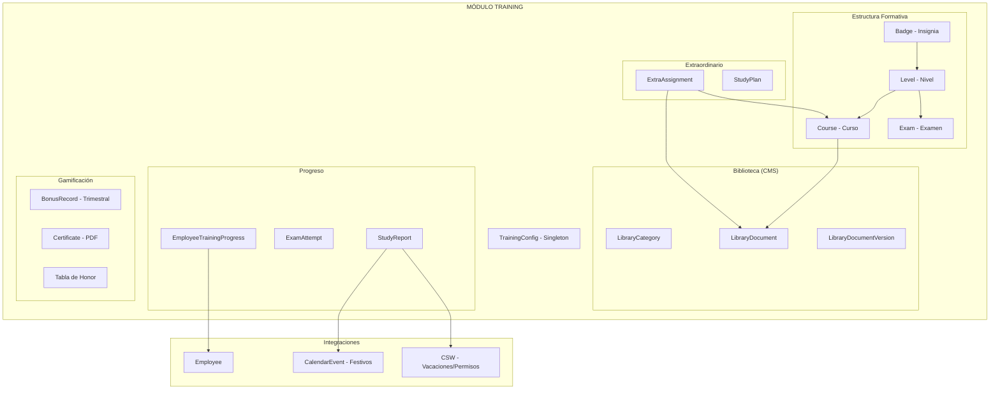

# Módulo de Training — RH Unlimitech Cloud

## Visión General

Sistema de capacitación empresarial con insignias gamificadas, seguimiento de progreso secuencial, reportes de estudio obligatorio (L/M/V), tabla de honor trimestral con bonificaciones monetarias, exámenes con evaluación manual/automática, biblioteca documental con editor dual, y certificaciones automáticas con PDF.

**Responsable actual:** Oscar (QUALITY & TRAINING OFFICER)
**Acceso total:** Hat HUMAN TALENT MANAGEMENT (Laura)

## Reglas Fundamentales

| Regla | Descripción |
|-------|-------------|
| Progreso secuencial | No se puede saltar niveles. Nivel N requiere completar nivel N-1 |
| Curso → empleado, Nivel → encargado | El empleado marca cursos; el encargado aprueba niveles (examen) |
| 1h mínimo por día obligatorio | L, M, V deben tener al menos 1 hora reportada |
| Ventana de reporte: jue → mié 23:59 | Solo se puede reportar dentro de la semana activa |
| Solo cursos del sistema | No se puede reportar material externo |
| Bonificaciones por trimestre | Q1-Q4, con premios monetarios visibles para todos |
| Asignaciones extraordinarias | Van por encima del flujo regular (prioridad) |
| Empleado inactivo = invisible | Progreso congelado, no aparece en tablas |
| Examen: 1 intento + cache | Sin tiempo límite, progreso en localStorage, confirmación de envío |

## Arquitectura



## Documentos del Módulo

| Documento | Descripción |
|-----------|-------------|
| [01-data-model.md](./01-data-model.md) | 15 colecciones, interfaces, diagramas Mermaid |
| [02-features.md](./02-features.md) | Features por sub-módulo, formulario de reporte |
| [03-api-endpoints.md](./03-api-endpoints.md) | ~50 endpoints REST |
| [04-library-module.md](./04-library-module.md) | Biblioteca documental + editor dual |
| [05-implementation-analysis.md](./05-implementation-analysis.md) | Componentes TailAdmin, optimizaciones, librerías |
| [06-decisions.md](./06-decisions.md) | 23 decisiones de diseño (fuente autoritativa) |

## Stack Tecnológico

| Capa | Tecnología |
|------|-----------|
| Backend | Express + Mongoose + Zod validators |
| Frontend | React 19 + MobX + TailwindCSS |
| Editor | react-quill-new (MIT) + turndown → Markdown |
| Render docs | react-markdown + remark-gfm |
| Íconos insignias | lucide-react (MIT, 1500+) |
| Certificados | jspdf (logo + contenido + firma) |
| Drag & drop | react-dnd (ya instalado) |
| Componentes UI | TailAdmin Pro (template existente) |

## Permisos

```
training:read       → Ver cursos, niveles, insignias, tabla de honor (todos)
training:create     → Crear cursos, niveles, exámenes, insignias, documentos
training:update     → Editar contenido de training y biblioteca
training:delete     → Eliminar cursos/niveles/documentos
training:manage     → Dashboard encargado, evaluar exámenes, reactivar, bonos
training:report     → Reportar horas de estudio (todos los empleados activos)
```

## Fases de Implementación

| Fase | Contenido | Estado |
|------|-----------|--------|
| **1** | Biblioteca + CRUD cursos/niveles/insignias + editor dual | 📋 Pendiente |
| **2** | Progreso del empleado + marcar cursos + exámenes (cache+evaluación) | 📋 Pendiente |
| **3** | Reportes de estudio + tabla de honor + bonificaciones trimestrales | 📋 Pendiente |
| **4** | Certificados PDF + planes individuales + dashboard encargado | 📋 Pendiente |

## Colecciones Nuevas (15)

`Course` · `Level` · `Badge` · `Exam` · `EmployeeTrainingProgress` · `ExamAttempt` · `StudyReport` · `StudyPlan` · `Certificate` · `TrainingConfig` · `LibraryCategory` · `LibraryDocument` · `LibraryDocumentVersion` · `BonusRecord` · `ExtraAssignment`

+ Campo `studyProgress` en Employee (para navbar)
