# Organigrama Unlimitech Cloud

## Visión General

**Misión (VFP General):** Crear valor para las empresas y personas ayudándoles a aprovechar la tecnología para expandirse.

**Socios:** Manuel Lara, Juan Carlos Lozano

**Junta Directiva:** Grupo colegiado que toma decisiones según las directrices de la junta de socios/accionistas. Ejerce la administración ejecutando las políticas diseñadas por la asamblea de socios.

---

## Diagrama General — Nivel Ejecutivo y Divisiones

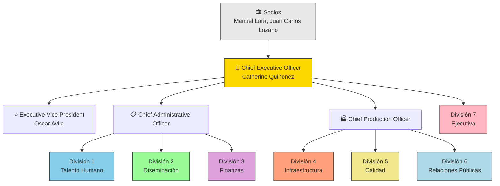

---

## División 7 | Ejecutiva

**VFP:** Unlimitech Cloud solvente, viable y en constante expansión.

**Función:** Supervisa, gestiona y coordina todos los aspectos de la organización para que se expanda, sea viable económicamente y fiel a los objetivos.

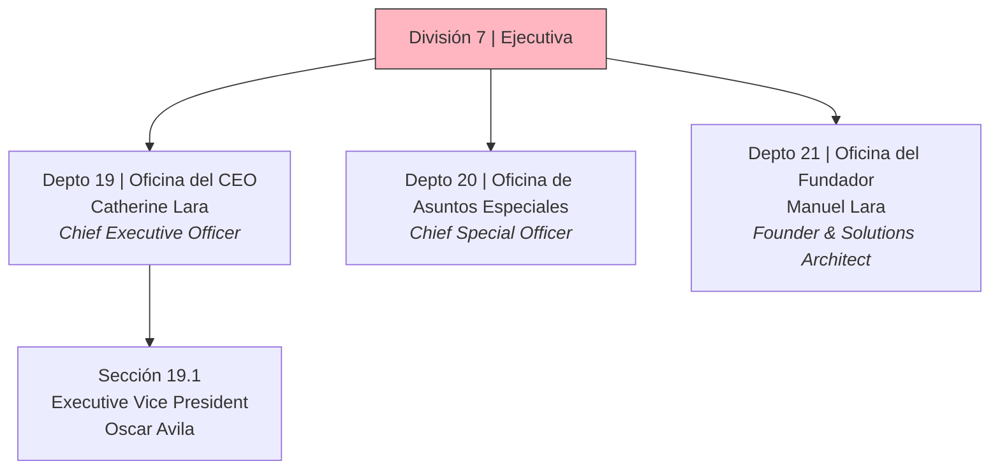

### Departamento 19 — Oficina del CEO
| Campo | Detalle |
|-------|---------|
| **Titular** | Catherine Lara |
| **Cargo** | Chief Executive Officer |
| **Función** | Concibe y emite la planificación estratégica, asegurándose de su ejecución. Es responsable general de la condición de todo Unlimitech Cloud y lleva a cabo la coordinación global. Mediante el uso de la estructura ejecutiva, mantiene a Unlimitech Cloud solvente, viable, produciendo y expandiéndose. |
| **VFP** | Coordinación eficaz para expansión y viabilidad organizacional que dan lugar a obtener los logros y una rápida expansión |

### Departamento 20 — Oficina de Asuntos Especiales
| Campo | Detalle |
|-------|---------|
| **Titular** | (Vacante) |
| **Cargo** | Chief Special Officer |
| **Función** | Se relaciona con los clientes y vela por el cumplimiento normativo y legal, buscando mantener la estabilidad, la reputación de la empresa y su buen nombre. Se ocupa del entorno corporativo, manteniendo relaciones con organismos gubernamentales y encargándose de asuntos legales. |
| **VFP** | Cumplimiento normativo y estabilidad reputacional de la empresa |

### Departamento 21 — Oficina del Fundador
| Campo | Detalle |
|-------|---------|
| **Titular** | Manuel Lara |
| **Cargo** | Founder and Solutions Architect |
| **Función** | Desarrolla planes de negocio que definen los objetivos de la empresa. Diseña y desarrolla el producto y los servicios principales. Es la fuente de la visión, metas, propósitos y principios. Formula las políticas para garantizar el éxito de la compañía. |
| **VFP** | Visión de mercado y mejora continua en productos y servicios |

---

## División 1 | Talento Humano

**VFP:** Unlimitech Cloud establecida, con staff contratado, asignado, entrenado en el Hat, productivo y ético.

**Manager:** Carmenza Trejos (Human Talent Manager)

**Función:** Contrata y forma personal y se asegura de que las líneas de comunicación se mantengan operativas internamente y con el público, mientras mantienen los estándares de ética y producción.

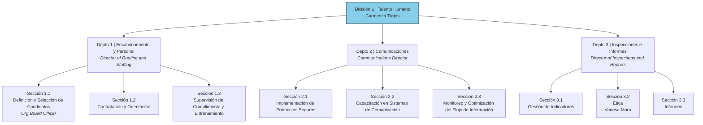

### Departamento 1 — Encaminamiento y Personal
| Campo | Detalle |
|-------|---------|
| **Cargo** | Director of Routing and Staffing |
| **Función** | Contrata al personal adecuado, lo asigna de manera óptima, y se asegura de que todo el personal reciba formación. Reconoce, establece y mantiene flujos de trabajo para que las personas y los materiales se desplacen ágil y fluidamente. |
| **VFP** | Personal competente y flujos de trabajo optimizados |

### Departamento 2 — Comunicaciones
| Campo | Detalle |
|-------|---------|
| **Cargo** | Communications Director |
| **Función** | Establece y mantiene sistemas para asegurar que toda comunicación, tanto interna como externa, se maneje de forma segura, ágil y fluida. |
| **VFP** | Comunicación interna y externa segura, fluida y rápida |

### Departamento 3 — Inspecciones e Informes
| Campo | Detalle |
|-------|---------|
| **Cargo** | Director of Inspections and Reports |
| **Función** | Hace posible que la dirección perciba y actúe de manera informada mediante la recopilación constante de datos y la elaboración precisa de gráficos de indicadores. Inspecciona la organización y detecta cualquier factor que pueda obstaculizar la producción y expansión. Mantiene un alto estándar de conducta ética y profesional. |
| **VFP** | Conducta alta de ética y altos niveles de productividad |
| **Personal** | Vanesa Mora (Ética) |

---

## División 2 | Diseminación

**VFP:** Suficiente volumen de ventas para garantizar que el ingreso sea mayor que el gasto, más las reservas.

**Manager:** Dissemination Manager (vacante)

**Función:** Hace que los servicios de Unlimitech Cloud se conozcan y se demanden de forma generalizada, creando un elevado volumen de clientes que los adquieren.

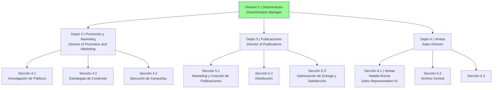

### Departamento 4 — Promoción y Marketing
| Campo | Detalle |
|-------|---------|
| **Cargo** | Director of Promotion and Marketing |
| **Función** | Genera una gran demanda orientando a los posibles clientes sobre los productos y servicios a través de promoción informativa, basada en encuestas precisas y campañas de marketing (mailings, boletines, revistas, sitios web, redes sociales). |
| **VFP** | Demanda activa y en gran volumen mediante campañas de marketing efectivas |

### Departamento 5 — Publicaciones
| Campo | Detalle |
|-------|---------|
| **Cargo** | Director of Publications |
| **Función** | Crea, vende y entrega con rapidez las publicaciones de la organización, transmitiendo al público las comprensiones alcanzadas por la empresa, fomentando el deseo y la demanda de los objetivos y servicios. |
| **VFP** | Publicaciones que crean una alta demanda por los servicios |

### Departamento 6 — Ventas
| Campo | Detalle |
|-------|---------|
| **Cargo** | Sales Director |
| **Función** | Realiza introducción a los posibles clientes que ya han expresado interés, para clasificarlos y calificarlos. Mantiene actualizados los archivos y la base de datos de todas las personas que alguna vez han adquirido algo de la empresa, para que se les puedan promover más servicios. |
| **VFP** | Clientes satisfechos y comprometidos, con ventas recurrentes y fidelizadas |
| **Personal** | Natalia Rocha (Sales Representative #1) |

---

## División 3 | Finanzas

**VFP:** Activos y reservas preservados y valiosos.

**Manager:** Finance Manager (vacante)

**Función:** Mantiene la gobernanza financiera adecuada, proporcionando a Unlimitech Cloud el cuerpo físico y los medios necesarios para producir sus productos, entregar sus servicios, permanecer solvente y alcanzar sus objetivos.

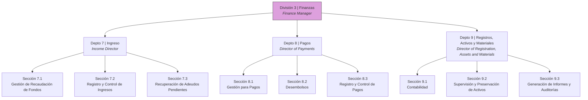

### Departamento 7 — Ingreso
| Campo | Detalle |
|-------|---------|
| **Cargo** | Income Director |
| **Función** | Gestiona los fondos entrantes, asegurándose de que se recauden y registren de manera adecuada y segura. Mantiene al día los registros de las cuentas de los clientes y recauda todos los adeudos pendientes. |
| **VFP** | Fondos gestionados con precisión y registros actualizados |

### Departamento 8 — Pagos
| Campo | Detalle |
|-------|---------|
| **Cargo** | Director of Payments |
| **Función** | Realiza los ajustes necesarios para desembolsar fondos destinados a adquisiciones y al pago de todas las facturas recibidas, así como al staff, garantizando que las obligaciones financieras se cumplan y que las demás divisiones dispongan de los recursos necesarios. |
| **VFP** | Pagos y recursos asegurados para continuidad operativa |

### Departamento 9 — Registros, Activos y Materiales
| Campo | Detalle |
|-------|---------|
| **Cargo** | Director of Registration, Assets and Materials |
| **Función** | Se asegura de la preservación del cuerpo físico de la empresa y mantiene registros precisos de todas las transacciones financieras, incluyendo contabilidad, auditorías y elaboración de informes financieros. |
| **VFP** | Activos preservados y registros financieros precisos |

---

## División 4 | Infraestructura (Producción)

**VFP:** Gran cantidad de servicios entregados a los consumidores con la puntualidad, el costo y la calidad prometidos.

**Manager:** Moises Gonzalez (Technical Architect Manager)

**Función:** Entrega e intercambia de manera eficiente y sin demoras los servicios de Unlimitech Cloud para sus usuarios y clientes.

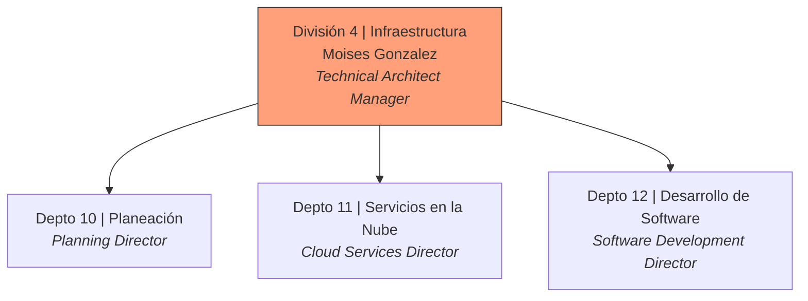

### Departamento 10 — Planeación

**Función:** Analiza y establece soluciones viables que permiten la entrega de servicios de manera ordenada y predecible, manteniendo los estándares de calidad. Es responsable de la completitud y la calidad de los proyectos.

**VFP:** Soluciones completas y de alta calidad para cierres de negocio efectivos. Servicios de alta calidad desarrollados, entregados con rapidez y con los más altos estándares de calidad.

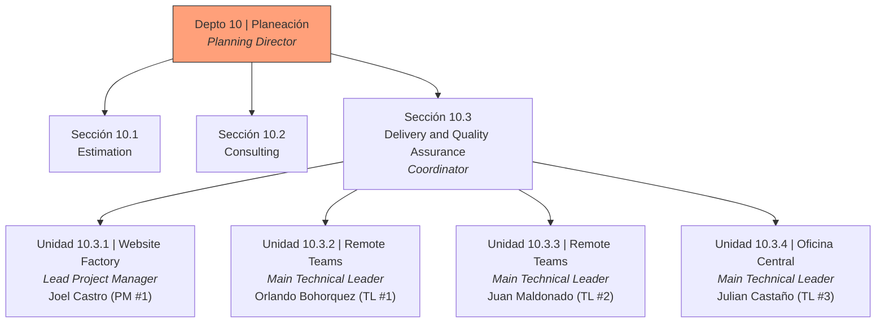

### Departamento 11 — Servicios en la Nube

**Función:** Asegura que los servicios de infraestructura ofrecidos por la empresa se entreguen de manera estándar y funcional durante todo el ciclo de vida del servicio, además de proporcionar el soporte necesario que los clientes requieren.

**VFP:** Servicios de infraestructura eficientes y estables con constante soporte de calidad y rapidez para clientes.

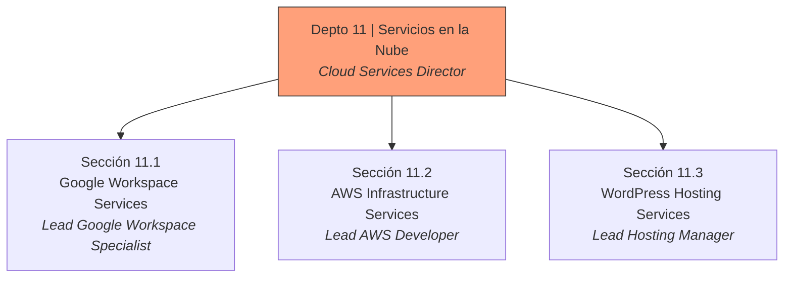

### Departamento 12 — Desarrollo de Software

**Función:** Produce el desarrollo de software de manera eficiente, cumpliendo con la planificación establecida por el Departamento de Planeación para la ejecución de soluciones, y entrega los proyectos con rapidez, alta calidad y en gran cantidad.

**VFP:** Software eficiente y de alta calidad desarrollado con rapidez.

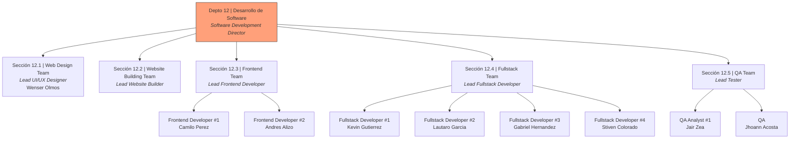

#### Equipo de Desarrollo — Roles y funciones

| Sección | Función | Personal |
|---------|---------|----------|
| **12.1 Web Design** | Diseño UI/UX | Wenser Olmos (Lead) |
| **12.2 Website Building** | Construcción de sitios web. Coordinación Cliente-Equipo de Desarrollo para entrega oportuna cumpliendo objetivos y alcances. Producto: Sitios web entregados de forma estándar, profesional y en los tiempos estimados. | Lead Website Builder |
| **12.3 Frontend** | Desarrollo del lado del cliente | Camilo Perez, Andres Alizo |
| **12.4 Fullstack** | Capacidad de trabajar en todos los aspectos de desarrollo de software, tanto front-end como back-end. Puede contribuir en todas las etapas del ciclo de vida de desarrollo, desde el diseño e implementación hasta el despliegue y mantenimiento. Producto: Alta calidad de elementos fullstack garantizando una calidad muy alta en los proyectos para el cliente. | Kevin Gutierrez, Lautaro Garcia, Gabriel Hernandez, Stiven Colorado |
| **12.5 QA** | Aseguramiento de calidad del software | Jair Zea, Jhoann Acosta |

---

## División 5 | Calidad

**VFP:** 1. Staff bien formado que es eficaz y eficiente, entregando productos finales valiosos en sus puestos. 2. Unlimitech Cloud corregida y sus servicios y productos de alta calidad, muy por encima del promedio del mercado.

**Manager:** Quality Manager (vacante)

**Función:** Asegura que todos los servicios y los sistemas organizativos de Unlimitech Cloud sean de la más alta calidad y trabaja constantemente para mejorarlos.

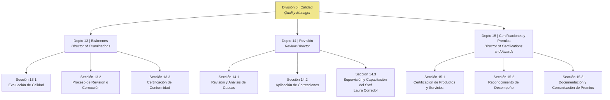

### Departamento 13 — Exámenes
| Campo | Detalle |
|-------|---------|
| **Cargo** | Director of Examinations |
| **Función** | Evalúa el resultado de la producción en términos de calidad, validez y precisión de los servicios, y los remite a revisión o certificación. Asegura que todo el producto cumpla con los estándares de calidad. |
| **VFP** | Servicios entregados cumpliendo con los estándares de calidad |

### Departamento 14 — Revisión
| Campo | Detalle |
|-------|---------|
| **Cargo** | Review Director |
| **Función** | Revisa los productos, servicios, personal y procesos organizativos para identificar las causas subyacentes de cualquier nivel de calidad inferior al estándar, implementando correcciones necesarias. Supervisa al personal asegurándose de que estén completamente capacitados. |
| **VFP** | Servicios, procesos y personal corregidos asegurando el más alto estándar de calidad |
| **Personal** | Laura Corredor (Staff Supervision and Training Officer) |

### Departamento 15 — Certificaciones y Premios
| Campo | Detalle |
|-------|---------|
| **Cargo** | Director of Certifications and Awards |
| **Función** | Certifica aquellos productos que se consideran de excelente calidad basándose en los resultados de la inspección y el examen. También certifica y premia a aquellas personas, unidades y canales organizativos cuya demostración de competencia merece reconocimiento. |
| **VFP** | Certificación de productos y reconocimiento a la excelencia interna y externa |

---

## División 6 | Relaciones Públicas

**VFP:** 1. Una base de clientes interesados y florecientes que demandan más productos y servicios. 2. Clientes satisfechos que nos recomiendan a otros y comparten sus buenas experiencias ampliamente.

**Manager:** Public Relations Manager (vacante)

**Función:** Mantiene el punto de contacto entre el público en general y Unlimitech Cloud. A través de campañas de información y relaciones públicas, introduce a nuevos clientes y prospectos, generando un interés creciente en la empresa dentro de la comunidad.

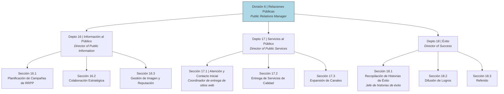

### Departamento 16 — Información al Público
| Campo | Detalle |
|-------|---------|
| **Cargo** | Director of Public Information |
| **Función** | Asegura que la imagen de la organización, sus líneas y su personal sean excelentes, logrando la aceptación del público. Da a conocer la empresa a nuevos clientes potenciales a través de campañas de relaciones públicas bien planificadas. Trabaja con grupos afines para crear un clima operativo sostenible. |
| **VFP** | Imagen sólida y buena reputación mediante campañas efectivas |

### Departamento 17 — Servicios al Público
| Campo | Detalle |
|-------|---------|
| **Cargo** | Director of Public Services |
| **Función** | Se asegura de la participación del público en los servicios introductorios de la empresa y los proporciona a la nueva clientela. A través de una entrega de calidad, incentiva a los nuevos clientes a participar en otros servicios de mayor alcance. Establece canales productivos de distribución externa. |
| **VFP** | Servicios introductorios de calidad que inspiran participación futura |

### Departamento 18 — Éxito
| Campo | Detalle |
|-------|---------|
| **Cargo** | Director of Success |
| **Función** | Recopila y comunica de manera generalizada los éxitos de las actividades y productos de la organización. Ejerce influencia sobre el área de impacto de la organización, animando a los clientes existentes a hablar sobre el buen trabajo y los servicios de la empresa. |
| **VFP** | Difusión de logros que refuerzan la influencia y buena reputación |

---

## Directorio de Personal Actual

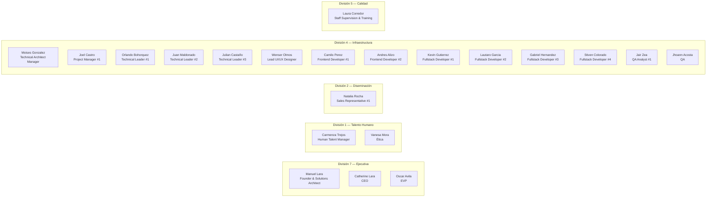

---

## Resumen Numérico de la Estructura

| Nivel | Cantidad | Descripción |
|-------|----------|-------------|
| **Socios** | 2 | Manuel Lara, Juan Carlos Lozano |
| **CEO** | 1 | Catherine Quiñonez |
| **C-Level** | 3 | CAO, CPO, CEO |
| **Divisiones** | 7 | Talento Humano, Diseminación, Finanzas, Infraestructura, Calidad, Relaciones Públicas, Ejecutiva |
| **Departamentos** | 21 | Numerados del 1 al 21 |
| **Secciones** | ~57 | 3 por departamento (promedio) |
| **Unidades** | 4 | Dentro de Sección 10.3 (Delivery & QA) |

---

## Flujo de Producción — Cómo se distribuyen las dos líneas de mando

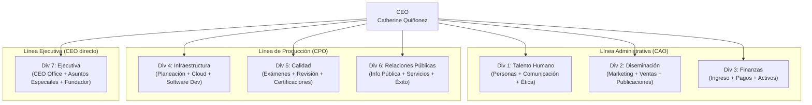

---

## Glosario

| Término | Significado |
|---------|-------------|
| **VFP** | Valuable Final Product — Producto Final Valioso. Es el resultado medible y valioso que se espera de cada posición, departamento o división. |
| **Hat** | Referencia al concepto de "sombrero" o rol funcional que se asigna a un puesto, con funciones y responsabilidades específicas. |
| **División** | Nivel organizacional principal. Cada división agrupa departamentos relacionados bajo un propósito macro. |
| **Departamento** | Nivel medio dentro de una división. Agrupa secciones temáticas. |
| **Sección** | Nivel operativo dentro de un departamento. Ejecuta funciones específicas. |
| **Unidad** | Nivel más granular, dentro de una sección. Solo existe en el Depto 10 (Delivery & QA). |
| **CAO** | Chief Administrative Officer — Línea administrativa (Div 1, 2, 3) |
| **CPO** | Chief Production Officer — Línea de producción (Div 4, 5, 6) |

---

## Lista de Cargos

| # | Cargo | División | Departamento | Sección/Unidad | Estado |
|---|-------|----------|--------------|----------------|--------|
| 1 | Chief Executive Officer (CEO) | Ejecutiva | — | — | ✅ Ocupado |
| 2 | Executive Vice President (EVP) | Ejecutiva | Depto 19 (Sección 19.1) | — | ✅ Ocupado |
| 3 | Founder and Solutions Architect | Ejecutiva | Depto 21 | — | ✅ Ocupado |
| 4 | Chief Special Officer | Ejecutiva | Depto 20 | — | ⬜ Vacante |
| 5 | Chief Administrative Officer (CAO) | — | — | — | ⬜ Vacante |
| 6 | Chief Production Officer (CPO) | — | — | — | ⬜ Vacante |
| 7 | Human Talent Manager | Div 1 — Talento Humano | — | — | ✅ Ocupado |
| 8 | Director of Routing and Staffing | Div 1 — Talento Humano | Depto 1 | — | ⬜ Vacante |
| 9 | Org Board Officer | Div 1 — Talento Humano | Depto 1 | Sección 1.1 | ⬜ Vacante |
| 10 | Communications Director | Div 1 — Talento Humano | Depto 2 | — | ⬜ Vacante |
| 11 | Director of Inspections and Reports | Div 1 — Talento Humano | Depto 3 | — | ⬜ Vacante |
| 12 | Ética (Officer) | Div 1 — Talento Humano | Depto 3 | Sección 3.2 | ✅ Ocupado |
| 13 | Dissemination Manager | Div 2 — Diseminación | — | — | ⬜ Vacante |
| 14 | Director of Promotion and Marketing | Div 2 — Diseminación | Depto 4 | — | ⬜ Vacante |
| 15 | Director of Publications | Div 2 — Diseminación | Depto 5 | — | ⬜ Vacante |
| 16 | Sales Director | Div 2 — Diseminación | Depto 6 | — | ⬜ Vacante |
| 17 | Sales Representative #1 | Div 2 — Diseminación | Depto 6 | Sección 6.1 | ✅ Ocupado |
| 18 | Finance Manager | Div 3 — Finanzas | — | — | ⬜ Vacante |
| 19 | Income Director | Div 3 — Finanzas | Depto 7 | — | ⬜ Vacante |
| 20 | Director of Payments | Div 3 — Finanzas | Depto 8 | — | ⬜ Vacante |
| 21 | Director of Registration, Assets and Materials | Div 3 — Finanzas | Depto 9 | — | ⬜ Vacante |
| 22 | Technical Architect Manager | Div 4 — Infraestructura | — | — | ✅ Ocupado |
| 23 | Planning Director | Div 4 — Infraestructura | Depto 10 | — | ⬜ Vacante |
| 24 | Delivery and Quality Assurance Coordinator | Div 4 — Infraestructura | Depto 10 | Sección 10.3 | ⬜ Vacante |
| 25 | Lead Project Manager | Div 4 — Infraestructura | Depto 10 | Unidad 10.3.1 | ⬜ Vacante |
| 26 | Project Manager #1 | Div 4 — Infraestructura | Depto 10 | Unidad 10.3.1 | ✅ Ocupado |
| 27 | Main Technical Leader (Remote Teams #1) | Div 4 — Infraestructura | Depto 10 | Unidad 10.3.2 | ⬜ Vacante |
| 28 | Technical Leader #1 | Div 4 — Infraestructura | Depto 10 | Unidad 10.3.2 | ✅ Ocupado |
| 29 | Main Technical Leader (Remote Teams #2) | Div 4 — Infraestructura | Depto 10 | Unidad 10.3.3 | ⬜ Vacante |
| 30 | Technical Leader #2 | Div 4 — Infraestructura | Depto 10 | Unidad 10.3.3 | ✅ Ocupado |
| 31 | Main Technical Leader (Oficina Central) | Div 4 — Infraestructura | Depto 10 | Unidad 10.3.4 | ⬜ Vacante |
| 32 | Technical Leader #3 | Div 4 — Infraestructura | Depto 10 | Unidad 10.3.4 | ✅ Ocupado |
| 33 | Cloud Services Director | Div 4 — Infraestructura | Depto 11 | — | ⬜ Vacante |
| 34 | Lead Google Workspace Specialist | Div 4 — Infraestructura | Depto 11 | Sección 11.1 | ⬜ Vacante |
| 35 | Lead AWS Developer | Div 4 — Infraestructura | Depto 11 | Sección 11.2 | ⬜ Vacante |
| 36 | Lead Hosting Manager | Div 4 — Infraestructura | Depto 11 | Sección 11.3 | ⬜ Vacante |
| 37 | Software Development Director | Div 4 — Infraestructura | Depto 12 | — | ⬜ Vacante |
| 38 | Lead UI/UX Designer | Div 4 — Infraestructura | Depto 12 | Sección 12.1 | ✅ Ocupado |
| 39 | Lead Website Builder | Div 4 — Infraestructura | Depto 12 | Sección 12.2 | ⬜ Vacante |
| 40 | Lead Frontend Developer | Div 4 — Infraestructura | Depto 12 | Sección 12.3 | ⬜ Vacante |
| 41 | Frontend Developer #1 | Div 4 — Infraestructura | Depto 12 | Sección 12.3 | ✅ Ocupado |
| 42 | Frontend Developer #2 | Div 4 — Infraestructura | Depto 12 | Sección 12.3 | ✅ Ocupado |
| 43 | Lead Fullstack Developer | Div 4 — Infraestructura | Depto 12 | Sección 12.4 | ⬜ Vacante |
| 44 | Fullstack Developer #1 | Div 4 — Infraestructura | Depto 12 | Sección 12.4 | ✅ Ocupado |
| 45 | Fullstack Developer #2 | Div 4 — Infraestructura | Depto 12 | Sección 12.4 | ✅ Ocupado |
| 46 | Fullstack Developer #3 | Div 4 — Infraestructura | Depto 12 | Sección 12.4 | ✅ Ocupado |
| 47 | Fullstack Developer #4 | Div 4 — Infraestructura | Depto 12 | Sección 12.4 | ✅ Ocupado |
| 48 | Lead Tester | Div 4 — Infraestructura | Depto 12 | Sección 12.5 | ⬜ Vacante |
| 49 | QA Analyst #1 | Div 4 — Infraestructura | Depto 12 | Sección 12.5 | ✅ Ocupado |
| 50 | QA | Div 4 — Infraestructura | Depto 12 | Sección 12.5 | ✅ Ocupado |
| 51 | Quality Manager | Div 5 — Calidad | — | — | ⬜ Vacante |
| 52 | Director of Examinations | Div 5 — Calidad | Depto 13 | — | ⬜ Vacante |
| 53 | Review Director | Div 5 — Calidad | Depto 14 | — | ⬜ Vacante |
| 54 | Staff Supervision and Training Officer | Div 5 — Calidad | Depto 14 | Sección 14.3 | ✅ Ocupado |
| 55 | Director of Certifications and Awards | Div 5 — Calidad | Depto 15 | — | ⬜ Vacante |
| 56 | Public Relations Manager | Div 6 — Relaciones Públicas | — | — | ⬜ Vacante |
| 57 | Director of Public Information | Div 6 — Relaciones Públicas | Depto 16 | — | ⬜ Vacante |
| 58 | Director of Public Services | Div 6 — Relaciones Públicas | Depto 17 | — | ⬜ Vacante |
| 59 | Coordinador de entrega de sitios web | Div 6 — Relaciones Públicas | Depto 17 | Sección 17.1 | ⬜ Vacante |
| 60 | Director of Success | Div 6 — Relaciones Públicas | Depto 18 | — | ⬜ Vacante |
| 61 | Jefe de historias de éxito | Div 6 — Relaciones Públicas | Depto 18 | Sección 18.1 | ⬜ Vacante |

**Resumen:** 61 cargos identificados — 21 ocupados, 40 vacantes.

---

## Lista de Empleados

| # | Nombre | Cargo | División | Departamento | Sección/Unidad |
|---|--------|-------|----------|--------------|----------------|
| 1 | Catherine Quiñonez (Catherine Lara) | Chief Executive Officer | Div 7 — Ejecutiva | Depto 19 | — |
| 2 | Oscar Avila | Executive Vice President | Div 7 — Ejecutiva | Depto 19 | Sección 19.1 |
| 3 | Manuel Lara | Founder and Solutions Architect | Div 7 — Ejecutiva | Depto 21 | — |
| 4 | Carmenza Trejos | Human Talent Manager | Div 1 — Talento Humano | — | — |
| 5 | Vanesa Mora | Ética (Officer) | Div 1 — Talento Humano | Depto 3 | Sección 3.2 |
| 6 | Natalia Rocha | Sales Representative #1 | Div 2 — Diseminación | Depto 6 | Sección 6.1 |
| 7 | Moises Gonzalez | Technical Architect Manager | Div 4 — Infraestructura | — | — |
| 8 | Joel Castro | Project Manager #1 | Div 4 — Infraestructura | Depto 10 | Unidad 10.3.1 (Website Factory) |
| 9 | Orlando Bohorquez | Technical Leader #1 | Div 4 — Infraestructura | Depto 10 | Unidad 10.3.2 (Remote Teams) |
| 10 | Juan Maldonado | Technical Leader #2 | Div 4 — Infraestructura | Depto 10 | Unidad 10.3.3 (Remote Teams) |
| 11 | Julian Castaño | Technical Leader #3 | Div 4 — Infraestructura | Depto 10 | Unidad 10.3.4 (Oficina Central) |
| 12 | Wenser Olmos | Lead UI/UX Designer | Div 4 — Infraestructura | Depto 12 | Sección 12.1 (Web Design) |
| 13 | Camilo Perez | Frontend Developer #1 | Div 4 — Infraestructura | Depto 12 | Sección 12.3 (Frontend) |
| 14 | Andres Alizo | Frontend Developer #2 | Div 4 — Infraestructura | Depto 12 | Sección 12.3 (Frontend) |
| 15 | Kevin Gutierrez | Fullstack Developer #1 | Div 4 — Infraestructura | Depto 12 | Sección 12.4 (Fullstack) |
| 16 | Lautaro Garcia | Fullstack Developer #2 | Div 4 — Infraestructura | Depto 12 | Sección 12.4 (Fullstack) |
| 17 | Gabriel Hernandez | Fullstack Developer #3 | Div 4 — Infraestructura | Depto 12 | Sección 12.4 (Fullstack) |
| 18 | Stiven Colorado | Fullstack Developer #4 | Div 4 — Infraestructura | Depto 12 | Sección 12.4 (Fullstack) |
| 19 | Jair Zea | QA Analyst #1 | Div 4 — Infraestructura | Depto 12 | Sección 12.5 (QA) |
| 20 | Jhoann Acosta | QA | Div 4 — Infraestructura | Depto 12 | Sección 12.5 (QA) |
| 21 | Laura Corredor | Staff Supervision and Training Officer | Div 5 — Calidad | Depto 14 | Sección 14.3 |

**Total empleados activos:** 21

### Distribución por División

| División | Empleados | % del Total |
|----------|-----------|-------------|
| Div 7 — Ejecutiva | 3 | 14% |
| Div 1 — Talento Humano | 2 | 10% |
| Div 2 — Diseminación | 1 | 5% |
| Div 3 — Finanzas | 0 | 0% |
| Div 4 — Infraestructura | 14 | 67% |
| Div 5 — Calidad | 1 | 5% |
| Div 6 — Relaciones Públicas | 0 | 0% |
| **Total** | **21** | **100%** |
